<figure align="center">
  
</figure>

---

## Introduction to Electromagnetism

### Preliminary Notes

#### Electric Charge is a Property of matter

- Two types of charge: Positive $(-)$ & $(+)$

<figure align="center">
  
  <figcaption><b>Fig.1</b> - Types of charges.</figcaption>
</figure>

- Charge of a single electron: $q=-e=-1.602 \times 10^{-19}~\text{C}$
- Charge of a single proton: $q=+e=+1.602 \times 10^{-19}~\text{C}$
- Charge is conserved (Can't be created or destroyed)
- Charge is quantized (exist in multiples of $e$)

#### Two kinds of matter

- **Insulators:** Charges cannot move, they are "fixed"
- **Conductors:** Charges are free to move around

<figure align="center">
  
  <figcaption><b>Fig.2</b> - Conductors vs. Insulators.</figcaption>
</figure>

## PHGN 100 - Equations

Useful Constants

### Useful Constants

- $g=9.81 \frac{\mathrm{m}}{\mathrm{s}^{2}}$
- $G=6.67 \times 10^{-11} \frac{\mathrm{N} \cdot \mathrm{m}^{2}}{\mathrm{~kg}^{2}}$

Vector Principles

### Vector Principles

- $\vec{A}=A_{x} \hat{\imath}+A_{y} \hat{\jmath}+A_{z} \hat{k}$

- $A \equiv|\vec{A}|=\sqrt{A_{x}^{2}+A_{y}^{2}+A_{z}^{2}}$

- $\hat{A}=\frac{\vec{A}}{A}$

- $\Delta \vec{A} \equiv \vec{A_{\mathrm{f}}}-\vec{A}_{\mathrm{i}}$

- $\left|\vec{A} \times \vec{B}\right|=A B \sin \theta$

- $\vec{A} \times \vec{B}=\left(A_{y} B_{z}-A_{z} B_{y}\right) \hat{\imath}-\left(A_{x} B_{z}- A_{z} B_{x}\right) \hat{\jmath}+\left(A_{x} B_{y}-A_{y} B_{x}\right) \hat{k}$

- $\vec{A} \cdot \vec{B}=A B \cos \theta=A_{x} B_{x}+A_{y} B_{y}+A_{z} B_{z}$

#### Center of Mass

$$\vec{r}_{\mathrm{cm}}=\frac{1}{m_{\mathrm{tot}}} \sum_{j} m_{j} \vec{r}_{j}; \quad \vec{r}_{\mathrm{cm}}=\frac{\int \vec{r} \mathrm{~d} m}{m_{\mathrm{tot}}}$$

Kinematics

### Kinematics

- $\vec{r}(t)=$ Position Vector

- $\vec{v} \equiv \frac{\mathrm{d} \vec{r}}{\mathrm{~d} t} \Rightarrow \vec{r}(t)=\vec{r}\left(t_{\mathrm{i}}\right)+\int_{t_{\mathrm{i}}}^{t} \vec{v}\left(t^{\prime}\right) \mathrm{d} t^{\prime}$

- $\vec{a} \equiv \frac{\mathrm{d} \vec{v}}{\mathrm{~d} t}=\frac{\mathrm{d}^{2} \vec{r}}{\mathrm{~d} t^{2}} \Rightarrow \vec{v}(t)=\vec{v}\left(t_{\mathrm{i}}\right)+\int_{t_{\mathrm{i}}}^{t} \vec{a}\left(t^{\prime}\right) \mathrm{d} t^{\prime}$

#### Average Velocity

$$\vec{v}_{\mathrm{av}} \mid t_{\mathrm{i}_{\mathrm{i}}}^{t_{\mathrm{f}}} \equiv \frac{1}{\Delta t} \int_{t_{i}}^{t_{f}} \vec{v}\left(t^{\prime}\right) \mathrm{d} t^{\prime}=\frac{\Delta \vec{r}}{\Delta t}$$

#### Average Acceleration

$$\vec{a}_{\text {av }}|_{t_{\mathrm{i}}}^{t_{\mathrm{f}}} \equiv \frac{1}{\Delta t} \int_{t_{i}}^{t_{f}} \vec{a}\left(t^{\prime}\right) \mathrm{d} t^{\prime}=\frac{\Delta \vec{v}}{\Delta t}$$

Translational Dynamics and Different Forces

### Translational Dynamics and Different Forces

#### Newton's Second Law for Translation

$$\sum_{j} \vec{F}_{j \mathrm{~b}}=m_{\mathrm{b}} \vec{a}_{\mathrm{b}, \mathrm{cm}}$$

#### Newton's Third Law

$$\vec{F}_{\text {ab }}=-\vec{F}_{\text {ba }}$$

#### Friction

$$f_{\mathrm{s}, \mathrm{ab}} \leq \mu_{\mathrm{s}} N_{\mathrm{ab}} ; \quad f_{\mathrm{k}, \mathrm{ab}}=\mu_{\mathrm{k}} N_{\mathrm{ab}}$$

#### Ideal Spring

$$F_{\mathrm{sp} \mathrm{ab}, x}(t)=-k\left[x(t)-x_{0}\right]$$

#### Universal Gravitation

$$\vec{F}_{\mathrm{G}, \mathrm{ab}}=-\frac{G m_{\mathrm{a}} m_{\mathrm{b}}}{r_{\mathrm{ab}}^{2}} \hat{\boldsymbol{r}}_{\mathrm{ab}}=-\frac{G m_{\mathrm{a}} m_{\mathrm{b}}}{r_{\mathrm{ab}}^{3}} \vec{\boldsymbol{r}}_{\mathrm{ab}}$$

#### Weight

$$\vec{W}_{\mathrm{Eb}}=m_{\mathrm{b}} \vec{g}$$

#### Gravitational Field

$$\vec{g}\left(\vec{r}_{\mathrm{b}}\right)=-\sum_{j} \frac{G m_{j}}{r_{j \mathrm{~b}}^{2}} \hat{r}_{j \mathrm{~b}}=-\sum_{j} \frac{G m_{j}}{r_{j \mathrm{~b}}^{3}} \vec{r}_{j \mathrm{~b}}$$

Circular Motion

### Circular Motion

- $s(t)=$ Arc Length

#### Angular Position

$$\theta(t) \equiv \frac{s(t)}{R}$$

#### Angular Velocity

$$\omega(t) \equiv \frac{\mathrm{d} \theta(t)}{\mathrm{d} t} \Rightarrow \theta(t)=\theta\left(t_{\mathrm{i}}\right)+\int_{t_{\mathrm{i}}}^{t} \omega\left(t^{\prime}\right) \mathrm{d} t^{\prime}$$

#### Angular Acceleration

$$\alpha(t) \equiv \frac{\mathrm{d} \omega(t)}{\mathrm{d} t}=\frac{\mathrm{d}^{2} \theta(t)}{\mathrm{d} t^{2}} \Longrightarrow \omega(t)=\omega\left(t_{\mathrm{i}}\right)+\int_{t_{\mathrm{i}}}^{t} \alpha\left(t^{\prime}\right) \mathrm{d} t^{\prime}$$

#### Centripetal Acceleration

$$a_{\mathrm{c}}(t)=\frac{v_{\mathrm{t}}(t)^{2}}{R}=\omega(t)^{2} R$$

#### Tangential Velocity

$$v_{\mathrm{t}}(t) \equiv \frac{\mathrm{d} s(t)}{\mathrm{d} t}=\omega(t) R$$

#### Tangential Acceleration

$$a_{\mathrm{t}}(t) \equiv \frac{\mathrm{d} v_{\mathrm{t}}(t)}{\mathrm{d} t}=\alpha(t) R$$

Simple Harmonic Motion

### Simple Harmonic Motion

Relationship between $a_{x}(t)$ and $x(t): a_{x}(t)=-\omega^{2}\left[x(t)-x_{\mathrm{eq}}\right]$

#### Position

$$x(t)=A \sin (\omega t+\delta)+x_{\mathrm{eq}}$$

#### Mass-Spring System

$$\omega=\sqrt{\frac{k}{m}}$$

#### Frequency, Angular Frequency, Period

$$f=\frac{1}{T} ; \quad \omega=2 \pi f$$

Rotational Motion

### Rotational Motion

#### Newton's Second Law for Rotation

$$\sum_{j} \vec{\tau}_{j \mathrm{~b}}=I_{\mathrm{b}} \vec{\alpha}_{\mathrm{b}}$$

#### Torque

$$\vec{\tau}_{\mathrm{ab}}=\vec{r} \times \vec{F}_{\mathrm{ab}} ; \quad \tau_{\mathrm{ab}}=r_{\perp} F_{\mathrm{ab}}=r F_{\mathrm{ab} \perp}=r F_{\mathrm{ab}} \sin \theta$$

#### Rolling

$$x_{\mathrm{cm}}=R \theta(t) ; \quad v_{\mathrm{cm}}=R \omega(t) ; \quad a_{\mathrm{cm}}=R \alpha(t)$$

Moments of Inertia and Inertial Calculus

### Moments of Inertia and Inertial Calculus

#### Point Mass

$$I=m r^{2};~\text{Cylindrical Shell (Hoop)}: I_{\mathrm{cm}}=m R^{2}$$

#### Thin Rod/Stick

$$I_{\mathrm{cm}}=(1 / 12) m L^{2} ; \quad I_{\mathrm{end}}=(1 / 3) m L^{2}$$

#### Solid Disk (Cylinder)

$$I_{\mathrm{cm}}=(1 / 2) m R^{2}$$

#### Solid Sphere

$$I_{\mathrm{cm}}=(2 / 5) m R^{2}$$

#### Hollow Sphere

$$I_{\mathrm{cm}}=(2 / 3) m R^{2}$$

#### Continuous Objects

$$m_{\mathrm{tot}}=\int \mathrm{d} m ; \quad I_{\mathrm{tot}}=\int \mathrm{d} I$$

$$\mathrm{d} m=\rho \mathrm{d} V(3 \mathrm{D}) ; \quad \mathrm{d} m=\sigma \mathrm{d} A(2 \mathrm{D}) ; \quad \mathrm{d} m=\lambda \mathrm{d} \ell(1 \mathrm{D})$$

Work, Energy, and Power

### Work, Energy, and Power

#### Work-Energy Theorem

$$W_{\text {tot }}=\Delta E_{\mathrm{sys}}$$

### Work

$$W_{\vec{F}_{\mathrm{ab}}}=\int_{\vec{s}_{b, \mathrm{i}}}^{\vec{s}_{b, \mathrm{f}}} \vec{F}_{\mathrm{ab}} \cdot \mathrm{d} \vec{s} ; d \vec{s}=d x \hat{\imath}+d y \hat{\jmath}+d z \hat{k}$$

$$W_{\vec{\tau}_{\mathrm{ab}}}=\int_{\theta_{b, \mathrm{i}}}^{\theta_{b, \mathrm{f}}} \tau_{\mathrm{ab}} \mathrm{d} \theta$$

#### Power

$$P_{\vec{F}_{\mathrm{ab}}} \equiv \frac{\mathrm{d} W_{\vec{F}_{\mathrm{ab}}}(t)}{\mathrm{d} t}=\vec{F}_{\mathrm{ab}} \cdot \vec{v}(t)$$

#### Change in PE

$$\Delta U_{\vec{F}_{\mathrm{ab}}} \equiv-\int_{\vec{s}_{b, \mathrm{i}}}^{\vec{s}_{\mathrm{ab}}} \vec{F}_{\mathrm{ab}} \cdot \mathrm{d} \vec{s}$$

#### Force from PE

$$\vec{F}_{\mathrm{ab}}=-\vec{\nabla} U_{\vec{F}_{\mathrm{ab}}} ; \quad \text{in 1D} \quad F_{\mathrm{ab}, x}=-\frac{\mathrm{d} U_{\vec{F}_{\mathrm{ab}}}}{\mathrm{d} x}$$

#### Earth's Gravitational PE: $\Delta U_{G}=-\frac{G m_{\mathrm{E}} m_{\mathrm{b}}}{r_{\mathrm{b}, \mathrm{f}}}+\frac{G m_{\mathrm{E}} m_{\mathrm{b}}}{r_{\mathrm{b}, \mathrm{i}}}$

#### Near Earth

$$\Delta U_{g}=m_{\mathrm{b}} g\left(y_{\mathrm{b}, \mathrm{f}}-y_{\mathrm{b}, \mathrm{i}}\right)$$

#### Ideal Spring PE

$$\Delta U_{\mathrm{sp}}=\frac{1}{2} k\left(x_{\mathrm{b}, \mathrm{f}}-x_{0}\right)^{2}-\frac{1}{2} k\left(x_{\mathrm{b}, \mathrm{i}}-x_{0}\right)^{2}$$

#### Kinetic Energies

$$K_{\mathrm{T}}=\frac{1}{2} m v_{\mathrm{cm}}^{2} ; \quad K_{\mathrm{R}}=\frac{1}{2} I \omega_{\mathrm{cm}}^{2}$$

#### Thermal Energy

$$\Delta E_{\text {therm }, \mathrm{ab}}=f_{\mathrm{k}, \mathrm{ab}} s_{\mathrm{ab}}$$

Momenta and Impulse

### Momenta and Impulse

#### Linear-Impulse-Momentum Theorem

$$\sum_{j} \vec{I}_{\vec{F}_{j \mathrm{~b}}}=\Delta \vec{p}_{\mathrm{b}}$$

#### Angular-Impulse-Momentum Theorem

$$\sum_{j} \vec{I}_{\vec{\tau}_{j \mathrm{~b}}}=\Delta \vec{L}_{\mathrm{b}}$$

#### Linear Momentum

$$\vec{p} \equiv m \vec{v}_{\mathrm{cm}}$$

#### Angular Momentum

$$\vec{L}_{\mathrm{T}} \equiv \vec{r} \times \vec{p} ; \quad \vec{L}_{\mathrm{R}}=I \vec{\omega}$$

#### Impulse

$$\vec{I}_{\vec{F}_{\mathrm{ab}}} \equiv \int_{t_{\mathrm{i}}}^{t_{\mathrm{f}}} \vec{F}_{\mathrm{ab}} \mathrm{d} t ; \quad \vec{I}_{\vec{\tau}_{\mathrm{ab}}} \equiv \int_{t_{\mathrm{i}}}^{t_{\mathrm{f}}} \vec{\tau}_{\mathrm{ab}} \mathrm{d} t$$

#### Average Force and Linear Momentum

$$\sum_{j} \vec{F}_{j \mathrm{~b}, \mathrm{av}}=\frac{\Delta \vec{p}_{\mathrm{b}}}{\Delta t}$$

#### Average Torque and Angular Momentum

$$\sum_{j} \vec{\tau}_{j \mathrm{~b}, \mathrm{av}}=\frac{\Delta \vec{L}_{\mathrm{b}}}{\Delta t}$$

#### Kinetic Energies and Momenta

$$K_{\mathrm{T}}=\frac{p^{2}}{2 m} ; \quad K_{\mathrm{R}}=\frac{L^{2}}{2 I}$$

#### Elastic collisions, 2 objects, 1D

$$v_{2 \mathrm{f}, x}-v_{1 \mathrm{f}, x}=v_{1 \mathrm{i}, x}-v_{2 \mathrm{i}, x}$$

## PHGN 200 - Equations

Maxwell's Equations

### Maxwell's Equations

#### Gauss's Law for Electric Field

$$\oint \vec{\boldsymbol{E}} \cdot d \vec{\boldsymbol{A}}=\frac{Q_{\text {encl }}}{\varepsilon_{0}}=4 \pi k Q_{\text {encl}}$$

##### Electric Flux

$$\Phi_{E}=\int \vec{\boldsymbol{E}} \cdot d \vec{\boldsymbol{A}}$$

#### Gauss's Law for Magnetic Field

$$\oint \vec{\boldsymbol{B}} \cdot d \vec{\boldsymbol{A}}=0$$

##### Magnetic Flux

$$\Phi_{B}=\int \vec{\boldsymbol{B}} \cdot d \vec{\boldsymbol{A}}$$

#### Ampère/Maxwell

$$\oint \vec{\boldsymbol{B}} \cdot d \vec{\boldsymbol{\ell}}=\mu_{0} I_{\text {thru }}+\mu_{0} \varepsilon_{0} \frac{d \Phi_{E}}{d t}$$

#### Faraday's Law

$$\mathcal{E}_{\text {induced }}=\oint(\vec{\boldsymbol{E}}+\vec{\boldsymbol{v}} \times \vec{\boldsymbol{B}}) \cdot d \vec{\boldsymbol{\ell}}=-\frac{d \Phi_{B}}{d t}$$

Fields, Forces, and Energy

### Fields, Forces, and Energy

#### Electric field

$$d \vec{\boldsymbol{E}}=\frac{k d Q}{r^{2}} \hat{\boldsymbol{r}}=\frac{k d Q}{r^{3}} \vec{\boldsymbol{r}} ; \quad \vec{\boldsymbol{F}}_{\text {electron on q }}=q \vec{\boldsymbol{E}}_{\text {at q }}$$

#### Electric potential

$$\Delta V=V_{B}-V_{A}=-\int_{A}^{B} \vec{\boldsymbol{E}} \cdot d \vec{\boldsymbol{\ell}} ; \quad E_{x}=-\frac{d V}{d x} ; \quad d V=\frac{k d Q}{r}$$

#### Electrostatic energy

$$\Delta U_{\text {of q }}=q \Delta V$$

#### Dielectrics

$$\varepsilon_{\mathrm{in}}=\kappa_{E} \varepsilon_{0} ; C=\kappa_{E} C_{0}$$

#### Magnetic field

$$d \vec{\boldsymbol{B}}=\frac{\mu_{0} I d
\vec{\boldsymbol{\ell}} \times \hat{\boldsymbol{r}}}{4 \pi r^{2}}=\frac{\mu_{0} I
\vec{\boldsymbol{\ell}} \times \vec{\boldsymbol{r}}}{4 \pi r^{3}}$$

#### Magnetic force

$$d \vec{\boldsymbol{F}}=I d \vec{\boldsymbol{\ell}} \times \vec{\boldsymbol{B}} ; \quad \vec{\boldsymbol{F}}_{\text {on q }}^{\mathrm{mag}}=q \vec{\boldsymbol{v}} \times \vec{\boldsymbol{B}}$$

#### Magnetic dipole

$$\vec{\boldsymbol{\mu}}=N I \vec{\boldsymbol{A}} ; \quad \vec{\boldsymbol{\tau}}=\vec{\boldsymbol{\mu}} \times \vec{\boldsymbol{B}} ; \quad U=-\vec{\boldsymbol{\mu}} \cdot \vec{\boldsymbol{B}}$$

Circuits

### Circuits

#### Resistors

$$V=I R ; \quad d R=\frac{\rho d L}{A} ; \quad R_{\text {series }}=\sum_{i} R_{i} ; R_{\text {parallel }}=\left(\sum R_{i}^{-1}\right)^{-1}$$

#### Capacitors

$$C=\frac{Q}{|\Delta V|} ; U_{\mathrm{C}}=\frac{1}{2} C(\Delta V)^{2} ; C_{\text {series }}=\left(\sum_{i} C_{i}{ }^{-1}\right)^{-1} ; C_{\text {parallel }}=\sum_{i} C_{i} ; C=\kappa_{E} C_{0}$$

#### Current

$$I=\frac{d Q}{d t}=n|q| v_{\mathrm{d}} A ; \vec{\boldsymbol{J}}=n q \vec{\boldsymbol{v}}_{\mathrm{d}}$$

#### Power

$$P=I \Delta V$$

#### Kirchhoff's Laws

$$\sum_{\text {Closed loop }} \Delta V_{i}=0 ; \quad \sum I_{\text {in }}=\sum I_{\text {out }}$$

#### RC Circuits

$$Q(t)=Q_{\text {final }}\left(1-e^{-t / R C}\right) ; \quad Q(t)=Q_{\text {initial }} e^{-t / R C}$$

#### AC Circuits

$$X_{\mathrm{C}}=\frac{1}{\omega C}; \quad  V_{\mathrm{C}}=I X_{\mathrm{C}}; \quad Z=\sqrt{R^{2}+X_{\mathrm{C}}^{2}}; \quad V=I Z; \quad V_{r m s}=\frac{V_{\text {peak }}}{\sqrt{2}}$$

#### Inductors

$$\mathcal{E}_{\text {ind }}=-L \frac{d I}{d t} ; \quad L=\frac{N \Phi_{\mathrm{B}, 1 \text { turn }}}{I} ; \quad U_{\mathrm{B}}=\frac{1}{2} L I^{2}$$

#### Inductance

$$M_{12}=\frac{N_2\Phi_{B,~\text{one turn of 2}}}{I_{\text{in}~1}}; \quad \mathcal{E}_1 = M_{12} \frac{dI_{2}}{dt}$$

#### LR Circuits

$$I(t)=I_{\text {final }}\left(1-e^{-t /(L / R)}\right) ; I(t)=I_{\text {initial }} e^{-t /(L / R)}$$

Electromagnetic Waves Optics and Field Energy Density

### Electromagnetic Waves Optics and Field Energy Density

#### Field Energy/Momentum

$$u_{E}=\frac{1}{2} \varepsilon_{0} E^{2} ; \quad u_{B}=\frac{1}{2 \mu_{0}} B^{2} ; \quad p=\frac{U}{c}$$

#### Wave Properties

$$\quad v=\lambda f ; \quad k=\frac{2 \pi}{\lambda} ; \quad \omega=2 \pi f ; \quad E=c B$$

#### Intensity

$$\vec{\boldsymbol{S}}=\frac{1}{\mu_{0}}(\vec{\boldsymbol{E}} \times \vec{\boldsymbol{B}}) ; \quad I=|\vec{\boldsymbol{S}}|_{\text {avg }}=c \frac{1}{2} \varepsilon_{0} E_{\mathrm{m}}^{2}=\frac{P_{\text {av }}}{A}$$

#### Reflection & Refraction

$$v_{\text {in material }}=c / n_{1} ; \quad \theta_{\text {inc }}=\theta_{\text {ref }} ; \quad n_{1} \sin \left(\theta_{\text {inc }}\right)=n_{2} \sin \left(\theta_{\text {trans }}\right)$$

#### Interference

##### Constructive

$$\Delta r=m \lambda$$

##### Destructive

$$\Delta r=\left(m+\frac{1}{2}\right) \lambda$$

#### Bragg

$$2 d \sin (\theta)=m \lambda$$

##### Double-slit

$$d \sin (\theta)=m \lambda \quad \text{or}\quad\underbrace{\frac{d y_{m}}{R}=m \lambda}_{\text{for small}~\theta}$$

Additional Information & Useful Constants

### Additional Information & Useful Constants

#### Electric fields

$$\vec{\boldsymbol{E}}_{\text {inf sheet }}=\frac{\sigma}{2 \varepsilon_{0}} ; \quad \vec{\boldsymbol{E}}_{\text {inf line }}=2 k \lambda / r ; \quad \vec{\boldsymbol{E}}_{\text {charged ring }}=\frac{k Q x}{\left(x^{2}+a^{2}\right)^{3 / 2}} \hat{i} ; \quad C_{\text {parallel plate }}=\frac{\varepsilon_{0} A}{d}$$

#### Magnetic fields

$$\vec{\boldsymbol{B}}_{\text {infinite wire }}=\frac{\mu_{0} I}{2 \pi r} ; \quad \vec{\boldsymbol{B}}_{\text {solenoid }}=\mu_{0} n I ; \quad L_{\text {solenoid }}=\mu_{0} n^{2} A \ell ; \quad \vec{\boldsymbol{B}}_{\text {current loop }}=\frac{\mu_{0} N I R^{2}}{2\left(x^{2}+R^{2}\right)^{3 / 2}}$$

#### Fundamental Charge

$$e=1.602 \times 10^{-19} \mathrm{C}$$

##### Electron Mass:

$$m_{\mathrm{e}}=9.11 \times 10^{-31} \mathrm{~kg}$$

##### Proton Mass

$$m_{\mathrm{p}}=1.673 \times 10^{-27} \mathrm{~kg}$$

#### Other Constants

- $k=\frac{1}{4 \pi \varepsilon_{0}}=9 \times 10^{9}\left(\frac{\mathrm{~N} \cdot \mathrm{m}^{2}}{\mathrm{C}^{2}}\right)$

- $\varepsilon_{0}=8.85 \times 10^{-12} \frac{\mathrm{F}}{\mathrm{m}}$
- $\mu_{0}=4 \pi \times 10^{-7} \frac{\mathrm{Tm}}{\mathrm{A}}=1.2566 \times 10^{-6} \frac{\mathrm{Tm}}{\mathrm{A}} ;$

- $c=\frac{1}{\sqrt{\mu_{0} \varepsilon_{0}}}=3 \times 10^{8} \mathrm{~m} / \mathrm{s} ;$

## Electrostatics

Topic IA: Coulomb's Law for Discrete Charge Distributions

### Topic IA: Coulomb's Law for Discrete Charge Distributions

#### Key Ideas from Topic IA

1. Electric force between two point charges is given by Coulomb's law: $\vec{F}_{1,2}=\frac{k q_1 q_2}{r_{1,2}^3} \vec{r}_{1,2}$

2. Electric field produced by a source charge is given by $\vec{E}=\frac{k q_s}{r^3} \vec{r}$ and is related to force on a charge brought into the electric field by $\vec{F}=q \vec{E}$.

3. Electric forces and electric fields follow the principle of superposition (i.e., they add as vectors).

> $$\hat{r} = \frac{\vec{r}}{r}=\frac{r_{x}\hat{i}+r_{y}\hat{j}+r_{z}\hat{k}}{r}$$

The vector force from charge 1 , exerted on charge 2 is

$$ \vec{F}_{1,2}=\frac{k q_1 q_2}{r_{1,2}^2} \widehat{r}_{1,2}=\frac{k q_1 q_2}{r_{1,2}^3} \vec{r}\_{1,2} $$

$q_1$ is causing $q_2$ to "feel" a force. So $\vec{r}_{1,2}$ would point from $q_1$ (cause) to $q_2$ (effect) Electric field produced by a source charge is

$$ \vec{E}=\frac{k q\_{\text {source }} \vec{r}}{r^3} $$

$q_{\text {source }}$ is the source of an electric field. So $\vec{r}$ would point from $q_{\text {source }}$ (cause) to the location where we want to know the electric field (effect). $\vec{r}$ always points from the cause to the effect!

---

<figure align="center">
  <iframe src="CoulombsLaw.svg" style="height: 200px; width:auto" sandbox>
    
    </iframe>
  <figcaption><b>Fig.3</b> - Forces of charge</figcaption>
</figure>

#### Example 1

If a charge $q_1 = 5~\mu\mathrm{C}$ is located at $(1,2,3)~\mathrm{m}$ and charge $q_{2}=-8~\mu\mathrm{C}$ is located at $(4,7,8)~\mathrm{m}$, what is the force exerted by $q_1$ on $q_2$?

$$
\begin{aligned} & \vec{F}_{1,2}=\frac{k q_1 q_2}{r^2 \hat{r}_{1,2}}=\frac{k q_1 q_2}{r_{1,2}} \vec{r}_{1,2} \\
& \vec{r}_{1,2}=\left(x_2-x_1\right) \hat{i}+\left(y_2-y_1\right) \hat{j}+\left(z_2-z_1\right) \hat{k} \\
& \vec{r}_{1,2}=(4-1) \hat{i}+(7-2) \hat{j}+(8-3) \hat{k} \\
& \vec{r}_{1,2}=3 \hat{i}+5 \hat{j}+5 \hat{k} \\
& \hat{r}_{1,2}=\frac{\vec{r}_{1,2}}{r_{1,2}}=\frac{3 \hat{i}+5 \hat{j}+5 \hat{k}}{\sqrt{3^2+5^2+5^2}}=\frac{3 \hat{i}+5 \hat{j}+5 \hat{k}}{59^{1 / 2}}\\
& \boxed{\vec{F}_{1,2}=k \frac{\left(5 \cdot 10^{-6} C\right)\left(-8 \cdot 10^{-6} C\right)}{59^{3 / 2}}(3 \hat{i}+5 \hat{j}+5 \hat{k})}\end{aligned}
$$

#### Example 2

Three charges $(Q_1,Q_2,Q_3)$ are arranged as follows: The position of $Q_2$ is $d_2$ directly below $Q_1$. $Q_3$ is located $d_3$ directly to the right of $Q_2$. What is the force on $Q_2$.

$$
\begin{align*}
\vec{F}_{1,2} & = \frac{kQ_{1}Q_{2}}{d_{2}^{3}} \cdot (-d_{2}\hat{j})\\
\vec{F}_{3,2} & = \frac{kQ_{3}Q_{2}}{d_{3}^{3}} \cdot (-d_{3}\hat{i})\\
\vec{F}_{1,2}+\vec{F}_{3,2} &= \boxed{-\frac{kQ_{3}Q_{2}}{d_{3}^{2}} \hat{\mathbf{i}}-\frac{kQ_{1}Q_{2}}{d_{2}^{2}} \hat{\mathbf{j}}}
\end{align*}
$$

#### Topic IA Homework

##### Problem 1

Suppose we have a charge, $q_{1} = 5~\mu\mathrm{C}$. This charge makes an electric field some distance $r = 73~\mathrm{cm}$ away from it. Now suppose our measurement of $q_{1}$ is only accurate to within $0.2~\mu\mathrm{C}$, and our measurement of $r$ is only accurate to within $1.5~\mathrm{cm}$.

> **Tip:** Remember to convert units: $\mu\mathrm{C} = 10^{-6}~\mathrm{C}$ & $1~\mathrm{cm} = 0.01~\mathrm{m}$.

> **Online Calculator:** [Desmos Graph](https://www.desmos.com/calculator/zwffgu0id4)

If we were to calculate the electric field made by that charge at the indicated distance, what would be the uncertainty in our calculation due only to the uncertainty in the size of $q_{1}$?

$$\boxed{dE_{q1}=\frac{1}{2}\left(\frac{k\ \left(q_{1}+q_{error}\ \right)}{r^{2}}-\frac{k\ \left(q_{1}-q_{error}\ \right)}{r^{2}}\right)}$$

What is the uncertainty in our field calculation due only to the uncertainty in the charge separation $r$?

$$\boxed{dE_{r}=\left|\frac{kq_{1}}{\left(r+0.015\right)^{2}}-\frac{kq_{1}}{r^{2}}\right|}$$

What is the total uncertainty in our electric field calculation due to the uncertainty in the size of $q_1$ and the uncertainty in the charge separation $r$?

$$\boxed{dE_{tot}=\sqrt{d_{Eq1}^{2}+d_{Er}^{2}}}$$

##### Question 2

Two identical balls of $4.1~\mathrm{g}$ are suspended from threads of length $1.48~\mathrm{m}$ and carry equal charges as shown in the figure. Each ball is $1.5~\mathrm{cm}$ from the centerline.

<figure align="center">
  
  <figcaption><b>Fig.4</b> - Topic IA Homework: Problem 2</figcaption>
</figure>

> **Online Calculator:** [Desmos Graph](https://www.desmos.com/calculator/sscdj41hsw)

Assume that the angle $\theta$ is so small that its tangent can be replaced by its sine. This is called the small angle approximation and means that for small angles $\sin(\theta)=\tan(\theta)$. Find the magnitude of charge on one of the balls.

> **Tip:** $F_e=F_g\tan(\theta)$: [See here](https://www.sfu.ca/phys/100/lectures/HangingCharges/HangingCharges.html)

$$\boxed{q=2x\sqrt{\frac{mgd}{lk}}}$$

Now, assume the two balls are losing charge to the air very slowly. That means they'll be slowly approaching each other. If a ball is moving at an instantaneous speed of $4.4 \cdot 10^{-5}~\mathrm{m/s}$, at what rate is the ball losing charge? Start by writing the speed of the ball and the rate of change of the charge as symbolic derivatives, and then relate those derivatives. Give your answer in Coulombs per second $(\mathrm{C/s})$. Note that because the balls are losing charge so slowly, we can still use our results from the previous part, as the system is almost in equilibrium. Give your answer as a magnitude.

> **Tip:** Convert $x$ to $\mathrm{meters}$ and mass to $\mathrm{grams}$

$$\frac{dq}{dt} = \frac{dq}{dx} \cdot \frac{dx}{dt}$$
$$\frac{dq}{dx} =\frac{d}{dx}\left(2x^{3/2}\sqrt{\frac{mg}{lk}}\right)= 3x^{1/2}\sqrt{\frac{mg}{lk}}$$
$$\boxed{\frac{dq}{dt}=3x^{1/2}\sqrt{\frac{mg}{lk}} \cdot \frac{dx}{dt}}$$

##### Question 3

> **Online Calculator:** [Desmos Graph](https://www.desmos.com/calculator/ffig5atef3)

What is the magnitude of the electric field at a distance of $0.1~\mathrm{nm}$ from a thorium nucleus?

> **Tip:** Convert unites $1~\mathrm{nm} = 10^{-9}~\mathrm{m}$ & $q_{electron} = -1.602\cdot10^{-19}~\mathrm{C}$

$$\boxed{\vec{E} = \left|\frac{k\cdot\left(90\times q_{electron}\right)}{r^{2}}\right|}$$

What is the magnitude of the force on an electron at that distance?

$$\boxed{F=\left|\vec{E} \cdot q_{electron}\right|}$$

Treating the electron classically, that is, as a point object that can move around the nucleus at reasonably slow speeds, what is the frequency of the electron's motion? We're looking for the linear frequency here, not the angular frequency.

> **Tip:** $v=2\pi r f$; $m_{electron}=9.1093837\cdot10^{-31}~\mathrm{kg}$; and $F=\frac{mv^2}{r}$

$$\boxed{f=\sqrt{\frac{F}{m_{electron}\cdot r\cdot4\pi^{2}}}}$$

Again treating the electron classically, how fast it it moving?

$$\boxed{v=\sqrt{\frac{\left(F\cdot r\right)}{m_{electron}}}}$$

What would the magnitude of the force be if the distance of the electron from the nucleus were doubled?
$$\boxed{F_{\mathrm{new}} = \frac{F}{4}}$$

##### Problem 4

We have four charges, each of which has size given by some integer $A$, $B$, $C$, or $D$ times $q$, where $q = 1.00\cdot10^{-7}~\mathrm{C}$. The charges sit in a plane at the corners of a square whose sides have length $d = 80 ~\mathrm{cm}$ as shown in the diagram below. A charge, of size $E_q$, is placed at the origin at the center of the square.

<figure align="center">
  
  <figcaption><b>Fig.4</b> - Topic IA Homework: Problem 4</figcaption>
</figure>

> **Online Calculator:** [Desmos Graph](https://www.desmos.com/calculator/haj1lsqka6)

Let $A = 4$, $B = 4$, $C = 5$, $D = 6$, and $E = 2$. Consider the charge at the center of the square, $q_E$. What is the net $x$-component of the force on this charge?

1. $$\vec{E}_{q}=\frac{k\cdot q_E}{r^3} \cdot \left\langle \frac{d}{2},\frac{d}{2}\right\rangle $$

2. $$F = \underbrace{\mathbb{Z}}_{\mathbb{Z} \in[A,E]} \cdot \vec{E} = $$

3. $$r=\sqrt{\left(\frac{d}{2}\right)^2+\left(\frac{d}{2}\right)^2}=\sqrt{\frac{d^2}{2}}$$

4. $$\vec{E}_{q}= \left\langle\frac{k q_E \cdot d}{2\cdot\left(\frac{d^2}{2}\right)^{\frac{3}{2}}}, \frac{k q_E d}{2 \cdot\left(\frac{d^2}{2}\right)^{\frac{3}{2}}}\right\rangle = \left\langle \frac{\sqrt{2}kq_{E}}{d^2},\frac{\sqrt{2}kq_E}{d^2}\right\rangle$$

$$\boxed{F_{x}=\left|\left(B+C-A-D\right)\cdot\frac{\sqrt{2}kq_{E}^{2}E}{d^{2}}\right|}$$

$$\boxed{F_{y}=\left|(A+B-C-D)\cdot\frac{\sqrt{2}kq_{E}^{2}E}{d^{2}}\right|}$$

Consider the situation as described above with $A=B=C=D=1$ and $E=-1$.

1. If one were to triple the magnitude of the negative charge, the negative charge would be in equilibrium.

2. The equilibrium point at the center is a stable equilibrium for the negative charge for motion perpendicular to the plane of the square.

3. The sum of the forces on the center charge in the $x$-direction equals zero.

##### Problem 5

Electric forces between two charged objects tend to be much stronger in magnitude than the attractive gravitational force between them. Two particles of masses $7.06 ~\mathrm{kg}$ and $5.04 ~\mathrm{kg}$ and charges $7.81 ~\mu\mathrm{C}$ and $-3.64 ~\mu\mathrm{C}$ respectively are separated by a distance $25.6 ~\mathrm{cm}$. Find the magnitude of the ratio of the gravitational to electric forces between them.

> **Tip:** Consider the system as one dimensional

> **Online Calculator:** [Desmos Graph](https://www.desmos.com/calculator/ankdq69aa6)

$$F_{E}= \frac{kq_{1}q_{2}}{r^{2}}$$
$$F_{G}= \frac{Gm_{1}m_{2}}{r^{2}}$$

$$\mathrm{ratio} = \frac{F_{G}}{F_{E}} = \boxed{\left|\frac{Gm_{1}m_{2}}{kq_{1}q_{2}}\right|}$$

##### Problem 6

We have three charges, $Q_1, Q_2$, and $Q_3$, arranged in a straight line. $Q_2$ is $0.38 \mathrm{~m}$ to the right of $Q_1$. $Q_3$ is $0.12 \mathrm{~m}$ to the right of $Q_2$.

> **Online Calculator:** [Desmos Graph](https://www.desmos.com/calculator/ppvk7kkfha)

Assume that the charges are arranged as before, and that they have the following sizes: $Q_1=1.6~\mu \mathrm{C}, Q_2=-3~\mu \mathrm{C}, Q_3=2.8~\mu \mathrm{C}$. Calculate the total force on $Q_2$. If the net force is to the left, enter it as a negative number. Otherwise, enter it as a positive number.

$$\sum F_{2} = F_{1,2}+F_{3,2} = \boxed{\frac{kQ_{1}Q_{2}}{d_{1}^{2}} -\frac{kQ_{3}Q_{2}}{d_{2}^{2}}}$$

Now we're going to change things a bit. The charges still have the same sizes and signs $\left(Q_1=1.6 ~\mu \mathrm{C}, Q_2=-3 ~\mu \mathrm{C}, Q_3=2.8 ~\mu \mathrm{C}\right)$. $Q_2$ is still $0.38 \mathrm{~m}$ to the right of $Q_1$. But now we're free to put $Q_3$ anywhere. Find the location at which $Q_3$ will feel zero net force. Write your answer as the distance $Q_3$ is from $Q_1$ with a negative sign if $Q_3$ is to the left of $Q_1$, and a plus sign otherwise.

> **Notes:** $Q_3$ has to be to the left of $Q_1$ since it will get repealed by $Q_1$ (left) and attracted to $Q_2$ (to the right). Since $Q_2$ is negative it cancels out the $(-)$ sign in front. Negative value of $|x|$ since it is to the left of the $Q_1$

$$0 = \frac{kQ_{1}Q_{2}}{x^{2}_{1,3}}+\frac{kQ_{2}Q_{3}}{(x+r_{1,2})^{2}}$$

$$x = \frac{d_{1}}{\sqrt{-\frac{Q_{2}}{Q_{1}}}-1}$$

Topic IB: Coulomb's Law for Continuous Charge Distributions

### Topic IB: Coulomb's Law for Continuous Charge Distributions

#### Topic IB Studio

> **Online Calculator:** [Desmos Graph](https://www.desmos.com/calculator/lecu4avoqi)

##### Problem 3: Asymmetric Line Charge

A line of charge with a uniform charge density $\lambda=-14 ~\mathrm{nC/m}$ lies along the $y$-axis in the region $0\leq y\leq 4.9~\mathrm{m}$. Calculate the electric field of this line of charge at point $P$ on the $x$-axis a distance $0.6~\mathrm{m}$ from the origin. <u>Note</u>: The $r$-vector that you use in this problem should have a $y$-component that is a variable quantity, not the constant $h$.

<figure align="center">
  
  <figcaption><b>Fig.5</b> - Asymmetric Line Charge.</figcaption>
</figure>

What is the $x$-component of the electric field at point $P$?

$$E_{x}=\int_{0}^{h}\frac{k\lambda d}{\left(d^{2}+y^{2}\right)^{\frac{3}{2}}}dy =\boxed{ \frac{k \lambda h}{d\left(h^2+d^2\right)^{\frac{1}{2}}}}$$

What is the $y$-component of the electric field at point $P$?

$$E_{y}=\int_{0}^{h}\frac{-k\lambda y}{\left(d^{2}+y^{2}\right)^{\frac{3}{2}}}dy=\boxed{-\frac{k\lambda((h^{2}+d^{2})^{\frac{1}{2}}-d)}{d(h^{2}+d^{2})^{\frac{1}{2}}}}$$

##### Problem 4: Ring of Charge

A uniform circular ring of charge $Q_{4}=8.26~\mu\mathrm{C}$ and radius $R=8.5~\mathrm{cm}$ is located in the $xy$-plane, centered on the origin as shown in the figure.

<figure align="center">
  
  <figcaption><b>Fig.6</b> - Ring of Charge.</figcaption>
</figure>

What is the magnitude of the electric field, $E$, at point $P$, located at $d_{z}=11~\mathrm{cm}$?

$$E_{z}=\boxed{\frac{kQ_{4}d_{z}}{\left(d_{z}^{2}+R^{2}\right)^{\frac{3}{2}}}}$$

At what value of $z$ is the magnitude of the electric field, $E$, at maximum?

$$E\left(z\right)=\frac{kQ_{4}z}{\left(z^{2}+R^{2}\right)^{\frac{3}{2}}}$$

$$E'\left(z\right)=\frac{kQ_{4}}{\left(z^{2}+R^{2}\right)^{\frac{3}{2}}}-\frac{3\left(kQ_{4}z^{2}\right)}{\left(z^{2}+R^{2}\right)^{\frac{5}{2}}}$$

$$E'(z)=0 \Longrightarrow z_{\text{max}}=\boxed{\frac{R}{\sqrt{2}}}$$

What is the maximum value of the electric field $E_{\text{max}}$ at this location along the $z$-axis?

$$E_{\text{max}}=\underbrace{E\left(z_{\text{max}}\right)}_{f: \mathbb{R}\to\mathbb{R}}$$

Now take the limit of the original electric field expression for $z << R$. You should see that the electric field, $E$, is linearly proportional to $z$. If you place an electron along the $z$-axis very near the origin, the electron will experience a "restoring force" similar to that from a spring, i.e., $F_{z}=-kx$, where $\kappa$ is called the restoring constant. Find the value of $\kappa$ by grouping together all of the constants in the equation (basically everything but
) and plugging values in. Note that the Coulomb constant $k$ and the spring constant $\kappa$ are not the same. <u>Note</u> also that we're looking for a positive number for that constant.

$$\kappa = \boxed{-\frac{kQ_{4}}{R^{3}}\cdot q_{\text{electron}}}$$

What is the frequency of small oscillations that an electron will undergo if it is released along the $z$-axis very near the origin?

$$f=\boxed{\frac{1}{2\pi}\sqrt{\frac{\kappa}{m_{\text{electron}}}}}$$

##### Problem 5: Non-Uniform Semicircular Charge

A semicircular ring as shown below has a linear charge density given by $\lambda = -B\cos(\theta)$, where $B$ is a positive constant and $\theta$ is the angle measured from the $x$-axis.

<figure align="center">
  
  <figcaption><b>Fig.7</b> - Non-Uniform Semicircular Charge.</figcaption>
</figure>

Determine a symbolic expression for the differential length occupied by this differential element of charge.

$$\boxed{d\ell= R~\mathrm{d}\theta}$$

Using the differential length, determine the total charge on the semicircular ring in terms of $B$ and $R$.

$$Q_{5}=\int_{-\frac{\pi}{2}}^{\frac{\pi}{2}}-B\cos\left(\theta\right)R\ \mathrm{d}\theta = \boxed{-2BR}$$

**Note:** $E_{x}<0$ and $E_{y} =0$

For the $\mathrm{d}Q$ found above, write a symbolic expression for $\vec{r}$ assuming that point $P$ is located at the point $(a,0,0)$.

$$r_{x}=\boxed{a-R\cos\left(\theta\right)}$$

$$r_{y}=\boxed{-R\cdot \sin\left(\theta\right)}$$

Now it's time to put it all together. What is the final symbolic expression for the $x$-component of the electric field? Use "$k$" for the Coulomb constant. A couple things to look out for:

- Your integral for $E_{x}$ should involve $\mathrm{d}Q$ (written in terms of other variables), not the total $Q_{5}$ you calculated in an earlier part.

- The $r$ in the denominator of your integral should be the magnitude of the entire $r$-vector, not the magnitude of just a component of it.

$$E_{x} = \boxed{\int_{-\frac{\pi}{2}}^{\frac{\pi}{2}} \frac{-kB\cos \left(\theta \right)R\cdot \left(a-R\cos \left(\theta \right)\right)}{\left(\left(a-R\cos\left(\theta\right)\right)^2+\left(-R\cdot \sin\left(\theta\right)\right)^2\right)^{\frac{3}{2}}} \, \mathrm{d}\theta}$$

#### Topic IB Homework

##### Problem 1: Nonuniform Semicircle

A non-uniformly charged semicircle of radius $R=31.9~\mathrm{cm}$ lies in the $xy$-plane, centered at the origin, as shown. The charge density varies as the angle $\theta$ (in radians) according to $\lambda = 3.01\theta = \ell \theta$, where $\lambda$ has units of $\mu\mathrm{C}$ per meter.

<figure align="center">
  
  <figcaption><b>Fig.8</b> - Nonuniform Semicircle.</figcaption>
</figure>

What is the total charge on the semicircle?

$$Q_{tot}=\boxed{\int_{0}^{\pi}\lambda R\ d\theta}$$

What is the $y$ component of the electric field at the origin?

$$
\begin{align*}
E_{y}&=\int_{0}^{\pi}\frac{k\lambda R}{R^{3}}(-R)\sin\left(\theta\right)\ d\theta\\
&= -\int_{0}^{\pi}\frac{k\ell\theta}{R}\sin\left(\theta\right)\ d\theta\\
&= \boxed{-\frac{\pi k\ell}{R}}
\end{align*}
$$

##### Problem 2: Field at End of Line of Charge

A charged rod of total length $7.2~\mathrm{m}$ lies centered on the $x$-axis as shown (the $L$ indicated in the picture is half of that number, meaning that $L = 3.6~\mathrm{m}$). The rod has a charge density which varies according to $\lambda = ax^2$ where $a = -24.9 ~\mu\mathrm{C}/\mathrm{m}^3$.

<figure align="center">
  
  <figcaption><b>Fig.9</b> - Field at End of Line of Charge.</figcaption>
</figure>

What is the total charge on the rod?

$$q=\int_{-L}^{L} \lambda\, \mathrm{d}\ell = \int_{-L}^{L}ax^{2}\, \mathrm{d}x = \boxed{\frac{2aL^{3}}{3}}$$

What is the $x$-component of the electric field at a point $P$ on the $x$-axis a distance of $D = 9.7~\mathrm{m}$ from the end of the rod? Use a negative sign for a field pointing in the $x$-direction.

$$
\begin{align*}
E_{x}&=\int_{-L}^{L}\frac{ax^{2}k}{\left(D+L-x\right)^{2}}\, \mathrm{d}x\\
&= \boxed{-ak\left(-2D\ln\left(\frac{D}{2L+D}\right)-2L\ln\left(\frac{D}{2L+D}\right)-4L-\frac{2L^{3}}{D\left(D+2L\right)}\right)}
\end{align*}
$$

##### Problem 4 Slowing E-Field

An electron with a speed of $v_i = 10 \times 10^{7}~\mathrm{m/s}$ enters an electric field of magnitude $\vec{E} = 5 \times 10^3~\mathrm{N/C}$, traveling along the field lines in the direction that slows its motion.

How long does it take the electron to stop?

$$a_{e} = \frac{F_e}{m_e}=\frac{q_e\cdot \vec{E}}{m_e}$$

$$t=\frac{v_f-v_i}{a_e} = \boxed{\frac{-v_{i}m_{e}}{q_{e}\cdot \vec{E}}}$$

How far will the electron travel in the field before stopping momentarily?

$$
\begin{align*}
d & =v_{0}t+\frac{1}{2}at^{2}\\
&= \frac{-v_{0}^{2}m_{e}}{q_{e}E}+\frac{v_{0}^{2}m_{e}}{2q_{e}E}\\
&=\boxed{\frac{-v_{0}^{2}m_{e}}{2q_{e}E}}
\end{align*}
$$

##### Problem 4: Uniformly Charged Rod

A charge $Q=8.65 \times 10^{-4}~\mathrm{C}$ is distributed uniformly along a rod of length $L=16.2~\mathrm{cm}$, extending from $y=-L / 2$ to $y=+L / 2$, as shown in the diagram below. A charge $q=1.2 \times 10^{-6}~\mathrm{C}$, and the same sign as $Q$, is placed at $(D,0)$, where $D=28~\mathrm{cm}$.

<figure align="center">
  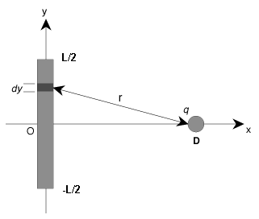
  <figcaption><b>Fig.10</b> -Uniformly Charged Rod.</figcaption>
</figure>

Consider the situation as described above and the following <b><u>true</u></b> statements.

- The $y$-components of the force on $q$ cancel.
- The charge on a segment of the rod of infinitesimal length $dy$ is given by $dQ=\frac{Q}{L} \, dy$.
- The total force on $q$ is generally in the $+x$-direction

Use integration to compute the total force on $q$ in the $x$-direction.

> **Note:** $\vec{r}=\langle D,y\rangle$

$$
\begin{align*}
F_{x} & =\int_{-\frac{L}{2}}^{\frac{L}{2}}\frac{kQqD}{L\left(y^{2}+D^{2}\right)^{\frac{3}{2}}}\,dy\\
&= \boxed{\frac{2kQq}{D(L^{2}+4D^{2})^{\frac{1}{2}}}} 
\end{align*}
$$

##### Problem 5: Electric Field Line Concepts

We have two equal and opposite point charges near each other (sometimes called an electric dipole). Consider the following **<u>true</u>** statements:

<figure align="center">
  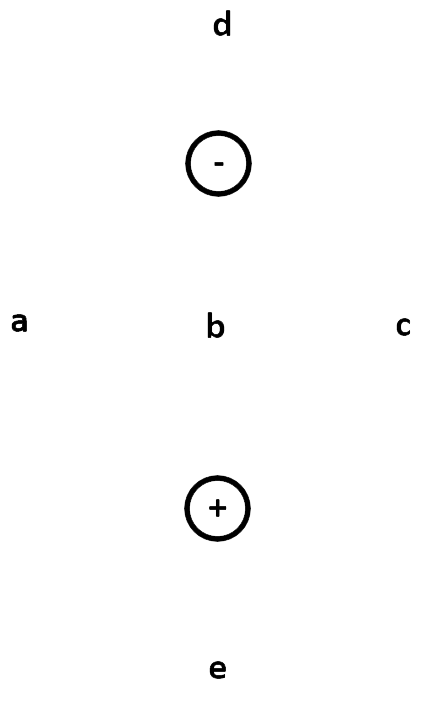
  <figcaption><b>Fig.10</b> - Electric Field Line Concepts.</figcaption>
</figure>

- A negative charge at point $D$ will accelerate towards the top of the page.
- A positive charge at point $C$ will accelerate towards the top of the page.

#### Key ideas from Topic IB

1. Electric field produced by a continuous charge distribution is found by chopping into small chunks of charge $d Q$ and adding their contributions together by $\vec{E}=\int \frac{k d Q}{r^3} \vec{r}$

2. $\vec{r}$ points from each small chunk of charge to the location that you want to find the electric field.

3. $dQ$ (infinitesimal chunk of charge) can be expressed using charge densities and differential spatial elements (infinitesimal chunks of length)

> $\vec{r}$ points from <i>cause</i> to <i>effect</i>, or from
> <i>source</i> to <i>observation point</i>. Sketch the system given, then mark out a $dq$, then draw an $\vec{r}$ for that $dq$ and observation point.

<figure align="center">
  <iframe src="Fig_11.svg" style="height: 400px; width:auto" sandbox>
    
    </iframe>
  <figcaption><b>Fig.11</b> - Charge of an object.</figcaption>
</figure>

<figure align="center">
  <iframe src="Fig_12.svg" style="height: 400px; width:auto" sandbox>
    
    </iframe>
  <figcaption><b>Fig.12</b> - Charge of an plane.</figcaption>
</figure>

$dq$ is located at some negative $x$ and $y$ location $\left(x=-x_0\right.$ and $y=-y_0)$

$$
\begin{aligned}
\vec{r}=y(-\hat{\jmath})+x(-\hat{\imath})+z_0(+\hat{k}) & =-y_0(-\hat{\jmath})+-x_0(-\hat{\imath})+z_0(+\hat{k}) \\
& =y_0(\hat{\jmath})+x_0(\hat{\imath})+z_0(+\hat{k})
\end{aligned}
$$

Topic IC: Gauss's Law (1 of 2)

### Topic IC: Gauss's Law (1 of 2)

#### Key ideas from Topic IC

1. The electric flux through a <u>closed surface</u> is proportional to the amount of charge that is enclosed by the surface: $\Phi_E=\frac{q_{e n c l}}{\varepsilon_0}$

2. Flux is a mathematical operation that allows us to count "how much" of something points through a surface. Electric flux through a closed surface is given by $\Phi_E=\oint \vec{E} \cdot d \vec{A}$.

3. Spherical, cylindrical, and planar symmetry allow us to solve for the electric field using Gauss's law: $\oint \vec{E} \cdot d \vec{A}=\underline{q_{\text {encl }}}$

**Electric Flux:** Quantifies how much electric field points through a surface.

$$\Phi_{E}=\int\vec{E}\cdot \mathrm{d}\vec{A}$$

Electric flux through a closed surface is directly proportional to the amount of charge enclosed by that surface.

$$\Phi_{E}=\oint\vec{E}\cdot \mathrm{d}\vec{A} = \frac{q_{enc}}{\varepsilon_{0}}$$

**Gaussian Surfaces:** A Gaussian surface is a closed surface in three-dimensional space through which the flux of a vector field is calculated; usually the gravitational field, electric field, or magnetic field.

**Sign:** The sign of flux through an open shape is ambiguous because there are two choices for $\hat{n}$. If the shape is closed, we can established a convention that

##### Electric Flux Due to a Point Charge

A point charge $Q$ is a distance $d/2$ directly above the center of a square of
side $d$. What is the magnitude of the electric flux through the square?

<figure align="center">
  
  <figcaption><b>Fig.13</b> - Flux in a Sphere.</figcaption>
</figure>

What is the electric flux through the cube?

$$\boxed{\Phi_{E_{\mathrm{cube}}} = \frac{Q}{\varepsilon_{0}}}$$

What is the electric flux through one face of the cube?

$$\boxed{\Phi_{E_{\mathrm{face}}} = \frac{Q}{6\varepsilon_{0}}}$$

##### Flux through an Area III

We’ve managed to set up an electric field that is modeled by $\vec{E} = Axy\hat{i} + Bx^{2}\hat{j}+Cy\hat{k}$ in the vicinity of the pictured cube that has side lengths $\ell$. What is the magnitude of the electric flux through the top surface of the cube?

1. What is the direction of $\mathrm{d}\vec{A}$ in terms of $x$, $y$ and $z$

$$\hat{k}$$

Perpendicular to the surface in the $z$-direction; Outward when there is a closed surface

2. What is the magnitude of $\mathrm{d}\vec{A}$ in terms of $x$, $y$ and $z$

$$\left|\mathrm{d}\vec{A}\right| = \mathrm{d}x \,\mathrm{d}y$$

$$
\begin{align*}
\Phi_{E} &= \int \left(Axy\hat{i} + Bx^{2}\hat{j}+Cy\hat{k}\right)\cdot  \,\mathrm{d}x \,\mathrm{d}y\hat{k}\\
& = \int_{0}^{\ell}\int_{0}^{\ell} Cy \,\mathrm{d}x \,\mathrm{d}y\\
&= \boxed{\frac{1}{2}C\ell^3}
\end{align*}
$$

#### Topic IC Homework

##### Problem 1: Flux Through an Area

We have an electric flux of magnitude $\Phi  = 152~\mathrm{Nm}^2\mathrm{/C}$ passing through a flat horizontal surface with an area of $A=0.62~\mathrm{m}^2$. The flux is due to a uniform electric field, which points $\theta_{1} = 13.7^{\circ}$ above the horizontal. Find the magnitude of the electric field.

> When the area is constant: $\Phi_{E} = E \cdot A\cos\left(\theta_{2}\right)$ where $\theta_{2}$ is the angle between the vector area and the electric field.

$$\vec{E}=\boxed{\frac{\phi_{1}}{A\cos\left(90^{\circ}-\theta_{1}\right)}}$$

##### Problem 2: Electric Flux Due to a Point Charge

We have point charge of size $Q=2.8~\mathrm{C}$ sitting a distance $\frac{d}{2}$ directly above the center of a square of side length $26~\mathrm{mm}$. What is the magnitude of the electric flux through the square?

<figure align="center">
  
  <figcaption><b>Fig.14</b> - Electric Flux Due to a Point Charge.</figcaption>
</figure>

> **Note:** We can simply perform division by 6, as each side experiences an equal amount of electric field passing through it. Also the units are $\frac{\mathrm{N}\cdot \mathrm{m}^2}{\mathrm{C}}$.

$$\Phi_{E,\mathrm{face}} = \boxed{\frac{Q}{6\varepsilon_{0}}}$$

##### Problem 3: Rectangular Box Flux Problem

Suppose we've managed to set up an electric field that can be described by the function $\vec{E}=w_1 y^2 \hat{\imath}+w_2 z^2 \hat{\jmath}+w_3 x^2 \hat{k}$ where $w_1=11 \mathrm{~N} /\left(\mathrm{C} \cdot \mathrm{m}^2\right), w_2=11 \mathrm{~N} /\left(\mathrm{C} \cdot \mathrm{m}^2\right)$, and $w_3=10 \mathrm{~N} /\left(\mathrm{C} \cdot \mathrm{m}^2\right)$. Let's look at a rectangular box in the Cartesian coordinate axes, shown below, with dimensions $a=1 \mathrm{~m}$ along the $x$-axis, $b=6.5 \mathrm{~m}$ along the $y$-axis, $c=3 \mathrm{~m}$ along the $z$-axis.

<figure align="center">
  
  <figcaption><b>Fig.15</b> - Rectangular Box Flux.</figcaption>
</figure>

What is the magnitude of the electric flux passing through the shaded area?

$$E\cdot dA = E_{y}\, dA$$

$$
\begin{align*}\Phi &= \int_{0}^{a}\int_{0}^{c}w_{2}z^{2}\, dz\, dy\\
&=\boxed{\frac{c^{3}aw_{2}}{3} }
\end{align*}
$$

##### Problem 5: Qualitative Solid Spherical

We have a solid metal sphere with total charge $Q$ and radius $R$ centered on the origin. Note that $>>$ and $<<$ mean "much larger than" and "much smaller than", respectively. <b><u>True</u></b> statements are listed below.

1. The charge on the conducting sphere must all be on the outer surface of the sphere.

2. The electric field for $r>R$ is the same as the field that would be made by a point charge with size $Q$ at the origin.

3. The electric field for $r>>R$ is the same as the field that would be made by a point charge with size $Q$ at the origin.

#### Topic IC Studio

##### Problem 2: On-Axis Electric Field of a Disk

You have now seen examples during lecture on how to calculate the electric field for a line of charge and a ring of charge - both uniformly distributed. This activity will ask you to solve for the electric field, on-axis, of a uniformly-charged disk sitting in the $xy$-plane. Below is a picture of the situation of interest.Note: Treat it as a totally flat disk and ignore its thickness in the $x$-direction. Also, let $x$ be the distance between the center of the disc and point $P$.

<figure align="center">
  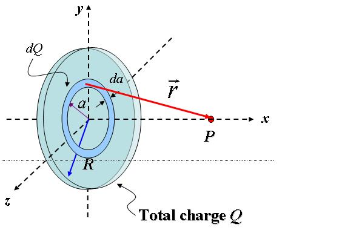
  <figcaption><b>Fig.17</b> - On-Axis Electric Field of a Disk.</figcaption>
</figure>

Identify the length and width of $dQ$ in terms of the variables in the figure above.

**Length** = $2\pi a$; **Width** = $da$

Using the charge density, determine $dQ$ in terms of the appropriate variables.

$$\boxed{dQ = \frac {Q}{\pi R^2} (2 \pi a\,\mathrm{d}a)}$$

Since our $dQ$ is a thin ring of charge, we cannot easily write out an expression for $\vec{r}$ – there isn't one single vector that points to every part of the ring at once. However, this problem has pretty good symmetry. Only one component of the E-field will survive, so we only have to write the component of $\vec{r}$ that gives us that part of the field. What is that component?

$$\boxed{\vec r = x \hat \imath}$$

Identify the full distance $r$ from $dQ$ to the point of interest in terms of the variables in the figure above. Keep in mind that due to symmetry, every point along the ring that makes up $dQ$ is at the same distance from the observation point. Also, even though some components of $\vec{r}$ were not used in the previous question the denominator of Coulomb's law still uses the total magnitude of $r$.

$$\boxed{r = \sqrt {a^2 + x^2}}$$

Substitute everything into Coulomb's Law, perform the integration, and get the electric field, $\vec{E}$ , made by the disc at point $P$.

$$
\begin{align*} \vec{E} &=\int_{0}^{R}\frac{kQ\left(2\pi a\right)x}{\pi R^{2}\left(a^{2}+x^{2}\right)^{\frac{3}{2}}}\, \mathrm{d}a\\ &= \frac{kQx}{R^{2}}\int_{0}^{R}\frac{\left(2a\right)}{\left(a^{2}+x^{2}\right)^{\frac{3}{2}}}\, \mathrm{d}a\\ &=\frac{kQx}{R^{2}}\left[\frac{-1}{\sqrt{x^2+a^2}}\right]_{0}^{R}\\ &= \boxed{\frac {2 k Q}{R^2} \left [1 - \frac{x}{\sqrt{x^2 + R^2}} \right ] \mathbf{\hat \imath}}
\end{align*}
$$

#### Problem 4: Flux Through Surfaces

An imaginary surface made of three flat pieces is shown. The entire surface is placed in a uniform electric field $\vec{E}$ pointing toward the top of the page, as shown in the side view.

<figure align="center">
  
  <figcaption><b>Fig.18</b> - Flux Through Surfaces.</figcaption>
</figure>

Rank the magnitude of the electric flux through sides, from _least_ to _greatest_.

$$\boxed{Z,Y,X}$$

What is the sign of the electric flux through the entire surface $XYZ$?

- The sign cannot be determined without more information since this is an open surface.

Topic ID: Gauss's Law (2 of 2)

### Topic 1D: Gauss's Law (2 of 2)

#### Key ideas from Topic ID

1. Spherical, cylindrical, and planar symmetry allow us to solve for the electric
   field at a location using Gauss’s law: $\oint \vec{E} \cdot d\vec{A} = \frac{q_{encl}}{\varepsilon_{0}}$

We draw the Gaussian surface to include the location we want to know the
electric field and check whether the surface has appropriate symmetry:

- $\vec{E} \mathbin{\|} d\vec{A}$ or $\vec{E}\bot d\vec{A}$ everywhere on the surface

- $E$ is constant (magnitude) everywhere on the surface

- Be careful when finding the charge enclosed. Draw out charge distributions.

**Gauss's Law:**

$$\boxed{\Phi = \oint \vec{E} \cdot d\vec{A} = \frac{q_{encl}}{\varepsilon_{0}}}$$

<i><b>Always true:</b></i> You can always find the flux if you know the charge enclosed by the surface.

<b><i>Sometimes:</i></b> Solve for $E$. Requires situations with spherical,
cylindrical, or planar symmetry.

##### Typical Conventions for Notation

Convention: We often use lower-case $r$ to indicate where we’re looking
at the field, and upper-case $R$ to indicate the radius of the object. Put another way, $r$ is a coordinate, and $R$ is a constant. This is not guaranteed, but it’s common.

<figure align="center">
  <iframe src="Fig_18.svg" style="height: 200px; width:auto" sandbox>
    
    </iframe>
  <figcaption><b>Fig.18</b> - Types of radius.</figcaption>
</figure>

##### Necessary Symmetries

If our system has good symmetry, we can simplify $\oint \vec{E}\cdot d\vec{A}$ down to $EA$ in two steps.

- <b><i>Spherical symmetry:</i></b> We can rotate an object about any axis without changing it.

- <b><i>Cylindrical symmetry:</i></b> We can rotate an object about the long axis, or translate it along the same axis, without changing it.

- <b><i>Planar symmetry:</i></b> We can translate an object along either of two axes without changing it.

<figure align="center">
  <iframe src="Fig_17.svg" style="height: 200px; width:auto" sandbox>
    
    </iframe>
  <figcaption><b>Fig.17</b> - Charge distribution, and a Gaussian
surface for a Cylinder.</figcaption>
</figure>

We start with $\oint \vec{E}\cdot d\vec{A}$ a charge distribution, and a Gaussian
surface.

1. E-field always points exactly parallel or perpendicular to every part of the Gaussian surface

$$\oint \vec{E}\cdot d\vec{A} = \int E \, dA$$

2. E-field doesn’t change on the Gaussian surface

$$\oint \vec{E}\cdot d\vec{A} = \int E \, dA = E\int \, dA = EA$$

##### Starting Points

$Q_{encl} = \int \rho, dV$ or $Q_{encl} = \int \sigma, dA$ are safe, general starting
points.
If the charge densities are constant (uniform charge), these
reduce to $Q=\rho V$ or $Q=\sigma A$.

#### Topic ID Homework

##### Problem 1: Non-conducting Sphere

We have a nonconducting solid sphere of radius $R_1=0.25~\mathrm{cm}$ carrying a uniformly distributed positive charge of $Q=6.9 ~\mathrm{nC}$.

What is the magnitude of the electric field at a point $r=1.7 ~\mathrm{cm}$ from the center of the sphere?

> Surface Area of Sphere: $A=4\pi R^2$;

> Volume of a sphere: $V=\frac{4}{3}\pi r^3$

$$
\begin{align*}
\vec{E}\cdot A &= \underbrace{\frac{(4/3)\pi r^3}{(4/3)\pi R_{1}^3}}_{\text{Ratio of Volume}} \cdot \frac{Q}{\varepsilon_0}\\
&= \frac{rQ}{R_{1}\varepsilon_0}\\
\vec{E} &= \frac{rQ}{AR_{1}\varepsilon_0} = \boxed{\frac{rQ}{4\pi R_{1}^3 \varepsilon_0}}
\end{align*}
$$

What is the magnitude of the electric field at a point $R_{2} = 4.5~\mathrm{cm}$ from the center of the sphere?

$$\vec{E}=\boxed{\frac{Q}{4\pi R_{2}^{2}\varepsilon_{0}}}$$

Now consider a conducting sphere with the same radius and total charge. What is the magnitude of the electric field at a point $r=1.7 ~\mathrm{cm}$ from the center of the sphere?

<i>In conducting materials all the charge is pushed to the outside so there is no charge enclosed inside the sphere. </i>

What is the magnitude of the electric field at a point $R_{2} = 4.5~\mathrm{cm}$ from the center of the conducting sphere?

$$\vec{E}=\boxed{\frac{Q}{4\pi R_{2}^{2}\varepsilon_{0}}}$$

##### Problem 2: Insulating Cylindrical Shell

A long insulating cylindrical shell has an inner radius of $a = 1.3 ~\mathrm{m}$ and an outer radius of $b = 1.64 ~\mathrm{m}$. The shell has a constant charge density of $\sigma =1.6 \times 10^{-9} ~\mathrm{C}/~\mathrm{m}^3$. The picture shows an end-on cross-section of the cylindrical shell.

<figure align="center">
  
  <figcaption><b>Fig.19</b> - Insulating Cylindrical Shell.</figcaption>
</figure>

What is the magnitude of the electric field at a distance of $r = 1.77 ~\mathrm{m}$ from the axis?

> Surface area of cylinder: $A=2\pi r \ell$

$$Q= \int_{a}^{b}\sigma \left(2\pi r \ell\right) \, dr=\sigma \pi\left(b^2-a^2\right) \cdot \ell$$

$$\vec{E}=\boxed{\frac{\sigma\left(b^2-a^2\right)}{2 \cdot r \cdot\varepsilon_0}}$$

What is the magnitude of the electric field at a distance of $r = 1.51 ~\mathrm{m}$ from the axis?

$$\vec{E}= \boxed{\frac{\sigma\left(r^{2}-a^{2}\right)}{2\cdot r\cdot e_{0}}}$$

What is the magnitude of the electric field at a distance of $r = 0.97 ~\mathrm{m}$ from the axis?

<i>The gauss’s sphere is enclosing no charge so the $E$ field is $0$. </i>

##### Problem 3: Nonuniformly Charged Cylinder 2

An infinitely long solid cylinder of radius $R=10 ~\mathrm{cm}$ has a non-uniform volume charge density given by $\rho=4r^3$ where $\rho$ is in $~\mathrm{C/m}^3$ when $r$ is in meters.

$$d\vec{E} = \frac{dQ_{encl}}{A\varepsilon_0}$$

$$dQ_{encl} = 2\pi rh \left(4r^3\right) \, dr$$

This is the gauss’s cylinder split into shells radially with some arbitrary height $h$. This is how we are splitting it since the charge density changes based on radius so each shell this way has the same charge.

Calculate the magnitude of the electric field $r_{1} = 5 ~\mathrm{cm}$ from the axis of the cylinder.

$$\vec{E} = \int^{r_1}_{0} \frac{2\pi r_{1}h \left(4r^3\right)}{2\pi h r_1 \varepsilon_0}\, dr = \int_{0}^{r_1} \frac{4r^3}{r_{1}\varepsilon_0} \, dr = \boxed{\frac{4r_{1}^4}{5\varepsilon_0}}$$

Calculate the magnitude of the electric field at a distance of $r_{2} = 21 ~\mathrm{cm}$ from the axis of the cylinder.

$$\vec{E} = \int^{r_2}_{0} \frac{2\pi r_{2}h \left(4r^3\right)}{2\pi h r_2 \varepsilon_0}\, dr = \int_{0}^{r_2} \frac{4r^3}{a\varepsilon_0} \, dr = \boxed{\frac{4r_{2}^5}{5\varepsilon_0}}$$

##### Problem 4: Two Charged Plates

We have two uniformly charged parallel plates, as shown. Their widths are much larger than the separation between the plates. The magnitudes of the charges on each are equal. $a$, $b$, and $c$ indicate the regions just above, in between, and just below the plates, respectively.

<figure align="center">
  
  <figcaption><b>Fig.16</b> - Two Charged Plates.</figcaption>
</figure>

For the above situation the following are true:

1. If both plates are positively charged, there is no electric field in region $b$.

2. If the plates are oppositely charged, there is no electric field in region $c$ & $a$

Now let's suppose that the plates are squares with side length $\ell = 1.2~\mathrm{cm}$, and that they have equal and opposite charges of magnitude $Q = 2.3~\mu\mathrm{C}$. What is the magnitude of the electric field in region $b$?

$$E_{\mathrm{sheet}} = \boxed{\frac{Q}{\ell^2 \varepsilon_{0}}}$$

#### Topic ID Studio

##### Problem 2: Uniformly Charged Sphere

Now that we've got some of the basics down, we're going to use Gauss's Law to solve for the exact electric field present in a specific situation. A nonconducting solid sphere of radius $R=2.3 ~\mathrm{cm}$ carries a uniformly distributed positive charge of $Q=7.4 ~\mathrm{nC}$.

Consider a point inside the sphere. What is the direction of the electric field at this point?

- Radially outward

Suppose the point inside the sphere is located at $r = 1.9 ~\mathrm{cm}$. If we draw a Gaussian sphere with that radius (and concentric with the charged sphere), how much charge will that Gaussian sphere enclose?

$$\rho_{1}=\frac{Q}{V_{\mathrm{tot}}} = \frac{\rho}{\left(\frac{4}{3}\right)\pi R^{3}}$$

$$Q_{\text{encl}} = \int_{0}^{r} \rho \, \mathrm{d}V = \int_{0}^{r} \rho \left(\frac{4}{3}\right)\pi R^{3}\, \mathrm{d}r = \boxed{\rho_{1}\cdot\left(\frac{4}{3}\right)\pi r^{3}}$$

With that in mind, calculate the magnitude of the electric field at that radius.

$$\vec{E}_{\text{encl}}=\boxed{\frac{Q_{\text{encl}}}{4\pi r^{2}\varepsilon_{0}}}$$

Next, calculate the magnitude of the electric field at a point $3.9 ~\mathrm{cm}$ away from the center of the sphere. Note that this point is outside the sphere, and thus your Gaussian surface should end up enclosing all of the available charge.

$$Q_{\text{out}}=\rho_{1}\cdot\left(\frac{4}{3}\right)\pi R^{3}$$

$$\vec{E}_{\text{out}}=\boxed{\frac{Q_{\text{out}}}{4\pi R_{2}^{2}\varepsilon_{0}}}$$

Now assume that the sphere is conducting. Calculate the magnitude of the electric field $r= 1.9 ~\mathrm{cm}$ from the center of the sphere. Recall that charge will push itself to the outside edge of a conducting object.

- There will be no charge since $r<R$

Again assume that we have a conducting sphere. Calculate the magnitude of the electric field $r= 3.9 ~\mathrm{cm}$ from the center of the sphere.

$$\vec{E}_{\text{out}}=\boxed{\frac{Q_{\text{out}}}{4\pi R_{2}^{2}\varepsilon_{0}}}$$

##### Problem 3: Nonuniformly Charged Cylinder

An infinitely long solid cylindrical insulator of radius $R=18 \mathrm{~cm}$ has a nonuniform volume charge density of $\rho\left(r\right)=C r^2$ with $r$ being the distance from the axis of the cylinder (in meters) and $C$ being $4 \mu \mathrm{C} / \mathrm{m}^5$. Calculate the magnitude of the electric field at a distance of $r=7 \mathrm{~cm}$ from the axis of the cylinder. For the most part, this problem will go the same way as a problem involving uniform charge, except for the calculation of $Q_{\text{enc}}$. Since the charge density is non-uniform, we need to use an integral for that instead of just multiplying $\rho$ times $V$.

$$Q_{\text{enc}}=2\pi\int_{0}^{r_{1}}\rho\left(r\right)\cdot r\,\mathrm{d}r = \frac{\pi r_{1}^{4}C}{2}$$

$$\vec{E}=\boxed{\frac{Q_{\text{enc}}}{2\pi r_{1}\varepsilon_{0}}}$$

##### Problem 4: Uniformly Charged Cylinder

A very long, solid cylinder with radius $R$ has a positive charge uniformly distributed throughout it, with charge per unit volume of $\rho_{0}$.

What is the direction of the electric field from this cylinder?

- Radially outward

Derive an expression for the magnitude of the electric field inside the cylinder at a distance $r_{G}$ from the axis of the cylinder in terms of $\rho_{0}$.

$$
\begin{align*}
\vec{E}_{\text{in}}&=\frac{\pi\rho_{0}\cdot r_{G}^{2} \cdot \ell}{2\pi\cdot r_{G} \cdot \ell\cdot \varepsilon_{0}}\\&=\boxed{\frac{\rho_{0}\cdot r_{G}}{2\cdot \varepsilon_{0}}}\end{align*}
$$

Now let's do this problem from a different point of view. Instead of thinking about the charge per volume, let's suppose someone gives us the charge per unit length $\lambda$. Find the electric field outside the cylinder in terms of that lambda and other variables.

$$\begin{align*}\vec{E}_{\text{out}}&= \frac{\frac{\lambda}{\pi R^{2}} \cdot R^{2}\cdot \ell}{2\pi \cdot r_{G}\cdot \ell \cdot \varepsilon_{0}}\\&=\boxed{\frac{\lambda}{2\pi \cdot \varepsilon_{0} \cdot r_{G}}}\end{align*}$$

##### Problem 5: Nonuniformly Charged Sphere

The charge density of a sphere of radius $R_{s}$ can be written as $\rho=Br^{n}$, with $B$ a constant and $r$ the distance from the center of the sphere. **Note:** Here we are dealing exclusively within the region inside of the actual sphere!

Determine the value of $n$ that will make the electric field within the sphere a constant. For that, I suggest just solving for the electric field with $n$ left as a variable. Then look at your E-field expression and see what value of $n$ will get rid of the dependence.

$$q=\int Br^{n} \cdot 4\pi r^{2} \, \mathrm{d}r = 4\pi B\left[\frac{r^{n+3}}{n+3}\right]$$

$$\vec{E} = \frac{4\pi B \cdot r^{n+3}}{4\pi R^2 \varepsilon_{0}\left(n+3\right)} $$

$$\boxed{n=-1}$$

Assuming that the sphere has the density function you determined for the first part (including the specific value of $n$ and a total charge of $q$) , solve symbolically for $B$ in terms of $q$ and $R_{s}$.

$$Q= 4\pi B \int_{0}^{R_s} r \, \mathrm{d}r = 2\pi B R_{s}^{2}$$

$$\boxed{B=\frac{q}{2\pi \cdot R_{s}^{2}}}$$

Topic IE Electric Potential (1 of 2)

### Topic IE: Electric Potential (1 of 2)

#### Topic IE Homework

##### Problem 1: Asymmetric Line Charge Voltage

A line of charge with a non-uniform charge density $\lambda = ay$, where $a = -34 ~\mathrm{nC/m}^2$ lies along the $y$-axis with one end at the origin and the other at $y=h$, where $h = 1.7 ~\mathrm{m}$.

<figure align="center">
  
  <figcaption><b>Fig.17</b> - Asymmetric Line Charge Voltage.</figcaption>
</figure>

What is the total charge?

$$Q=\int_{0}^{h}ay\, \mathrm{d}y=\boxed{\frac{ah^2}{2}}$$

Calculate the electric potential of this line of charge at point $P$ on the $X$-axis a distance $d=1.2~\mathrm{m}$ from the origin. Assume the potential equals zero at infinity.
$$V=\int_{0}^{h}\frac{kay}{\left(d^{2}+y^{2}\right)^{\frac{1}{2}}}\, \mathrm{d}y=\boxed{ka((h^{2}+d^{2})^{\frac{1}{2}}-d)}$$

##### Problem 2 Equipotential Lines

The lines in the figure below show the equipotential contours in the plane of three point charges, $Q_1$, $Q_2$, and $Q_3$. Note that these are point charges (one is not bigger in size than the others; they're points). That means that the potential goes to infinity as you approach them. We stop showing countours past plus and minus $7~\mathrm{kV}$. The white space is where the potential is greater or less than that. The values of the equipotential lines are in $\mathrm{kV}$, and we labeled the $+1$, $0$, and $-1~\mathrm{kV}$ contours. The positions of the charges are also labeled.

<figure align="center">
  
  <figcaption><b>Fig.18</b> - Equipotential Lines.</figcaption>
</figure>

The following are **true** statements:

- Charge $Q_2$ is the smallest negative charge.
- The electric field at point $e$ is stronger than the field at point $c$.

##### Problem 3: Parallel Plate II

The potential difference between two parallel plates is $\Delta V = 385 ~\mathrm{V}$. An alpha particle with mass $m= 6.64 \times 10^{-27} ~\mathrm{kg}$ and charge of $q=3.20 \times 10^{-19} ~\mathrm{C}$
is released from rest near the positive plate. What is the speed of the alpha particle when it reaches the other plate? The distance between the plates is $d=26.2 ~\mathrm{cm}$.

> For this problem recall conservation of energy.

$$\Delta U = q_{\mathrm{partical}}\cdot \Delta V = \frac{1}{2} mv^2$$

$$v = \boxed{\sqrt{\frac{2q_{\mathrm{partical}}\cdot \Delta V}{m}}}$$

##### Problem 4 Rain Drop

A spherical rain drop carries a charge of $q=3.800 \times 10^{-8} ~\mathrm{C}$ and has an electric potential of $\Delta V = 7.727\times 10^{4} ~\mathrm{V}$ at the surface. Find the surface area of the drop assuming that the potential equals zero at infinity.

$$\Delta V =\frac{kq}{r} \leadsto r = \frac{kq}{\Delta V} $$

$$\text{Surface Area} = \boxed{\frac{4\pi k^2q^2}{\Delta V}}$$

##### Problem 5: Two Charge Potential

Consider the figure shown below. $Q_1 = 1.3 \times 10^{-9} ~\mathrm{C}$ and $Q_2 = -5.35 \times 10^{-9} ~\mathrm{C}$. Calculate the electric potential at the location marked `3`. Charges $Q_1$, $Q_2$, and point `3` are all located at integer coordinates that you can read off of the graph. Assume the electric potential at infinity is zero.

<figure align="center">
  
  <figcaption><b>Fig.18</b> - Two Charge Potential.</figcaption>
</figure>

> **Tip:** Note that the units on the graph are in $\mathrm{cm}$, note the conversion to $\mathrm{m}$ in the calculations for the radii below.

$$r_{1,3} = \sqrt{\left(0.03\right)^{2}+\left(0.04\right)^{2}}=5\cdot 10^{-2}\quad \text{and}\quad r_{2,3} = \sqrt{\left(0.02\right)^{2}+\left(0.04\right)^{2}} = 2\sqrt{5}\cdot 10^{-2}$$

$$\sum V = \boxed{\underbrace{\frac{kQ_1}{r_{1,2}}}_{V_1}+\underbrace{\frac{kQ_2}{r_{2,3}}}_{V_2}}$$

#### Topic IE Studio

##### Problem 1: Conceptual Potential

Below is a diagram of equipotential lines around a positive point charge $Q$ at the origin.

<figure align="center">
  
  <figcaption><b>Fig.19</b> - Conceptual Potential.</figcaption>
</figure>

The following are a series of <u> true </u> statements that correspond to the image above.

- The potential energy of a negatively charged particle if released at $A$ will be <u>decreasing</u>.

- A negatively charged particle, if released at $B$, will move in the direction of <u>increasing</u> voltage.

- The potential energy of a positively charged particle if released at $C$ will be <u>decreasing</u>.

- A positively charged particle, if released at $C$, will move in the direction of <u>decreasing</u> voltage.

- The total energy of a negatively charged particle if released at $C$ will be <u>constant</u>.

- The magnitude of work it takes you to move the charge from $C$ to A is <u>equal to</u> the magnitude of work it takes you to move it from $B$ to $A$.

- The amount of work it takes you to move the charge along the curve from $C$ to $B$ is <u>equal to</u> the amount of work it takes you to move it from $C$ to $A$ to $B$ on straight line paths.

- The voltage at $A$ is <u>greater than</u> the voltage at $B$.

- The force from Q on a negatively charged particle placed at B is oriented <u>towards</u> the charge $Q$.

- The magnitude of the force on a positive test charge at $B$ is <u>equal to</u> the magnitude of the force on the charge at $C$.

##### Problem 2: Positive Charge

We have an object with a positive charge of $q_1=3 \mu \mathrm{C}$ fixed in place. We take another object of positive charge $q_2=4.5 \mu \mathrm{C}$ and mass $m=7.3 \mathrm{~g}$ and fire it towards the fixed charge, with initial speed $v=49.1 \mathrm{~m} / \mathrm{s}$. The two particles start with a separation of $d=5.5 \mathrm{~cm}$.

What is the closest the moving charge gets to the fixed charge before it comes to rest and begins to move away?

$$K_i+U_i = K_f + U_f$$

$$\frac{1}{2}mv^{2}+\frac{kq_{1}q_{2}}{d}=\frac{kq_{1}q_{2}}{x}$$

$$x_{f}=\boxed{\frac{2kq_{1}q_{2}d}{mv^{2}d+2kq_{1}q_{2}}}$$

##### Problem 3: More Conceptual Potential

<figure align="center">
  
  <figcaption><b>Fig.19</b> - Conceptual Potential.</figcaption>
</figure>

The picture above shows equipotential lines in some region of space. The voltage varies by $V_{0}$ for every distance $h$ in the $y$-direction. The voltage is $0$ at the origin.

Conceptual questions:

- The potential energy of a negatively charged particle released at point $C$ will <u>decrease</u>.

- The voltage seen by a positively charged particle released at point $C$ will <u>decrease</u>.

- If a positively charged particle is released at $B$, it will travel <u>down</u>.

To help make sense of this situation, it would be handy if we had an expression or value for the electric field. We have a graph of equipotential lines, which we can use to find an expression for the voltage. After we have that expression we can use it to find an expression for the electric field.

Go ahead and find the expression for voltage in terms of $h$, $V_0$ , and the coordinates $x$, and $y$. Note that the voltage varies linearly with the $y$-coordinate, so your expression should involve a slope and an intercept.

$$V=\boxed{\frac{V_{0}}{h}\cdot y}$$

Now, derive the expression of the electric field in terms of constants and the position variables $x$, and/or $y$. Remember that in lecture we treated field as basically the slope on the voltage plots, except that we had to be careful with sign.

$$\boxed{E_{x}=0; \quad E_{y}=-\frac{V_{0}}{h}; \quad E_{z}=0}$$

That's a good result. The electric field turns out to be constant with a linear voltage. Think about what kinds of physical situations can result in a voltage like this one.

Knowing both the voltage and the electric field, we can describe the motion of a charged particle.

Let's suppose we place a negative charge $-q$ at rest at point $A$. It'll start moving, and let's say that after it has traveled a distance $d$, it has reached some speed $v$.

Most problems in physics can be solved in many different ways. Some take a lot more time than others. The easiest way to find the final speed of the charge would be using <u>energy conservation.</u>

In this specific case, the force approach turns out not to be that much harder than the energy approach. But since we have well-defined initial and final conditions, and all the kinetic and potential energies involved are fairly straightforward, energy conservation is a very safe choice. Find an algebraic expression for the magnitude of the final velocity of the charge in terms of its charge $-q$, mass $m$, and other constants. Don't forget that the charge is of magnitude $q$, but is negative in sign.

Some things to consider:

- It's easy to make sign errors during conservation of energy, so start from the most general possible expression of that: $U_i + K_i = U_f + K_f$

The potential energy does not come from the interaction of two point charges, so $\frac{kq_1q_2}{r}$ doesn't apply. Start from the most general possible equation: $U=qV$. And check the sign of $q$.

$$-qV_{0}=\frac{1}{2}mv^{2}-\frac{qV_{0}\left(h+d\right)}{h}$$

$$v=\boxed{\sqrt{\frac{2V_{0}\left(-q+\frac{q\left(h+d\right)}{h}\right)}{m}}}$$

Now, find out numerically how much time it takes a charge $-q$ to travel a distance $d$ if it is released from rest at point $A$. Note that the acceleration of the charge will be constant, so choose a kinematics approach that takes advantage of that fact.

$$\boxed{t=\frac{2d}{v}}$$

##### Problem 6: Two Systems of Charge

<figure align="center">
  
  <figcaption><b>Fig.20</b> - Two Systems of Charge.</figcaption>
</figure>

The above shows two separate systems. In each we have four charges of equal magnitude arranged in a square of side length
$L$. Some are positive and some are negative. Points $A$ and $C$ are at the exact centers of their respective squares. Points $B$ and $C$ are centered on the line connecting the bottom two charges in their squares. <b>True</b> statements are as follows:

- The electric field at $A$ is zero.
- The voltage at $A$ is zero.
- The voltage at $B$ is zero.
- The voltage at $C$ is zero.

If $q = 2.75 \mu~\mathrm{C}$ and $L=3.4~\mathrm{m}$, what is the magnitude of the electric field at point $D$?

> <b>Note:</b> The left and right vectors of the electric charge for $-q$ and $q$ cancel out. The only vector of the felid interacting with $D$ is the downward vector of both $+q$.

$$r_{1}=\sqrt{L^{2}+\left(\frac{L}{2}\right)^{2}}$$

$$E_{D}=\boxed{\frac{2kq}{r_{1}^{3}}\cdot L}$$

##### Problem 7: CRT Deflection Static

<figure align="center">
  
  <figcaption><b>Fig.21</b> - CRT Deflection Static.</figcaption>
</figure>

A charged particle is traveling to the left with some speed as it passes between the plates of a parallel plate capacitor held at potential $V$ and $-V$ , as shown in the figure above (assume $V>0$). The distance between the plates is $d=0.2~\mathrm{m}$ meters. The graph in the figure plots the vertical component of the particle's velocity as a function of time. The charge of the particle is <u>negative</u>

If the voltage, $V$, is $0.87$ Volts, determine the ratio $q/m$ where $q$ and $m$ are the charge and mass of the particle respectively. Note that the part of the $v_{y}$ vs. $t$ graph with the slope starts at a point $(1.00~\mathrm{s}, 0.00~ \mathrm{m/s})$ and ends at a point $(1.16~\mathrm{s}, 1.77 ~ \mathrm{m/s})$. This region of $\Delta t$ and $\Delta v_{y}$ corresponds to when the charged particle is in the region of space in between the parallel plate capacitor.

$$a=\frac{1.77~\mathrm{m/s}-0.00~\mathrm{m/s}}{1.16~\mathrm{s}-1.00~\mathrm{s}}$$

$$E=\frac{\Delta V}{d}$$

$$F=qE = ma \leadsto \frac{q}{m}=\frac{a}{E}$$

$$\text{Ratio}\approx -1.27155172414~\frac{\mathrm{C}}{\mathrm{kg}}$$

Topic IF Electric Potential (2 of 2)

### Topic IF: Electric Potential (2 of 2)

#### Topic IF Homework

##### Problem 1: Electric Field to Potential II

Suppose that an electric field has the following components: $E_x = 6x^{2}yz^{2}$, $E_y = 2x^{3}z^{2} +  2yz$, $E_z = 4x^{3}yz + y^{2}$, where $\vec{\boldsymbol{E}}$ is measured in $\mathrm{V/m}$ and the distances are measured in $\mathrm{m}$. Find the electrical potential difference in going from the origin to the point $x = -2.00 ~\mathrm{m}$, $y=4.1~\mathrm{m}$, $z=5.5~\mathrm{m}$.

> **Tip:** Recal that $\vec{\boldsymbol{E}} =\nabla V \Longrightarrow \Delta V = -\int \vec{\boldsymbol{E}} \cdot \mathrm{d}\ell$.

> **Note:** In the end you will have some function $V(x,y,z)$ such that $-\nabla V(x,y,z) = \left\langle E_{x}, E_{y},E_{z}\right\rangle$

- $\int E_{x} \cdot \mathrm{d}x = 2x^{3}yz^2$
- $\int E_{y} \cdot \mathrm{d}y = 2x^{3}yz^2+y^2z$
- $\int E_{z} \cdot \mathrm{d}z = 2x^{3}yz^2+y^2z$

$$V\left(x,y,z\right) = \boxed{ -\left(2x^{3}yz^2+y^2z\right)}$$
$$V\left(-2,4.1,5.5\right)-V\left(0,0,0\right) \approx 1891.945~\mathrm{V}$$

##### Problem 2: Electric Field from Potential

The electric potential in a certain region of space is given by $V\left(x, y, z\right) = \alpha x^2 y + \beta y^2 z$, where $\alpha = 298 ~\mathrm{V/m^3}$ and $\beta = 485 ~\mathrm{V/m^3}$ are constants. Consider the point $P(x, y, z) = 2, 3.5, 4.25$, where the coordinates are given in $\mathrm{m}$.

> **Note:** The units are $\mathrm{V/m}$.

- $E_{x} = -\frac{\mathrm{d}V}{\mathrm{d}x} = -\left(2\alpha x y\right)$
- $E_{y} = -\frac{\mathrm{d}V}{\mathrm{d}y} = -\left(\alpha x^{2}+2\beta y z\right)$
- $E_{z} = -\frac{\mathrm{d}V}{\mathrm{d}z} = -\left(-\beta y^2 \right)$

##### Problem 3: Insulating Cylindrical Shell

<figure align="center">
  
  <figcaption><b>Fig.22</b> -Insulating Cylindrical Shell.</figcaption>
</figure>

A long cylindrical insulating shell has an inner radius of $a = 1.31 ~\mathrm{m}$ and an outer radius of $b = 1.69 ~\mathrm{m}$. The shell has a constant charge density of $\rho = 3.8\times 10^{-9} ~\mathrm{C/m^3}$. The picture shows an end-on cross-section of the cylindrical shell.

What is the magnitude of the electric field at a distance of $r_{i} = 1.81 ~\mathrm{m}$ from the axis?

$$\vec{E}=\int \frac{\mathrm{d}Q}{\varepsilon_{0} \cdot A} = \int_{a}^{b} \frac{\rho \cdot 2\pi r' \cdot h}{\varepsilon_{0} \cdot 2\pi r \cdot h} \mathrm{d}r' = \int_{a}^{b} \frac{\rho \cdot r'}{\varepsilon_{0} \cdot r} \mathrm{d}r'=\boxed{\frac{\rho\left(b^2-a^2\right)}{2\cdot r \cdot\varepsilon_0}}$$

What is the magnitude of the electric field at a distance of $r = 1.55 ~\mathrm{m}$ from the axis?

$$\vec{E} = \int_{a}^{r} \frac{\rho \cdot r'}{\varepsilon_{0} \cdot r} \mathrm{d}r'=\boxed{\frac{\rho\left(r^2-a^2\right)}{2\cdot r \cdot\varepsilon_0}}$$

If we take the potential at the axis to be zero, what is the electric potential at the outer radius of the shell?

$$\begin{align*} \Delta V &= V_{b}- V_{a}\\ &= -\int_{0}^{b} \vec{E} \, \mathrm{d}x + \underbrace{\cancel{\int_{0}^{a} \vec{E} \, \mathrm{d}r}}_{\text{This is}~ V_{a}} \\ &= \underbrace{\cancel{-\int_{0}^{a} \vec{E}\mathrm{d}r} -  \int_{a}^{b} \vec{E} \, \mathrm{d}r}_{\text{This is all} ~V_{b}} \\ & = - \int_{a}^{b}\frac{\rho\left(r^2-a^2\right)}{2\cdot r \cdot\varepsilon_0} \, \mathrm{d}r \\ &= \boxed{-\frac{\rho}{2ε_{0}}\left(-a^{2}\left(\ln\left|b\right|-\ln\left|a\right|\right)+\frac{b^{2}-a^{2}}{2}\right)} \end{align*}$$

##### Problem 4: Radial Electric Field

Examine the following plot an electric field as a function of $r$ and answer the questions that follow. The electric field is directed radially outward, and the variation of $\vec{\boldsymbol{E}}$ with $r$ is independent of direction.

<figure align="center">
  
  <figcaption><b>Fig.23</b> -Radial Electric Field.</figcaption>
</figure>

<u>True</u> statements are listed below:

- All points at a given distance $d$ from the origin are at the same electrostatic potential.
- The work done by you to bring a point negative charge from infinity to $\mathbf{A}$ (it starts and finishes at rest) is negative.
- The electric potential is constant for $\frac{1}{r}$ less than $\mathbf{R}$.

Referring to the figure above, determine the work done by the electric field on a charge $q=3.1 \mu~\mathrm{C}$ moved from $\mathbf{A}$ to $\mathbf{B}$.

$$W=\Delta U=qV$$

$$\Delta V = - \int_{A}^{B} \vec{E} \cdot \mathrm{d} \ell$$

> **Note:** Based on the graph there is a point at $\left(2,25\right)$. Solve for $kq$ in the expression $E= \frac{kq}{r^2}$ for the principle electric field. Also, $\mathrm{d}\ell = \mathrm{d}r$.

$$100 = kq \leadsto \vec{E}= \frac{100}{r^2}$$

$$\Delta V = - \int_{4}^{10} \frac{100}{r^2} \, \mathrm{d}r = -15~ \mathrm{V}$$

$$W = q\cdot \Delta V  = -0.0000465 ~ \mathrm{J}$$

#### Problem 5: Symmetric Cross

Two rods of equal length $L = 1.72 ~\mathrm{m}$
form a symmetric cross. The horizontal rod has a charge of $Q = 300 ~\mathrm{C}$, and the vertical rod has a charge of $-Q = 300 ~\mathrm{C}$. The charges on both rods are distributed uniformly along their length. Calculate the potential at the point $P$ at a distance $D = 3.96 ~\mathrm{m}$ from one end of the horizontal rod.

<u>Special note:</u> You're going to have to take the difference between the potentials made by the positive and negative rods, which are similar numbers. That means that to get an accurate answer you need to keep more digits than usual while you're doing your calculation.

<figure align="center">
  
  <figcaption><b>Fig.24</b> - Symmetric Cross.</figcaption>
</figure>

Horizontal Rod:

$$V_{H} = \int_{D}^{D+L} \frac{k \cdot \frac{Q}{L}}{x}\, \mathrm{d}x = \frac{Qk\left(\ln\left|D+L\right|-\ln\left|D\right|\right)}{L}$$

Vertical Rod:

$$V_{V} = \int_{-L/2}^{L/2}\frac{k \cdot -\frac{Q}{L}}{\sqrt{y^{2}+\left(D+\frac{L}{2}\right)^2}} \, \mathrm{d}y = -\frac{kQ\left(\ln\left(\frac{\left|L+\sqrt{2L^{2}+4LD+4D^{2}}\right|}{\left|L+2D\right|}\right)-\ln\left(\frac{\left|-L+\sqrt{2L^{2}+4LD+4D^{2}}\right|}{\left|L+2D\right|}\right)\right)}{L}$$

Total of both rods:

$$\begin{align*}V_{\mathrm{tot}} &= \boxed{V_{H}+V_{V}}\\ &\approx 8.9808107655\times 10^{9}~\mathrm{V}\end{align*}$$

#### Topic IF Studio

##### Problem 3 Integrate to Find Potential at a Point

A uniform line of charge with total charge $Q$ lies on the $x$-axis from $x=-\frac{L}{4}$ to $x=L$ as shown. We want to determine the potential at point $P$ due to this line of charge.

<figure align="center">
  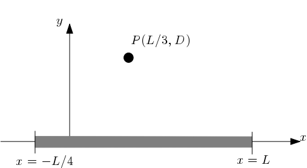
  <figcaption><b>Fig.24</b> - Integrate to Find Potential at a Point.</figcaption>
</figure>

Find an algebraic expression for the differential charge $\mathrm{d}q$ that resides in a differential length $\mathrm{d}x$ using the variable given.

> **Note:** The total length of the rod is $\frac{5}{4}L$.

$$\boxed{\mathrm{d}q = \frac{4Q}{5L}\mathrm{d}x}$$

Find algebraic expressions for the components of $\vec{r}$.

- $r_{x}=\frac{L}{3}-x$

- $r_{y} = D$

Figure out and write down the complete integral expression for the electric potential at point $P$.
$$\boxed{\int_{-L/4}^{L}\frac{4kQ}{5L}\frac{dx}{\sqrt{(x-L/3)^2+D^2}}}$$

##### Problem 5 Potential of a Nonuniform Cylinder

A long, solid cylinder with radius $a$ has a non-uniform volume charge density given by $\rho=B\sqrt{r}$, where $B$ has units of $\mathrm{C}/\mathrm{m}^{7/2}$.

Assuming the voltage is zero at the center of the cylinder, find a symbolic expression for the voltage at $r=a$.

$$\begin{align*}q_{\mathrm{encl}} &= 2\pi r\ell\cdot\int \rho \, \mathrm{d}V\\ &= \frac{2Br^{5/2}}{5} \cdot 2\pi\ell\end{align*}$$

$$\begin{align*}V_{a} &= \int_{0}^{a} \frac{q_{\mathrm{encl}}}{2\pi r \ell \cdot \varepsilon_{0}} \, \mathrm{d}r\\ &= \frac{2}{5}B \int_{0}^{a} r^{3/2} \, \mathrm{d}r \\ & = \boxed{-\frac{4Ba^{\frac{5}{2}}}{25\cdot \varepsilon_0}}\end{align*}$$

Assuming the voltage is zero at the center of the cylinder, find a symbolic expression for the potential at $r=3a$.

> **Note:** The form of the electric field in the region from $r=0$ to $r=a$ is different from the form of the field from $r=a$ to $r=3a$.

$$q_{\mathrm{encl}}=\frac{2Ba^{5/2}}{5} \cdot 2\pi\ell$$

$$\begin{align*}V_{r}& =\int_{a}^{3a}\frac{q_{\mathrm{encl}}}{2\pi r\ell} \, \mathrm{d}r+V_a\\&= -\frac{2Ba^{5/2}}{5\varepsilon}\int_{a}^{3a}\frac{1}{r} \, \mathrm{d}r-\frac{4Ba^{\frac{5}{2}}}{25\cdot \varepsilon_0}\\& = \boxed{\left(\frac{-2}{5\cdot \varepsilon_0}Ba^{\frac{5}{2}}\cdot \log\left(3\right)\right)-\left(\frac{4Ba^{\frac{5}{2}}}{25\cdot \varepsilon_0}\right)}\end{align*}$$

##### Problem 6: Potential at Center of Insulating Spherical Shell

The inner radius of a spherical insulating shell is $c = 13.6 ~\textrm{cm}$, and the outer radius is $d = 15.7 ~\textrm{cm}$. The shell carries a charge of $q = 3.3 \times 10^{-8} ~\mathrm{C}$, distributed uniformly through its volume. The goal of this problem is to determine the voltage at the center of the shell ($r=0$), assuming the voltage is zero infinitely far from the sphere. In order to do this, we will first determine the electric field everywhere in space due to this charge distribution, and then use the relationship between the electric field and the change in voltage to find the voltage at the center.

1. Find an algebraic expression for the charge density of the spherical shell using the variables given.

$$\rho=\frac{3q}{4\pi \left(d^3-c^3\right)}$$

2. Place a gaussian surface in the hollow, where $r<c$, and find the electric field there.

$$\boxed{E_{\text{center}} = 0~\frac{\mathrm{N}}{\mathrm{C}}}$$

3. Find an algebraic expression for the charge enclosed by a gaussian surface of radius $r$, such that $c < r < d$, again using the variables given.

$$\boxed{Q_{\mathrm{encl}}=\frac{q\cdot \left(r^3-c^3\right)}{\left(d^3-c^3\right)}}$$

4. Now apply Gauss's law to find an algebraic expression for the electric field at any radius $r$, such that $c < r < d$, again using the variables given.

$$\boxed{E_{c < r < d}=\frac{q\cdot \left(r^3-c^3\right)}{4\cdot \pi \cdot r^2\cdot \varepsilon_0\cdot \left(d^3-c^3\right)}}$$

5. Apply Gauss's law a third time to find an algebraic expression for the electric field at at any radius $r$, such that $r>d$, again using the variables given.

$$\boxed{E_{r>d}=\frac{q}{4\cdot \pi \cdot r^2\cdot \varepsilon_0}}$$

6. Apply the relationship between the change in electric potential and the electric field and the knowledge that the electric potential is zero at infinity, to find a numerical value for the electric potential at $r=d$.

$$\begin{align*}V_{d}&=-\int_{\infty}^{d}\frac{q}{4\pi r^{2}\varepsilon_{0}}\, \mathrm{d}r\\& = \frac{q}{4\pi \varepsilon_{0}} \left[\frac{1}{r}\right]_{\infty}^{d}\\&=\boxed{\frac{q}{4\pi \varepsilon_{0}d}}\end{align*}$$

7. Now apply the relationship between the change in electric potential and the electric field and the value of the electric potential at $r=d$, to find a numerical value for the electric potential at $r=c$. You'll need an expression for the E-field at any point between $c$ and $d$, since our integral spans that whole distance (you should already have found this expression earlier).

$$\begin{align*}V_{C}&=-\int_{d}^{c}\frac{q\cdot\left(r^{3}-c^{3}\right)}{4\cdot\pi\cdot r^{2}\cdot \varepsilon_{0}\cdot\left(d^{3}-c^{3}\right)}\, \mathrm{d}r+V_{d}\\& = \boxed{-\frac{q\left(3c^{2}d-2c^{3}-d^{3}\right)}{8\pi e_{0}d\left(-c^{3}+d^{3}\right)}+V_{d}}\end{align*}$$

8. Finally, apply the relationship between the change in electric potential and the electric field and the value of the electric potential at $r=c$, to find a numerical value for the electric potential at $r=0$.

$$\boxed{V_0 = \int 0 \, \mathrm{d}\vec{\ell} +V_{c}+V_{d}}$$

## Circuits

Topic IIA: Current and Resistance (Part 1 of 2)

### Topic IIA: Current and Resistance (Part 1 of 2)

#### Current

Current is the flow of electric charge through a cross-sectional area:

$$
I=\frac{\Delta Q}{\Delta t}
$$

**Units:** $1~\mathrm{A} = 1~\text{C}/\text{s}$ (Ampere)

- Number of charge carriers (electrons) per unit volume: $n$
- Wire of cross-sectional area $A$:
- Charge on each carrier: $q$
- Drift speed of each charge carrier: $v_d$
- Distance a charge travels in some time: $\ell=v_d \Delta t$
- Total charge that flows through that length, in that time:
  $$
  \Delta Q=n q A\left(v_d \Delta t\right)
  $$

**Current:** $$I=\frac{\Delta Q}{\Delta t}=n|q| A v_d$$

<figure align="center">
  
  <figcaption><b>Fig.25</b> - Wire of cross-sectional area A.</figcaption>
</figure>

#### Current Density $\vec{J}$

Current $I$ has some direction, but it is <i>not</i> a vector quantity

Current Density: $J= \frac{1}{A} = n|q|v_{d}$

- $\vec{J}$ can be a vector because it describes the current at one particular location in a circuit.
- Conventional Current: The direction of the flow of positive
  charges

#### Resistance

Pushing electrons across a less-than-perfect conductor takes effort.

<figure align="center">
  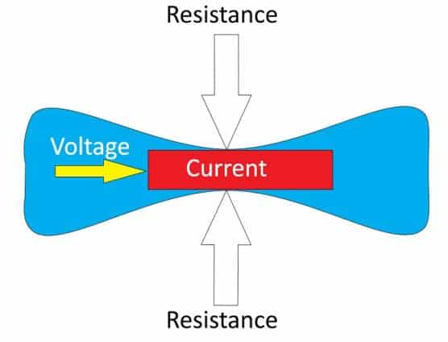
  <figcaption><b>Fig.26</b> - Resistance in a wire.</figcaption>
</figure>

**Resistance:** $R=\frac{V}{I}$ Units: ohm ($\Omega= 1~\mathrm{V}/\mathrm{A}$)

When the resistance does not depend on the voltage drop or the
current, it is said to be an ohmic material.

Ohm’s Law: $I=RV$, $R$ is constant.

#### Series and Parallel

Circuit elements that are in parallel are arranged so that they are guaranteed to always see the same voltage drop across them.

Circuit elements that are in series are arranged such that current through one of them must go through all of them.

<figure align="center">
  
  <figcaption><b>Fig.27</b> - Series and Parallel Circuits.</figcaption>
</figure>

**Resistors in Series**
Current is the same: $I_1=I_2=I_3$

$$R_{\text {eq, series }}=\sum_i R_i$$

Voltages add:

$$
\begin{aligned}
& V_{\text {tot }}=V_a-V_b=I R_1+I R_2+I R_3 \\
& =I\left(R_1+R_2+R_3\right) \\
& =I R_{\text {eq,series }}
\end{aligned}
$$

**Resistors in Parallel**

Voltages are the same: $V_1=V_2=V_3$

$$V \sum_i \frac{1}{R_i}=\frac{V}{R_{\text {eq,parallel }}} \longleftrightarrow \frac{1}{R_{\text {eq, parallel }}}=\sum_i \frac{1}{R_i}$$

$$ \begin{align*} I\_{\mathrm{tot}}&=I_1+I_2+I_3\\&=\frac{V}{R_1}+\frac{V}{R_2}+\frac{V}{R_3}\\&=V\left(\frac{1}{R_1}+\frac{1}{R_2}+\frac{1}{R_3}\right) \\ \end{align*}$$

##### Two Wires Discusssion

In Wire 1, the drift speed rises from $0$ at the edge $(r=R)$ to $v_{0}$ at the center $(r=0)$ according to $v_d(r) = v_0\left(1-\frac{r^2}{R^2}\right)$. Wire 2 has the same radius and charge carrier density but has a constant drift speed $$v_d(r) = fv_0$$. What is the ratio of the current carried by Wire 2 to the current carried by Wire 1?

$$q=1~e$$
$$I_{1} = \int_{0}^{R} n|q| v_0\left(1-\frac{r^2}{R^2}\right) 2\pi r \, \mathrm{d}r= 2\pi n q v_{0}\left(\frac{R^2}{2}-\frac{R^2}{4}\right)$$
$$I_{2} = n|q|v_{d} A$$

$$\frac{I_{2}}{I_{1}} = \frac{R^2 f}{\left(\frac{R^2}{2}-\frac{R^2}{4}\right)} = 2f$$

#### Topic IIA Homework

##### Problem 1 Two Wire Comparison

The diagram shows two wires: wire $1$ and wire $2$. The charge carriers in wire $1$ of circular cross section and radius $R$ have a drift speed down the wire that is not constant across the wire. Instead, the drift speed rises from zero at the outer edge $r = R$ to $v_0$ at the center ($r=0$), according to $v_d(r) = v_0(1-(r/R))$. The second wire (wire $2$) has the same radius, the same density of charge carriers and a constant drift speed given by $v_d(r) = fv_0$. Evaluate the ratio of the current carried by wire 2 to the current carried by wire 1, when $f = 0.495$.

<figure align="center">
  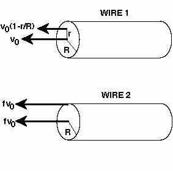
  <figcaption><b>Fig.28</b> - Charge in a wire.</figcaption>
</figure>

$$I_{1} = n|q|v_{d} A  = 2\pi R \cdot n q \cdot v_{0}f$$

$$I_{2} = \left(2\pi r \cdot n q\right)\int_{0}^{R} v_{d}(r) \, \mathrm{d}r = \left(2\pi \cdot n q v_{0}\right)\left(\frac{R^{2}}{2}-\frac{R^{3}}{3R}\right) $$

$$\frac{I_{1}}{I_{2}} = \frac{Rf}{\left(\frac{R^{2}}{2}-\frac{R^{3}}{3R}\right)} = \boxed{3f}$$

#### Topic IIA Studio

##### Problem 1: Series and Parallel Circuits

Consider the resistors in the following diagram, and decide whether they're in series or parallel with one another.

<figure align="center">
  
  <figcaption><b>Fig.31</b> -  Series and Parallel Circuits.</figcaption>
</figure>

1. Resistors $A$ and $B$ are in parallel.

2. Resistors $A$ and $C$ are neither in series or parallel.

3. If you package $A$ and $B$ up into one single object, it is in Series with $C$.

Now consider the resistors in a more complex diagram, and decide whether they're in series or parallel with one another.

<figure align="center">
  
  <figcaption><b>Fig.32</b> -  Series and Parallel Circuits.</figcaption>
</figure>

1. Resistors $A$ and $B$ are in Series

2. Resistors $D$ and $F$ are neither in series or parallel.

3. Resistors $E$ and $G$ are in Series.

4. Resistors $C$ and $D$ are in series or parallel.

5. Combine $C$, $E$, and $G$ into a single package. That package is in Parallel with $D$.

Let's take a look at one last circuit diagram.

<figure align="center">
  
  <figcaption><b>Fig.33</b> -  Series and Parallel Circuits.</figcaption>
</figure>

1. Resistors $A$ and $B$ are in parallel.

2. Resistors $B$ and $C$ are in parallel.

3. Resistors $A$ and $C$ are in parallel.

##### Problem 2: Simplifying Circuits

Calculate the total resistance of the circuit:

<figure align="center">
  
  <figcaption><b>Fig.34</b> -  Series and Parallel Circuits.</figcaption>
</figure>

$$R_{\text{total}}=\left(\frac{1}{R_{2}}+\frac{1}{R_{1}+R_{3}}\right)^{-1}+R_{4}+R_{5}$$

Topic IIB: Current and Resistance (Part 2 of 2)

### Topic IIB: Current and Resistance (Part 2 of 2)

#### Topic IIB Homework

##### Problem 1 Car Battery

A 12 Volt lead-acid car battery, engineered for "up to 500 or more charge/discharge cycles," has a rating of 95 Ampere-hours. A one Ampere-hour battery can provide one Amp of current for one hour. It sells for $126.

If initially fully charged, what is the total electrical energy that the battery can deliver before it needs to be recharged?

$$\text{Energy} = I \cdot t \cdot V = 95~\mathrm{A} \times 3,600 ~\mathrm{s} \cdot 12~\text{V} = \boxed{4.104\times 10^{6}\ {\mathrm{J}}}$$

The battery has a mass of $10.9 ~\mathrm{kg}$. What total mass of such batteries would be required to deliver the same effective mechanical energy as 16 gallons of gasoline? Assume that the efficiency of an electrically powered car is 2.5 times that of a gasoline-powered car for the conversion to mechanical energy, and that energy content of 1 gallon of gas is equivalent to $1.32\times 10^{8}$ Joules.

$$\boxed{\frac{16~{\text{gal}}}{1} \times \frac{1.32\times 10^{8}~{\mathrm{J}}}{1~{\text{gal}}} \times \frac{1~\text{electric J}}{2.5~\text{gasoline J}}\times \frac{10.9~{\mathrm{kg}}}{4.104\times 10^{6}\ {\mathrm{J}}}=2243.74269006~{\mathrm{kg}}}$$

##### Problem 2 Resistance Between Cylinders

The space between two metallic coaxial cylinders of length $L = 0.52 ~\mathrm{m}$ and radii $a = 1.5 ~\mathrm{cm}$ and $b = 2.8 ~\mathrm{cm}$ is completely filled with a material having a resistivity $\rho = 22~\Omega\cdot\mathrm{m}$. The figure below shows a cross section of the configuration.

<figure align="center">
  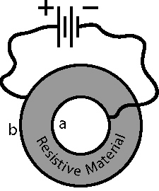
  <figcaption><b>Fig.29</b> - Resistance Between Cylinders.</figcaption>
</figure>

What is the resistance between the two cylinders?

$$R=\int_{a}^{b}\frac{\rho}{2\pi r\cdot L}dr= \boxed{\frac{\rho(\ln\left|b\right|-\ln\left|a\right|)}{2πL}}$$

Find the current between the two cylinders if a potential difference of $10$ Volts is maintained between the two cylinders.

$$I=\frac{V}{R}$$

##### Problem 3 Stretched Wire

A metal wire $l_i=7.5 ~\mathrm{m}$ long has a circular cross section of radius $r_i=0.22 ~\mathrm{mm}$ and an end-to-end resistance $R_i$ of 70 Ohms. The metal wire is then stretched uniformly so that its cross section is still circular but its total length is now $l_f=33.75 ~\mathrm{m}$. What is the resistance of the wire after stretching?

In the case of wire $R=\frac{\rho L}{\pi r^2}$, the wire has the same volume before and after it stretches where $\pi r_{i}^2 \ell_{i} = \pi r_{f}^2 \ell_{f}$.

$$\rho = \frac{R_{i}\pi r_{i}^{2}}{\ell_{i}}$$
$$\pi r_{f}^{2} = {A}_{f} = \frac{\ell_{i}\pi r_{i}^{2}}{\ell_{f}}$$

$$\begin{align*}R_{f}&=\frac{\frac{R_{i}\pi r_{i}^{2}}{\ell_{i}}\cdot \ell_{f}}{\frac{\ell_{i}\pi r_{i}^{2}}{\ell_{f}}}\\&=\frac{\ell_{f}}{\pi r_{i}^{2}\ell_{i}}\cdot\frac{R_{i}\pi r_{i}^{2}}{\ell_{i}}\ell_{f}\\&=\boxed{\frac{R_{i}\ell_{f}^{2}}{\ell_{i}^{2}}}\end{align*}$$

##### Problem 4 Three Resistors Three Batteries

The diagram below shows a circuit where $R_1=1 \Omega, R_2=3 \Omega$, $R_3=4 \Omega, V_1=6$ Volts, $V_2=5$ Volts, and $V_3=7$ Volts. What is the value of $I_1$ ? In solving this problem, initially pick the current directions as shown. If the actual current turns out to be in the opposite direction, then your answer will be negative. If you get a negative number, enter it as negative.

<figure align="center">
  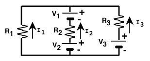
  <figcaption><b>Fig.30</b> - Three Resistors Three Batteries.</figcaption>
</figure>

**Loop rule**

Left to middle loop <i>(assume clockwise path)</i>
$$-I_1 R_1-V_1+R_2 I_2-V_2=0$$

Right to middle loop <i>(assuming clockwise path)</i>
$$V_2-I_2 R_2+V_1+R_3 I_3-V_3=0 $$

Left and right loop <i>(assuming clockwise path)</i>
$$-I_1 R_1+I_3 R_3-V_3=0$$

To find $I_1$ we are going to find $I_3$ and $I_2$ in terms of $I_1$ then substitute it in.

$$
\begin{aligned}
& \frac{V_3+I_1 R_1}{R_3}=I_3 \\
& \frac{V_2+V_1+I_1 R_1}{R_2}=I_2 \\
& I_1+\frac{V_3}{R_3}+\frac{I_1 R_1}{R_3}+\frac{V_2}{R_2}+\frac{V_1}{R_2}+\frac{I_1 R_1}{R_2}=0 \\
& I_1+\frac{I_1 R_1}{R_3}+\frac{I_1 R_1}{R_2}=-\frac{V_3}{R_3}-\frac{V_2}{R_2}-\frac{V_1}{R_2} \\
& I_1=\frac{-\frac{V_3}{R_3}-\frac{V_2}{R_2}-\frac{V_1}{R_2}}{\left(1+\frac{R_1}{R_3}+\frac{R_1}{R_2}\right)}
\end{aligned}
$$

#### Topic IIB Studio

##### Problem 4: Internal Resistance of a Battery

Batteries are not perfect. They can't deliver infinite current. As the current load on a battery gets larger, the voltage output gets smaller. We can represent this by treating batteries as if they have some small internal resistance.

The yellow box in the circuit below represents a battery, modeled as a perfect voltage source (indicated with $\mathcal{E}$) in series with a small resistor $r$ that represents the internal resistance. The battery is hooked up to a load resistor $R$, a voltmeter V (for measuring voltages), and an ammeter A (for measuring currents). Notice how the circuit we built compares.

When you put a measuring device on something, like a circuit, you don't want the measuring device to change the circuit. This means that ideal voltmeters have infinite resistance, and ideal ammeters have zero resistance. In reality, neither of these are true, but for this problem, and for all other problems unless you're told otherwise, we'll assume that our ammeters and voltmeters are ideal (they're pretty close).

For this problem, when the switch S is open, the voltmeter (V) reads $3.36~\mathrm{V}$. When the switch is closed, the voltmeter reading drops to $3.23~\mathrm{V}$ and the ammeter (A) reads $0.154~\mathrm{A}$.

Given the available information, what is the electromotive force of the battery?

$$\mathcal{E}=3.36~\mathrm{V}$$

What percent of the battery's electromotive force is actually reaching resistor $R$, the load resistor?

$$\frac{3.23~\mathrm{V}}{3.36~\mathrm{V}}\cdot 100 = 96.130952381\%$$

What is the internal resistance $r$ of the battery?

$$R_{\text{internal}}=\frac{V_{\text{total}}-V_{\text{loss}}}{0.154~\mathrm{A}}$$

What is the resistance $R$ of the load on the ciruit? The load resistor represents whatever appliance or device you've hooked up to the circuit.

$$R_{\text{load}}=\frac{3.36~\mathrm{V}}{0.154~\mathrm{A}}$$

How much power is being delivered to the load?

$$P=\frac{V_{\text{total}}^{2}}{R_{\text{load}}}$$

How much power is being lost to the internal resistance?

$$P_{\text{loss}}=\frac{\left(V_{\text{total}}-V_{\text{loss}}\right)^{2}}{R_{\text{internal}}}$$

As you've seen, not all of a battery's rated voltage makes it to the appliance that the battery is hooked up to. Qualitatively speaking, is this situation made worse, made better, or unaffected if we attach a bigger load resistor? That is, if we make $R$ bigger, does the amount of voltage lost to the internal resistance go up, go down, or stay the same?

> **Anwser:** The amount of voltage lost goes down

##### Problem 5: Kirchhoff Analysis

The circuit shown below is complex enough to require Kirchhoff's equations. This will be a step-by-step exercise in using Kirchhoff's Rules to analyze a circuit involving only resistors and direct-current voltage sources.

<figure align="center">
  
  <figcaption><b>Fig.31</b> - Three Resistors Three Batteries.</figcaption>
</figure>

Which of the listed equations is a valid junction equation for this circuit?

$$I_1 + I_2 + I_3 = 0$$

Your four equations should look like the following:

Junction on the left (EQ1): $I_1 + I_2 + I_3 = 0$

Outer Loop (EQ2): $-I_3 R_4 + I_1 R_2 + I_1 R_1 - V_2 = 0$

Bottom Inner Loop (EQ3): $-I_3 R_4 + I_2 R_3 - V_1 - V_2 = 0$

Top Inner Loop (EQ4): $I_1 R_2 + I_1 R_1 + V_1 - I_2 R_3= 0$

With the one junction equation and any two of the three loop equations, you now have 3 independent equations to use to solve the 3 unknown currents (i.e., solve for one thing in terms of another using one equation, then plug it into another equation, solve for another thing, then ... I think you get the picture).

To solve for $I_1$, you will need the following set of parameters:

- $V_1 = 8~\mathrm{V}$
- $V_2 = 26~\mathrm{V}$
- $R_1=50~\Omega$
- $R_2=350~\Omega$
- $R_3=250~\Omega$
- $R_4=900~\Omega$

$$I_{1}=\frac{\left(\frac{R_{3}V_{2}}{R_{4}}-V_{1}\right)}{\left(R_{3}+R_{2}+R_{1}+\frac{R_{3}}{R_{4}}\left(R_{1}+R_{2}\right)\right)}$$

$$I_{2}=\frac{I_{1}R_{2}+I_{1}R_{1}+V_{1}}{R_{3}}$$

$$I_{3}=-I_{1}-I_{2}$$

##### Problem 6: Circuit Segment

<figure align="center">
  
  <figcaption><b>Fig.32</b> - Circuit Segment.</figcaption>
</figure>

If a current $I=4~\mathrm{A}$ exists between points $a$ and $b$, $R_1=5~\Omega$, $R_2=7~\Omega$, $V_1=20~\mathrm{V}$,and $V_2=12~\mathrm{V}$, the voltage difference $V_a-V_b$ is

$$V_{a}-V_{b}=IR_{1}+V_{1}+IR_{2}-V_{2}$$

##### Problem 7: Graphical Analysis

The graph shows the current at a certain point in a circuit as a function of time. Calculate the charge that passed through that point from a time of 40 to 100 s.

<figure align="center">
  
  <figcaption><b>Fig.33</b> - Graphical Analysis.</figcaption>
</figure>

The function of the graph can be approximated by $f\left(x\right)=\sin\left(\frac{x}{1.5\pi}\right)+2$

$$\int_{40}^{100}f\left(x\right)\, \mathrm{d}x = 120.588909654~\mathrm{C}$$

##### Problem 8: Drift Velocity and Resistance

A wire with a uniform diameter of $1~\mathrm{mm}$ and a conduction electron density of $n = 8 \times 10^{27}$ per $\mathrm{m}^3$ carries a current of $4.1~\mathrm{A}$.

Find the drift speed of the electrons in the wire.

$$A=\pi r^{2}$$

$$v_{d}=\frac{I}{nqA}$$

If the Electric field in the wire is $20~\mathrm{V}/\mathrm{m}$
and it is $40.9 \ \mathrm{cm}$ long, what is its resistance? (You may assume that the wire is straight.)

$$V=20\cdot40.9\cdot10^{-2}$$

$$R=\frac{V}{I}$$

##### Problem 9 LED vs. Incandescent

LEDs (light-emitting diodes) are semiconductors which emit light due to the passage of current (a process known as electroluminescence). Incandescent bulbs consist of a filament, which emits light when it reaches a sufficiently high temperature (a process known as incandescence). LED's boast many advantages over incandescent light bulbs including lower energy use. Let's see if we can quantify some of these advantages.

A tungsten alloy filament of an incandescent bulb is approximately $0.57 \ \mathrm{m}$ long with a diameter of $0.047 \ \mathrm{mm}$. Calculate the resistance of this wire filament. (Take the electrical resistivity of the tungsten alloy as being $\rho=0.6877~\mu\Omega\cdot \mathrm{m}$.

$$R=\frac{\rho \ell}{A}$$

If the current through the filament is $I=0.5~\mathrm{A}$, calculate the voltage across the incandescent bulb.

$$V=IR$$

Given the voltage and current calculated, how much power is dissipated in the wire?

$$P=I^{2}R$$

Lumens are the SI unit of luminous flux, or the total amount of light emitted by a source. The light output rating for an incandescent bulb is 800 lumens. If we define luminous efficacy as the total luminous flux emitted per unit power of this source, calculate a value for luminous efficacy for this incandescent bulb.

$$\text{Luminous Efficacy} = \frac{800}{P}$$

An LED with the same light output rating as the above discussed incandescent bulb is rated at $P_2=7~\mathrm{W}$ for power. What is the luminous efficacy of the LED?

$$\text{Luminous Efficacy} = \frac{800}{P_2}$$

What is the ratio (for a set amount of time) of the energy used by this LED to the energy used by this incandescent bulb, both of which have an output of 800 lumens?
$$\text{Ratio}=\frac{7}{P}$$

#### Topic IIB Notes

- A circuit must be complete so that current can flow
  through all the elements
- Current that goes through one element in a series goes
  through every element
- The voltage across one element in parallel is the same
  across every element
- More current will be found along paths with less
  resistance

Resistors resist current flow

When charge travels from point $a$ to point $b$, the energy lost is given by:
$$\Delta U = \Delta Q\left(V_a-V_b\right)$$

The rate at which energy is lost is given by:

$$P=\frac{\Delta U}{\Delta t} = \frac{\Delta Q V_{\mathrm{ab}}}{\Delta t} = IV$$

In general, Power Lost / Gain: $P=IV$.

For ohmic resistors specifically:

$$P=IV = I^2R = \frac{V^2}{R }$$

For most materials $R=\frac{\rho L}{A}$.

- $L$ is the length of the wire
- $A$ is the cross-sectional area of the material ($\bot$ to the flow of charge)
- $\rho$ is the resistivity of the material $\left(\Omega\cdot \mathrm{m}\right)$

For most conductors $\rho = 1\times 10^{-8}$

For glass (insulator): $\rho = 10^{10}-10^{14}$

**Junction Rule:** Comes from Conservation of Charge. The sum of the currents into a junction must equal the sum of the currents out of a junction.

**Loop Rule:** Comes from Conservation of Energy. If you go around any closed loop in a circuit, the sum of the changes in potential must equal zero.

**Sign Conventions:**

- Cross a battery from the negative terminal to the positive terminal: Positive contribution

- Cross a resistor in the direction of positive current flow: Negative contribution

- Cross from the negative plate of the capacitor to the positive plate of a capacitor: Positive contribution

- And vice versa for all of the above

Topic IIC: Capacitance (Part 1 of 2)

### Topic IIC: Capacitance (Part 1 of 2)

#### Key Ideas from Topic IIC

**Capacitor:** A device with two distinct metal surfaces
(electrodes) separated by an insulator.
Each surface holds an equal but opposite amount of charge.

Capacitance is a measure of how many Coulombs of charge you can store per Volt you apply: $\mathrm{C}=\frac{\mathrm{Q}}{\mathrm{V}}$.

The unit for capacitance is the farad: $1~\mathrm{F} = 1~ \frac{\mathrm{C}}{\mathrm{V}}$

Capacitance is, by convention, always positive (since a capacitor will have both $+$ and $-$ charges)

A voltage source will push charges onto the plates until they reach a certain density. If the voltage source shuts off, the capacitor can provide current for a short time.

<figure align="center">
  
  <figcaption><b>Fig.34</b> - Capacitor Circuit.</figcaption>
</figure>

  <iframe src=
    "Topic_2C_VideoNotes.pdf" width="800" height="700">
  </iframe>

#### Topic IIC Homework

##### Problem 1: Move Plates Apart

A parallel-plate capacitor with plates of area $A =541 ~\mathrm{cm^2}$ is charged to a potential difference $\mathrm{V}$ and is then disconnected from the voltage source. When the plates are moved $d_f=7.93 ~\mathrm{mm}$ farther apart, the voltage between the plates increases by $V_f=120$ Volts.

What is the charge on the positive plate of the capacitor?

> **Note:** Convert units for $A$ and $d_f$: $\mathrm{cm^2} \times 10^{-4}=  \mathrm{m^2}$ and $\mathrm{mm} \times 10^{-3} = \mathrm{m}$.
> $$C=\frac{\varepsilon_0 \cdot A}{d_i}= \frac{Q}{V}$$

$$C_{\text{new}} = \frac{\varepsilon_0 \cdot A}{\underbrace{\left(d_i+\Delta d\right)}_{d_f}}= \frac{Q}{\underbrace{\left(V_i+\Delta V\right)}_{V_{f}}}$$
$$\boxed{Q = \frac{\varepsilon_0 \cdot A \cdot V_{f}}{d_f}}$$

How much does the energy stored in the capacitor increase due to the movement of the plates?

$$\Delta U = \left(V+\Delta V\right) - \frac{1}{2} QV = \boxed{\frac{1}{2}Q\Delta V}$$

##### Problem 2: Insulated Coaxial Cable

The diagram below depicts a cross section of coaxial conductor with an inner wire of diameter $d_i$ and an outer conducting sheath of inside diameter $d_{0}$, and some material placed in the space between the two wires. Suppose that you have a coaxial wire with $d_i = 2.75 ~\mathrm{mm}$ and $d_o = 6.95 ~\mathrm{mm}$, and we put polystyrene $(\kappa = 2.5)$ in the space between the two wires. If there is a potential of $1~\mathrm{kV}$ between the wires, how much energy is stored in a $\ell = 10~\mathrm{m}$ piece of cable?

<figure align="center">
  
  <figcaption><b>Fig.36</b> - Co-Axial Cable.</figcaption>
</figure>

$$\begin{align*}V&=-\int_{\frac{d_{i}}{2}}^{\frac{d_{o}}{2}}\frac{Q}{2\pi r \ell\varepsilon_{0}}\,\mathrm{d}r\\&=\frac{Q}{2\pi \ell \varepsilon_{0}}\ln\left(\frac{\frac{d_{o}}{2}}{\frac{d_{i}}{2}}\right)\\&=\frac{Q}{2\pi \ell \varepsilon_{0}}\ln\left(\frac{d_{o}}{d_{i}}\right)\end{align*}$$

> **Remember:** $C= \frac{V}{Q}$ and $C= \kappa C_{0}$

$$C=\kappa\cdot \left(\frac{2\pi \ell\varepsilon_{0}}{\ln\left(\frac{d_{o}}{d_{i}}\right)}\right)$$

$$U=\frac{1}{2}CV^{2}$$

##### Problem 3: Concentric Hollow Spheres

Derive an expression for the capacitance of two concentric hollow spherical conductors of radii $r$ and $R$. What value do you get for the capacitance when $r = 2 ~\mathrm{m}$ and $R=7.5~\mathrm{m}$?

$$\boxed{C=\frac{4\pi \varepsilon_{0}}{\left|\frac{1}{R}-\frac{1}{r}\right|}}$$

##### Problem 4: True or False

For all of the following, we're considering parallel plate capacitors. All of the following statements are <b><u>false</u></b>:

1. The charges on the two plates of a capacitor are equal in magnitude and sign.

2. Charge is stored in the dielectric medium between the plates of a capacitor.

3. Capacitance is the property of a device that enables it to store current.

4. Adding a dielectric between the plates of an isolated air-filled charged capacitor reduces the charge stored on the device.

5. The capacitance of a parallel plate capacitor depends on the charge stored on the plates.

#### Topic IIC Studio

#### Problem 1: Seven Resistor Equivalent

Find the equivalent resistance of the circuit as shown in the diagram below; where $R_1=1 \Omega, R_2=2 \Omega, R_3=2 \Omega, R_4=2 \Omega, R_5=1 \Omega, R_6=1 \Omega$, and $R_7=2 \Omega$. I suggest going in small steps: Find a couple resistors that are in series or parallel, and then replace them with their equivalent resistance. Then do that again, over and over, until you're all done.

<figure align="center">
  
  <figcaption><b>Fig.38</b> - Resistance Diagram.</figcaption>
</figure>

$$R_{67}=R_{6}+R_{7}$$

$$R_{34}=R_{3}+R_{4}$$

$$R_{2345}=R_{2}+\left(\frac{1}{R_{34}}+\frac{1}{R_{5}}\right)^{-1}$$

$$R_{\text{total}}=\left(\frac{1}{R_{1}}+\frac{1}{R_{67}}+\frac{1}{R_{2345}}\right)^{-1}$$

##### Problem 2: System of Capacitors

The figure shows a collection of capacitors, with $C_1=2 \mu ~\mathrm{F}, C_2=2 \mu F$, $C_3=1 \mu ~\mathrm{F}, C_4=10 \mu~\mathrm{F}, C_5=9 \mu ~\mathrm{F}$. The voltage difference between point $A$ and point $B$ is $V=15~\mathrm{V}$.

<figure align="center">
  
  <figcaption><b>Fig.39</b> -  System of Capacitors.</figcaption>
</figure>

What is the equivalent capacitance of $C_2$, $C_3$ and $C_4$?

$$C_{234}=\left(C_{2}+C_{3}+C_{4}\right)$$

What is the equivalent capacitance of the entire arrangement of capacitors?

$$C_{12345}=\left(\frac{1}{C_{234}}+\frac{1}{C_{1}}+\frac{1}{C_{5}}\right)^{-1}$$

What is the total charge stored by the entire arrangement of capacitors?

$$Q_{tot}=C_{12345}\cdot V$$

What is the charge stored by capacitor $C_1$?

$$C_1=C_{tot}$$

What is the charge stored by capacitor $C_5$?

$$C_1=C_{tot}$$

What is the charge stored by the combination of $C_2$, $C_3$ , and $C_4$?

$$C_{234}=C_{tot}$$

What is the voltage across the plates of $C_1$?

$$V_{1}=\frac{Q_{tot}}{C_{1}}$$

What is the voltage across the plates of $C_5$?

$$V_{5}=\frac{Q_{tot}}{C_{5}}$$

What is the voltage across the combination of $C_2$, $C_3$ , and $C_4$?

$$V_{234}=\frac{Q_{tot}}{C_{234}}$$

What is the energy stored in $C_1$?

$$U_{1}=\frac{1}{2}C_{1}V_{1}^{2}$$

What is the energy stored in $C_5$?

$$U_{5}=\frac{1}{2}C_{5}V_{5}^{2}$$

What is the total stored energy of the entire combination of capacitors?

$$U_{12345}=\frac{1}{2}C_{12345}V^{2}$$

What is the energy stored in the combination of $C_2$, $C_3$ , and $C_4$?

$$U_{234}=\frac{1}{2}C_{234}V_{234}^{2}$$

What is the voltage across $C_2$?

$$V_{2}=\frac{Q_{tot}}{C_{234}}$$

What is the voltage across $C_3$?

$$V_{3}=V_{2}$$

What is the voltage across $C_4$?

$$V_{4}=V_{2}$$

What is the charge stored on $C_2$?

$$Q_{2}=C_{2}V_{2}$$

What is the charge stored on $C_3$?
$$Q_{3}=C_{3}V_{3}$$

What is the charge stored on $C_4$?

$$Q_{4}=C_{4}V_{4}$$

What is the energy stored in $C_2$?
$$U_{2}=\frac{1}{2}C_{2}V_{2}^{2}$$

What is the energy stored in $C_3$?
$$U_{3}=\frac{1}{2}C_{3}V_{3}^{2}$$

What is the energy stored in $C_4$?
$$U_{4}=\frac{1}{2}C_{4}V_{4}^{2}$$

##### Problem 3: Capacitance Ratios

If you increase the charge on a parallel-plate capacitor by a factor of 3.2, and increase the plate separation by a factor of 8.1, by what factor does the energy stored in the capacitor change?

$$U=\frac{Q^2 \cdot d}{2\varepsilon_0 \cdot A}$$

$$U_{new} = \frac{(3.2\cdot Q)^2 \cdot (8.1 \cdot d)}{2\varepsilon_0 \cdot A}$$

$$\text{Ratio} = (3.2)^2 \cdot 8.1$$

##### Problem 4: Cylindrical Capacitor

In this activity, we're going to practice calculating capacitance. Instead of using two flat plates, we'll use two concentric cylindrical shells of outer radius $b$ and inner radius $a$. The capacitor has an overall length $L$.

Use Gauss's law to find an algebraic expression for the magnitude of the electric field at any arbitrary radius $r$ in the region of interest.

$$E_{r}=\frac{Q}{2\cdot \pi \cdot \varepsilon_{0}\cdot r\cdot L}$$

With the above in mind, find the magnitude of the difference in voltage between the two plates that resulted from this amount of charge.

$$\Delta V = \frac{Q}{2\pi \cdot \varepsilon_{0}\cdot L}\cdot \ln\left(\frac{b}{a}\right)$$

You now have everything you need to find an algebraic expression for the capacitance of two concentric cylinders (a surprisingly common configuration in real applications).

$$C_{yls} = \frac{\left(2\pi \cdot \varepsilon_{0}\cdot L\right)}{\ln\left(\frac{b}{a}\right)}$$

##### Problem 5: Single Sphere Capacitance

In this activity, you will calculate the capacitance of a single, isolated, conducting sphere of radius $R$. This is an extension of what we've done so far. Normally, when we speak of capacitors, we speak of two surfaces that hold equal and opposite charges. It's also possible to define a capacitance for a single object, since it acquires a voltage if you charge it.

Sketch the sphere, and give it a radius of $R$. Assuming a charge $Q$ on the sphere, use Gauss's law to find an algebraic expression for the magnitude of the electric field at any arbitrary radius $r$ outside of the sphere. Assume the sphere is surrounded by vacuum.

$$E_{r}=\frac{Q}{\varepsilon_{0}\cdot 4\pi \cdot r^2}$$

Now that you know where the two electrodes are located, you can integrate the electric field from one electrode to the other to find the potential difference between these electrodes. Input your algebraic expression for the magnitude of the potential difference below.

$$\Delta V = \frac{Q}{4\pi \cdot \varepsilon_{0}\cdot R}$$

You now have everything you need to find an algebraic expression for the capacitance of a single sphere.

$$C_{\text{sphere}}= 4\pi \cdot \varepsilon_{0}\cdot R$$

Now, assume the sphere is surrounded by an insulating material other than vacuum.

For this problem, let's pretend the material is inhomogenous, so that $\kappa$ varies with radius via $\kappa=k_0\textrm{e}^{ar}/r^2$. Use Gauss's law again to find an algebraic expression for the magnitude of the electric field at any arbitrary radius $r$ outside of the sphere under these conditions.

$$E_{r}=\frac{Q}{k_0\cdot \varepsilon_{0}\cdot 4\pi \cdot e^{ar}}$$

What is the magnitude of the potential difference between the electrodes under these conditions?

$$\Delta V = \frac{Q}{k_0\cdot \varepsilon_{0}\cdot 4\pi }\left(\frac{1}{ae^{aR}}\right)$$

What is the capacitance of the sphere under these conditions?

$$C_{\text{sphere}} = k_0\cdot \varepsilon_{0}\cdot 4\pi \left(ae^{aR}\right)$$

Use what you've learned above to calculate the capacitance of two concentric spheres with radii 76 cm and 342 cm, assuming the space between them is filled with the insulating material described above, such that $k_0=4.5 \ \textrm{m}^2$ and $a=0.6 \ \textrm{m}^{-1}$.

$$C_{\text{shell}}=4\pi\cdot k_{0}\varepsilon_{0}\cdot\left(\frac{e^{-ar}-e^{-aR}}{a}\right)^{-1}$$

##### Problem 6 Max Voltage on Capacitor System

Five capacitors are connected across a potential difference $V_{ab}$
as shown below. Because of the materials used, any individual capacitor will break down if the potential across it exceeds $30.0~\mathrm{V}$.

 <figure align="center">
  
  <figcaption><b>Fig.40</b> -  Max Voltage on Capacitor System.</figcaption>
</figure>

We'd like to find the largest total voltage $V_{ab}$ that can be applied without damaging any of the capacitors.

To do this, we can start by identifying the maximum charge allowed on each capacitor. So given that these capacitors are connected in series, what is the maximum charge that won't lead to breakdown?

$$Q_{\text{max}} = 5.0\mu~\mathrm{F} \cdot 30.0~\mathrm{V}$$

What is the equivalent capacitance of this system of capacitors?
$$C_{eq}=\left(\frac{1}{15}+\frac{1}{45}+\frac{1}{5}+\frac{1}{10}+\frac{1}{25}\right)^{-1}\times 10^{-6}$$

Finally, what is the maximum voltage that can be connected to this system of capacitors without any one of them breaking down?

$$V_{\text{max}} = \frac{Q_{\text{max}}}{C_{eq}}$$

##### Problem 7: Complex Kirchhoff with Charged Capacitor

The circuit shown below should look a bit familiar to you. However, instead of 2 direct-current voltages sources, we have replaced one of them with a capacitor. How will this change the circuit analysis? Let's once again take it step-by-step, using Kirchhoff's Rules, to find the currents and voltage across the capacitor.

 <figure align="center">
  
  <figcaption><b>Fig.40</b> -  Max Voltage on Capacitor System.</figcaption>
</figure>

- Junction on the left (EQ1): $I_1+I_2+I_3=0$
- Outer Loop (EQ2): $-I_3 R_4+I_1 R_2+I_1 R_1-V=0$
- Bottom Inner Loop (EQ3): $-I_3 R_4+I_2 R_3+V_C-V=0$
- Top Inner Loop (EQ4): $I_1 R_2+I_1 R_1-V_C-I_2 R_3=0$

$$I=\frac{V}{R_{4}+R_{2}+R_{1}}$$

Now you can solve for $V_C$.
$$V_{C}=I\left(R_{2}+R_{1}\right)$$

Topic IID: Capacitance (Part 2 of 2)

### Topic IID: Capacitance (Part 2 of 2)

#### Topic IID Homework

##### Problem 1: Two Dielectrics

A really big capacitor made of of two plates of area $A = 16.9 ~\mathrm{m}^2$ is filled with two slabs of dielectric material. The dielectric constants are $\kappa_{1} = 2$ and $\kappa_{2} = 6.3$, respectively. The separation between the plates is $d = 0.17 ~\mathrm{m}$. What is the total capacitance?

<figure align="center">
  
  <figcaption><b>Fig.37</b> - Two Dielectrics.</figcaption>
</figure>

$$d_{1}=d_{2}= \frac{d}{2}$$

$$C_{\text{plate}} = \frac{\varepsilon_{0}A}{d}$$

$$C_{\text{total}} = \left(\frac{1}{C_1}+\frac{1}{C_2}\right)^{-1}$$

$$\boxed{C_{\text{total}}=\frac{\kappa_{1}\kappa_{2}\varepsilon_{0}^{2}A}{\kappa_{1}\varepsilon_{0}d_{1}+\kappa_{2}\varepsilon_{0}d_{2}}}$$

##### Problem 2: Rearrange Capacitors

Two capacitors $C_1 = 5.3\mu~\mathrm{F}$ and $C_2 = 10.9~\mu~\mathrm{F}$ are connected in series across a 13-Volt battery. They are carefully disconnected so that they are not discharged and are reconnected to each other (but not the battery) in parallel with positive plate to positive plate and negative plate to negative plate.

Find the charge on $C_1$ after the capacitors are reconnected.

> The capacitors in this problem are initially in series hence $Q$ is constant and $V$ is variable. $Q_{T,i} = Q_{1}=Q_{2}$ and $V_{T,i}=V_{1}+V_{2}$.

$$C_{T,i} = \left(\frac{1}{C_{1}}+\frac{1}{C_{2}}\right)^{-1} = \frac{Q_{T,i}}{|\Delta V_{T,i}|}$$

$$Q_{T,i} = \frac{|\Delta V_{T,i}|}{\left(\frac{1}{C_{1}}+\frac{1}{C_{2}}\right)}$$

$$V_{1} =\frac{C_{1}}{Q_{T,i}} \quad \text{and} \quad V_{2} =\frac{C_{2}}{Q_{T,i}}$$

> In the final state, capacitors of this problem are in parallel hence $V$ is constant and $Q$ is variable. $Q_{T,f} = Q_{1}+Q_{2}$ and $V_{T,f} = V_{1}=V_{2}$.

$$Q_{T,f} = Q_{1}+Q_{2} = 2Q_{T,i}$$

$$C_{T,f} = \frac{Q_{T,f}}{V_{T,f}} = \frac{2Q_{T,i}}{V_{T,f}}$$

$$V_{T,f} = \frac{2Q_{T,i}}{C_{T,f}} = \frac{2Q_{i}}{C_{1}+C_2}$$

$$C_{1} = \frac{Q_1}{V_1} = \frac{Q_{1}}{V_{T,f}}$$

$$Q_1 = C_{1}V_{T,f} = \frac{2Q_{T,i}C_{1}}{C_{1}+C_{2}} = \boxed{\frac{2V_{T,f} \cdot C_1}{\left(\frac{1}{C_{1}}+\frac{1}{C_{2}}\right)\left(C_1+C_2\right)}}$$

Find the final energy stored in $C_1$.

$$\boxed{U_{1}=\frac{1}{2}\frac{Q_{1}^{2}}{C_{1}}}$$

##### Problem 3: Insert Dielectric

Two identical capacitors $C_a$ and $C_b$ each of capacitance $7.25 \mu~\mathrm{F}$ are connected in parallel across a <u>constant</u> total electric potential difference $V = 690~\mathrm{V}$. A dielectric slab of dielectric constant $\kappa = 2.3$ can fill $C_{a}$ and is slowly inserted into that capacitor.

What is the change in charge, $\Delta Q_{a}$, on $C_{a}$ when the dielectric is added to $C_{a}$?

$$\boxed{\Delta Q_{a} = \kappa C_{a} V - C_{a}V}$$

What is the change in charge, $\Delta Q_{b}$, on $C_{b}$ when the dielectric is added to $C_{a}$?

$$\boxed{\Delta Q_{b} = 0~\mathrm{C}}$$

##### Problem 4: More True or False

Consider two oppositely charged, isolated parallel plates separated by distance $D$, with capacitance $C$, charge $Q$, and stored energy $U$. $D$ is small compared to the dimensions of the plates. The following are <b><u>true</u></b>:

1. When $D$ is doubled, $U$ increases.
2. Increasing $D$ leaves the electric field unchanged.
3. When $D$ is halved, $Q$ stays the same.

#### Topic IID Studio

##### Problem 3: Dielectrics Top and Bottom

A capacitor consisting of two parallel plates of area $A = 18.8 ~\mathrm{m}^2$ and spacing $d = 0.11 ~\mathrm{m}$ is filled with two parallel slabs of dielectric material of equal thickness and with dielectric constants
$\kappa_{1} = 1.7$ and $\kappa_{2} = 5.2$, respectively. Find the total capacitance.

<figure align="center">
  
  <figcaption><b>Fig.37</b> - Two Dielectrics.</figcaption>
</figure>

$$\frac{d}{2} = d_{1}=d_{2}$$

$$C_{1}=\frac{\kappa_{1}\varepsilon_{0}A}{d_{1}} \quad \text{and} \quad C_{2}=\frac{\kappa_{2}\varepsilon_{0}A}{d_{2}}$$

$$C_{\text{total}}=\left(\frac{1}{C_{1}}+\frac{1}{C_{2}}\right)^{-1}$$

$$\boxed{C_{\text{total}}=\frac{\kappa_{1}\kappa_{2}\varepsilon_{0}^{2}A}{\kappa_{1}\varepsilon_{0}d_{1}+\kappa_{2}\varepsilon_{0}d_{2}}}$$

###### Problem 4: Dielectrics Side by Side

A parallel plate capacitor with total plate area $A$ has the space between the plates filled with two slabs of dielectric, one with constant $K_{1}$ and one with constant $K_{2}$, as shown in the figure below. The thickness of each slab is the same as the plate separation $d$, and each slab fills half of the volume between the plates. Find the capacitance of this capacitor.

<figure align="center">
  
  <figcaption><b>Fig.38</b> - Dielectrics Side by Side.</figcaption>
</figure>

$$\boxed{C=\frac{\varepsilon_0 A}{2d}\left(K_1+K_2\right)}$$

##### Problem 5: Dielectric Energy Storage

Let's start with a capacitor with capacitance $C=3.5~\mathrm{F}$ hooked up to a $V=6~\mathrm{V}$ battery.

What is the initial amount of charge that can be stored in this system?

$$\boxed{Q_{i}=CV}$$

What is the initial amount of potential energy that can be stored in this system?

$$\boxed{U_{i}=\frac{1}{2}CV^{2}}$$

Now we carefully disconnect the battery, then insert into the capacitor a dielectric material made of Styrofoam with dielectric constant $\kappa = 1.03$. What is the energy stored in the capacitor now?

$$\boxed{U_{f}=\frac{U_{i}}{\kappa}}$$

We know that the difference in the energy stored in the capacitor went into polarizing the dielectric material, creating a secondary electric field that reduces the original electric field in between the capacitor plates. So it would seem that the system now stores less energy. Now lets hook this capacitor & dielectric system to a light bulb and light it up by discharging the total energy. What is the total energy discharged through lighting the light bulb?

$$U_{\text{total}} = U_{i}$$

##### Problem 6: Energy in a Capacitor Proportionality

If the area of the plates of a parallel plate capacitor is halved, and the separation between the plates tripled, all while the charge on the capacitor remains constant, then by what factor does the electric field potential energy stored in the capacitor change?

- Increase by a factor of 6

##### Problem 7: Cardiac Defibrillator

A cardiac defibrillator can be used to help an erratic heartbeat return to a regular pattern. A defibrillator contains a capacitor charged to a voltage of $V=6000~\mathrm{V}$ with an energy storage of $U=250~\mathrm{J}$. Calculate the capacitance of the capacitor.

$$\boxed{C=\frac{2U}{V^{2}}}$$

##### Problem 8: Coaxial Cable with Dielectric Insulation

A commonly used coaxial cable connecting the video components of your home entertainment system is the `RC-6`. It has an inner copper conductor with radius of $r_{i}=0.88~\mathrm{mm}$ and an outer conductor with radius of $r_{0}=5~\mathrm{mm}$. The inner and outer conductors are separated by a styrofoam insulation whose dielectric constant is $\kappa = 1.03$. You can treat this cable as a cylindrical capacitor. If the cable that you're using is $\ell = 6~\mathrm{m}$ in length, what is its capacitance (in Farads)?

$$\boxed{C=\kappa\left|\left(\frac{2\pi \ell \varepsilon_{0}}{\ln\left(\frac{r_{o}}{r_{i}}\right)}\right)\right|}$$

##### Problem 9: Spherical Shells with a Dielectric

We've learned a general procedure for figuring out the capacitance of an arbitrary object. Consider two concentric metal spheres, of inner and outer radius $a = 1.1~\mathrm{m}$ and $b = 2.0~\mathrm{m}$, respectively. The space between the spheres is filled by a kind of plastic with dielectric constant $\kappa = 3.7$. What is the capacitance of this object?

$$\boxed{C=\kappa\left|\left(\frac{4\pi \varepsilon_{0}}{\frac{1}{b}-\frac{1}{a}}\right)\right|}$$

##### Problem 10: Insert Dielectric

Two identical capacitors $C_a$ and $C_b$ each of capacitance $7.65\mu~\mathrm{F}$
are connected in series across a <u>fixed</u> total potential of $450~\mathrm{V}$. A dielectric slab of dielectric constant $\kappa = 4.05$ can fill $C_a$ and is slowly inserted into that capacitor.

What is the change in charge, $\Delta Q_{a}$, on $C_{a}$ when the dielectric is added to $C_{a}$?

$$\boxed{\Delta Q_{a}=\left(\frac{1}{\kappa C_{a}}+\frac{1}{C_{b}}\right)^{-1}V-\left(\frac{1}{C_{a}}+\frac{1}{C_{b}}\right)^{-1}V}$$

What is the change in charge, $\Delta Q_{b}$, on $C_{b}$ when the dielectric is added to $C_{a}$?

$$\boxed{\Delta Q_{b}=\Delta Q_{a}}$$

  

Topic IIE: RC Circuits

### Topic IIE: RC Circuits

#### Topic IIE Homework

##### Problem 1: RC Switching

Consider the RC circuit in the figure below. The switch was at position a for a long period of time and is switched to position $b$ at time $t = 0$.

<figure align="center">
  
  <figcaption><b>Fig.39</b> -  RC Switching.</figcaption>
</figure>

The following are <b>true</b> statements that represents the circuit above:

- While the switch is at $a$ (having been at $a$ for a while), the current 'through' the capacitor is zero.

- The current through the resistor and the current 'through' the capacitor are always the same.

- If the switch has been at $a$ for a while and we then switch it to $b$, the current through the resistor as a function of time will look like an exponential decay.

- Immediately after the switch is moved to $b$, the voltage across the capacitor is not zero.

Suppose $R=442~\Omega$, $C=4.9\mu~\mathrm{C}$, and $V_{b} = 4.6~\mathrm{V}$. What will be the voltage drop across the resistor at $t=1.8~\mathrm{ms}$?

$$I_{0}=\frac{V_{b}}{R}$$

$$I_{f}=I_{0}e^{-\frac{t}{RC}}$$

$$\boxed{V_{r}=I_{f}R}$$

How much energy in total will eventually be dissipated by the resistor?

> **Explanation:** In the circuit equation $0 = V_T - V_C - V_R$, where $V_T$ is the total voltage, $V_C$ is the voltage across the capacitor, and $V_R$ is the voltage across the resistor, it can be observed that as the resistor loses voltage, the capacitor gains voltage. This signifies that while the resistor dissipates energy, the capacitor stores energy. Ultimately, they will reach a state of equilibrium where their energies are equal.

$$\boxed{U=\frac{1}{2}C\left(V_{b}\right)^{2}}$$

Now suppose that the switch has been at position b for a long time and is switched to position a at $t = 0~\mathrm{s}$. What will be the voltage drop across the capacitor after $t=1.8~\mathrm{ms}$?

> **Explanation:** The equation is $V_{t,C} = V_T - V_{t,\text{resistor}}$. If the time is consistent, you can directly subtract the previously found voltage across the resistor from the total voltage to obtain the voltage across the capacitor. However, if the time is not the same, you can utilize the formula $\boxed{V_{t,C} = V_T (1 - e^{-\frac{t}{RC}})}$. This indicates that the capacitor is gaining voltage as it accumulates charge.

##### Problem 2: Resistor Capacitor Circuit

The diagram below depicts an RC circuit where $C = 8.35 \mu~\mathrm{F}$, $R_0 = 27.5~ \Omega$,$R_1 = 15~\Omega$, $R_2 = 10~\Omega$, and $V_{T} = 8$ Volts. The capacitor is initially uncharged.

<figure align="center">
  
  <figcaption><b>Fig.41</b> -Resistor Capacitor Circuit.</figcaption>
</figure>

What is the current through $R_1$ and $R_2$ immediately after the switch $S$ is closed?

> **Note:** Initially, when the switch $S$ is closed, the capacitor behaves like a wire with zero resistance.

**Junction Rule**

- $$I_{0}=I_{1}+I_{2}$$

**Loop Rule**

- $$I_1R_1-I_2R_2 = 0$$
- $$V-I_0R_0-I_1R_1$$

Solving the following equations:

$$I_1 = \frac{V}{\left(1+\frac{R_{1}}{R_{2}}\right)R_0+R_1}$$

$$I_2 = I_1\left(R_1+R_2\right)$$

Different Approach:

$$R_{T}=R_{0}+\left(\frac{1}{R_{1}}+\frac{1}{R_{2}}\right)^{-1}$$

$$I_{0}=I_{1}+I_{2}=\frac{V_{T}}{R_{T}}$$

$$V_{0}=I_{0}R_{0}$$

$$V_{1~\text{and}~2}=V_{T}-V_{0}$$

$$\boxed{I_{1}=\frac{V_{1}}{R_{1}} \quad \text{and}\quad I_{2}=\frac{V_{2}}{R_{2}}}$$

What is the current through the capacitor immediately after the switch $S$ is closed?

$$\boxed{I_{\text{capacitor}}=I_2}$$

> **Note:** This is a basic circuit problem demonstrating the behavior of capacitors within a circuit. We will analyze the immediate current $(I)$ through all components $(R_1, R_2, C)$. The capacitor initially behaves like a wire and will carry the same current as $R_2$.

What is the current through $R_1$ after the switch $S$ has been closed for a very long time? Assume that the battery does not go dead.

$$\boxed{I=\frac{V_{T}}{R_{0}+R_{1}}}$$

What is the current through $R_2$ after the switch $S$ has been closed for a very long time? Assume that the battery does not go dead.

> **Anwser:** In the steady state, after the switch $S$ has been closed for a long time, the capacitor acts like an open circuit. Therefore, the circuit simplifies to only include $R_0$ and $R_1$ in series. As a result, there is no current flowing through $R_2$ since it is effectively disconnected from the circuit.

##### Problem 3: Kirchoff Equations

<figure align="center">
  
  <figcaption><b>Fig.41</b> - Kirchoff Equations.</figcaption>
</figure>

The following are the Kirchoff equations are correct for the following diagram above:

1. $$i_1 - i_2 - i_3 = 0$$
2. $$E_1 - i_1 R_1 - i_3 R_3 - E_3 = 0$$

##### Problem 4: Computer Power Supply

What is the smallest capacitor needed in a computer power supply in order to produce at least $3.7~\mathrm{V}$ for $t=0.42~\mathrm{s}$ after the power goes off? Assume that the resistance of all the components of the computer motherboard is $R=6~\Omega$ and that the capacitor and motherboard are powered with a $V=5~\mathrm{V}$ power supply.

> **Soulution:** The requirement for "at least 3.7 V" means that at $t = 0.75$ seconds, we aim for a voltage of $3.7$ volts. Representing the voltage we desire at any time $t$ as $V_t$, and the initial voltage of the power supply as $V_0$, we use the formula $V_t = V_0 \cdot e^{-\frac{t}{RC}}$ to model the voltage decay over time.As the components of the computer discharge, the voltage decreases as the capacitor releases diminishing current.

$$\boxed{C=\frac{-t}{R\ln\left(\frac{V_{T}}{V_{0}}\right)}}$$

#### Key Ideas from Topic IIE

At time $t = 0$ in an RC circuit, which involves a resistor ($R$) and a capacitor ($C$), after the switch has been thrown and the electric field has been established in the circuit, when the rate of change of charge with respect to time $\left(\frac{\mathrm{d}Q}{\mathrm{d}t}\right)>0$. In RC circuits:

- We can charge a capacitor with a voltage source by connecting it to the circuit.

- Later, we can utilize that charged capacitor to provide a current for a certain period.

- These processes and behaviors can be analyzed and understood mathematically through the principles of circuit theory and differential equations governing the behavior of capacitors and resistors in such circuits.

##### Three Main Points

1. In an RC circuit, for quantities that are going from some high value
   to a lower value, then they follow behavior:
   $$Q(t)=Q_{\text{initial}} e^{-\frac{t}{RC}}$$

2. In an RC circuit, for quantities that are starting at zero and then
   increasing to a final value, then they follow behavior:
   $$Q(t)=Q_{\text{final}} \left(1-e^{-\frac{t}{RC}}\right)$$

3. An <u>uncharged capacitor</u> acts like a short circuit (a wire) for a
   moment. A <u>fully charged</u> capacitor acts like an open circuit (a
   break).

##### Discharge

Let's clarify the expression:

Starting with the differential equation:

$$\frac{dQ}{dt}=-\frac{Q}{RC}$$

This equation represents the relationship between the charge $Q$ and time $t$ in an RC circuit, where RC is the product of resistance $R$ and capacitance $C$, known as the time constant.

By integrating both sides:

$$\int_{Q_o}^{Q_f} \frac{dQ}{Q} = \int_0^{t_f} -\frac{dt}{RC}$$

We obtain:

$$\ln \left(\frac{Q_f}{Q_o}\right) = -\frac{t_f}{RC}$$

This simplifies to:

$$\frac{Q_f}{Q_o} = e^{-\frac{t_f}{RC}}$$

Which further simplifies to:

$$Q = Q_o e^{-\frac{t_f}{RC}} = Q_o e^{-\frac{t_f}{\tau}}$$

Here, $\tau = RC$ is the time constant for the RC circuit.

The current $(I)$ can be expressed as the derivative of charge with respect to time:

$$I = -\frac{dQ}{dt} = -Q_o \left(-\frac{1}{\tau}\right) e^{-\frac{t}{\tau}} = \frac{Q_o}{RC} e^{-\frac{t}{\tau}}$$

Which simplifies to:

$$I = I_o e^{-\frac{t}{\tau}}$$

##### Charge

- At time $t = 0$:

$$
\begin{aligned}
& \text{Initial conditions:} \quad Q = 0, \quad V_{o, \text{capacitor}} = 0 \\
& \text{Current and voltage across resistor:} \quad I = I_o, \quad V_{o, \text{resistor}} = I_o R \\
& \text{Initial loop equation:} \quad \varepsilon = I_o R \quad \Rightarrow \quad I_o = \frac{\varepsilon}{R}
\end{aligned}
$$

- At time $t = \infty$:

$$
\begin{aligned}
& \text{Final conditions:} \quad I = 0, \quad V_{f, \text{resistor}} = 0 \\
& \text{Final voltage across capacitor:} \quad V_{f, \text{capacitor}} = \frac{Q_f}{C} = \varepsilon \\
& \text{Final charge:} \quad Q_f = \varepsilon C
\end{aligned}
$$

Applying Kirchhoff's law: $\varepsilon - IR - \frac{Q}{C} = 0$, we derive the differential equation:

$$
\begin{aligned}
& \frac{dt}{RC} = \frac{dQ}{C\varepsilon - Q} \\
& \int_0^t \frac{dt}{RC} = \int_0^{Q_f} \frac{dQ}{C\varepsilon - Q} \quad \Rightarrow \quad \frac{t}{RC} = \ln\left(\frac{C\varepsilon}{C\varepsilon - Q}\right) \\
& e^{\frac{t}{\tau}} = \frac{C\varepsilon}{C\varepsilon - Q}
\end{aligned}
$$

Solving for $Q$:

$$
\begin{aligned}
(C\varepsilon - Q) e^{-\frac{t}{\tau}} &= \frac{C\varepsilon}{C\varepsilon - Q} e^{-\frac{t}{\tau}}(C\varepsilon - Q) \\
(C\varepsilon - Q) &= C\varepsilon e^{-\frac{t}{\tau}} \\
Q &= C\varepsilon\left(1 - e^{-\frac{t}{\tau}}\right) = Q_f\left(1 - e^{-\frac{t}{\tau}}\right)
\end{aligned}
$$

The current is given by:

$$
\begin{aligned}
I &= \frac{dQ}{dt} \\
&= -\frac{1}{RC}(-C\varepsilon) e^{-\frac{t}{RC}} \\
&= I_o e^{-\frac{t}{RC}}
\end{aligned}
$$

Topic IIF: AC Circuits

### Topic IIF: AC Circuits

Most circuits so far used Direct Current (DC)

- DC conditions are common in digital electronics

- DC provides a steady voltage

Many applications use Alternating Current (AC)

- This is the kind of electricity that comes out of the wall

- AC provides an oscillating voltage and current

- AC is very easy to generate, and works naturally with transformers

We describe AC signals with two parameters

Frequency: $\omega = 2\pi f$; Units for $f$: cycles/second, $\mathrm{s}^{-1}$, Hz

Amplitude: $I_0$ or $V_0$

Example: $V_{0}(t)=V_{0}\cos\left(\omega t\right)$

$V=IR \leadsto I(t)=\frac{V(t)}{R} \leadsto I(t)=I\left(t\right)=\frac{V_{0}}{R}\cos\left(\omega t\right) = I_{0}\cos\left(\omega t\right)$

#### Root-Mean-Square Value

For current:
$$
\begin{aligned}
I_{\text {rms }} & =\sqrt{\left(I^2\right)_{\text {mean }}} \quad\left(I^2\right)_{\text {mean }}=\left(I_{\text {peak }}^2 \cos ^2 \omega t\right)_{\text {mean }}=\frac{1}{2} I_{\text {peak }}^2 \\
& =\frac{1}{\sqrt{2}} I_{\text {peak }}
\end{aligned}
$$

In general, the rms value of any quantity that varies with time as a sinusoidal function is equal to its peak value divided by $\sqrt{2}$

In fact, the expressions that we had for resistor circuits are pretty much still the same:
$$
\begin{aligned}
P=I \varepsilon & \Rightarrow P_{\text {mean }}=I_{\mathrm{rms}} \varepsilon_{\mathrm{rms}} \\
P=I^2 R & \Rightarrow P_{\text {mean }}=\left(I_{\mathrm{rms}}\right)^2 R \\
V=I R & \Rightarrow V_{\mathrm{rms}}=I_{\mathrm{rms}} R
\end{aligned}
$$

#### Capacitors in AC circuits

With low-frequency (DC-like) input, capacitors prevent current flow. With high-frequency input, the capacitor charges and discharges quickly, letting current “through”. Capacitors block low frequency currents, and allow high
frequency currents to pass through

Example: $V_{0}(t)=V_{0}\cos\left(\omega t\right)$

$$\begin{aligned}
&I=\frac{d Q}{d t} \quad V=\frac{Q}{C} \Rightarrow Q=V C\\
&I(t)=V_0 C \frac{d}{d t} \cos (\omega t)=-V_0 C \omega \sin (\omega t) \Rightarrow I_0=V_0 \omega C
\end{aligned}$$

$$\begin{aligned}
& I_0=V_0 \omega C \\
& V_0=I_0 \frac{1}{\omega C} \\
& V_0=I_0 R
\end{aligned}$$

$$''R''=\frac{1}{\omega C}=X$$

The quantity $X$ plays the role of resistance.
We call it reactance.
$\mathrm{X}$ is large for small $\omega$ and small for large $\omega$

#### RC circuits with AC

Voltages across $R$ and $C$ are not necessarily in phase; we can’t add $R$ to $X$.

$$
Z=\sqrt{R^2+X^2}=\sqrt{R^2+\frac{1}{(\omega C)^2}}
$$

The rms current through the circuit comes from:

$$V_{\text{rms, in}}=I_{\text{rms}} Z$$

The rms voltage drop across $C$ comes from:

$$
\begin{align*}
V_{\text{rms, }C} &= I_{\text{rms, }C} X_C \\
&= \frac{V_{\text{rms, in}} \cdot \frac{1}{(\omega C)}}{\sqrt{R^2+\frac{1}{(\omega C)^2}}} \\
&= \frac{V_{\text{rms, in}}}{\sqrt{\omega^2 R^2 C^2+1}}
\end{align*}
$$

This is a low-pass filter. Low frequency signals are transmitted, and high frequency signals are blocked.

#### Topic IIF Studio

##### Theoretical Intro to RC Filters

###### Low pass filters

Our overall goal is to understand how to make simple filters out of a resistor and capacitor in series.  In lecture, we learned that if we send an AC signal of frequency $\omega$ into an RC combination and measure the voltage across the capacitor, we can pick up low frequencies clearly, while high frequencies are blocked.  Specifically, the ratio of rms voltage out to rms voltage in (which we will refer to as gain, $A$) is given by:

$$\frac{V_{\mathrm{out,rms}}}{V_{\mathrm{in,rms}}} = \frac{1}{\sqrt{(\omega R C)^{2} + 1}}$$

where $R$ is the resistance of the resistor and $C$ is the capacitance of the capacitor.

We also know that the rms power consumed by a circuit element can be written as:

$$P_{\mathrm{rms}} = \frac{V_{\mathrm{rms}}^{2}}{R}$$

One way to characterize a filter is to calculate the frequency at which the power out equals one-half of the power in.  We call this the break-point frequency.  Since $V$ is squared in the power equation, this happens when the voltage out is $\frac{1}{\sqrt{2}}$ times the voltage in.  In terms of the gain,

$$A_{\mathrm{breakpoint}} = \frac{1}{\sqrt{2}}$$

If we set the gain equation equal to the above, we can solve for the break-point frequency $f_{b}$, keeping in mind that $\omega = 2\pi f$.  We get:

$$f_{b} = \frac{1}{2 \pi RC}$$

The capacitance of a capacitor can be difficult to measure in practice.  This gives us a way:  We build an RC circuit, find the break-point frequency, and calculate the capacitance using the easy-to-find resistance.

###### High-pass filters
Once we know how to make low-pass filters, making high-pass filters is straightforward.  Since the resistor and capacitor are the only elements in the circuit and they are in series, whatever voltage drop does not occur across the capacitor must occur across the resistor.  Put another way, if we take our output voltage from the resistor instead of from the capacitor, we immediately get a high-pass filter.  Using the same kind of math as in the case of the low-pass filter, we can find that the gain equation for the high-pass filter is:

$$\frac{V_{\mathrm{out,rms}}}{V_{\mathrm{in,rms}}} = \frac{\omega R C}{\sqrt{(\omega R C)^{2} + 1}}$$

Setting the gain equation equal to $\frac{1}{\sqrt{2}}$ allows us to solve for the break-point frequency for high-pass filters.  We get the same frequency as in the low-pass case:

$$f_{b} = \frac{1}{2 \pi RC}$$

Thus, we see that this one simple circuit can perform two very different functions with just a minor change.  The circuit can either block out high-frequency signals or low-frequency signals.

##### Problem 9: Low Pass Filter Gain
The schematic shows a low-pass filter identical to the one you built in studio. This filter uses a $R=35\mathrm{k}~\Omega$ resistor and a $C=550~\mathrm{pF}$ capacitor, and the input signal is at $f= 20~\mathrm{kHz}$. $(1~\mathrm{pF}=10^{-12}~\mathrm{F})$

<figure align="center">
  
  <figcaption><b>Fig.42</b> - Low Pass Filter Gain.</figcaption>
</figure>

What is the reactance of the capacitor?

$$X_{C}=\frac{1}{(2\pi f) C}$$

What is the signal gain?

$$\frac{V_{\mathrm{out,rms}}}{V_{\mathrm{in,rms}}} = \frac{1}{\sqrt{\left(\left(2\pi f\right)CR\right)^{2}+1}}$$

##### Problem 10: Impedance Calculation

Calculate the impedance of the circuit shown given a $100 ~\mathrm{Hz}$ AC signal. $R_1$ is $50m~\Omega$, $R_2$ is $40m~\Omega$, $C_1$ is $100m~F$, and $C_2$ is $330m~F$.

<figure align="center">
  
  <figcaption><b>Fig.43</b> - Impedence Calculation.</figcaption>
</figure>

$$C_{T}=\left(\frac{1}{C_{1}}+\frac{1}{C_{2}}\right)^{-1}$$

$$R_{T}=\left(\frac{1}{R_{1}}+\frac{1}{R_{2}}\right)^{-1}$$

$$X_{C}=\frac{1}{\omega C_{T}}$$

$$Z=\sqrt{R_{T}^{2}+X_{C}^{2}}$$

#### Topic IIF Homework

##### Problem 1 AC Capacitance

Capacitance is much more difficult to measure than resistance.  This problem shows one crude way to get that measurement done.  Consider a R = 15~\Omega$ resistor in series with an unknown capacitor.  You can use a function generator like those in the studio to make a $V = 20$ Volt rms signal at $f = 5700~\mathrm{Hz}$.

<figure align="center">
  
  <figcaption><b>Fig.42</b> - AC Capacitance.</figcaption>
</figure>

If a multimeter shows the rms current through the circuit to be $0.6310 ~\mathrm{A}$, what is the capacitance of your capacitor?

> **Note:** The following expressions will be used. $V=IC$, $X=\frac{1}{\omega C}$, $\omega = 2\pi f$, and $Z = \sqrt{R^2+X^2}$

$$V=I\sqrt{\left(\frac{1}{C\omega}\right)^{2}+R^{2}}$$

$$\frac{V^2}{I^2} = \left(\frac{1}{C\omega}\right)^{2}+R^{2}$$

$$\frac{1}{\omega C} = \sqrt{\frac{V^2}{I^2} - R^2}$$

$$C=\frac{1}{\omega \sqrt{\frac{V^{2}}{I^{2}}-R^{2}}}$$

##### Problem 2: Power Supply

Consider an AC power supply that provides a voltage of $V(t)=A\sin\left(B t\right)$, Volts, where $t$ is in seconds. $A$ and $B$ are both unitless constants. The power supply is hooked up to a $192~\Omega$ resistor.

What is the <u>mean</u> current through the resistor?

$$I_{\text{mean}} = 0$$

> **Explanation:** This is because the current waveform is sinusoidal, spending equal time periods with positive and negative currents of equal magnitude, resulting in cancellation when averaged over time.

What is the <u><i>rms</i></u> current through the resistor?

$$\underbrace{I_{\text{peak}}}_{V/R} = \frac{A}{R}$$

$$I_{rms} = \frac{I_{\text{peak}}}{\sqrt{2}}$$

What is the mean power being delivered to the resistor?

$$P_{rms}=I_{rms}\cdot V_{rms}\ =\ I_{rms}\cdot\left(I_{rms}\cdot R\right)\ =\ I_{rms}^{2}R = \boxed{\frac{A^2}{2R}}$$

##### Problem 3: RMS Current
As you know, if you put two DC voltage sources in series, you can provide a larger voltage to an application. For example, two $1.5~\mathrm{V}$ `AA` batteries in series provides $3.0~\mathrm{V}$. You can do the same thing with AC voltage, though the situation is more complicated. Suppose you have two AC voltage sources that have the same amplitude and frequency, but are out of phase with one another. In mathematical terms, one of the voltage functions looks like $V_{1}\left(t\right)=V_{0}\sin\left(\omega t\right)$ and the other looks like $V_{2}\left(t\right)=V_{0}\sin\left(\omega t +\delta\right)$. is referred to as a phase offset and is in radians. If you add those sources together, what's the rms voltage of the resulting signal?

> **Online Calculator:** [Desmos Graph](https://www.desmos.com/calculator/dh7y3raxw5)

Period: $T=\frac{2\pi}{\omega}$

$$\begin{align*}V_{rms} &= \sqrt{\frac{1}{T}\int_{0}^{T}\left(V_{1}(t)+V_2(t)\right)^2\, dt}\\&=\sqrt{\frac{1}{T}\int_{0}^{T}\left(V_{0}\sin\left(\omega t\right)+V_{0}\sin\left(\omega t+\delta \right)\right)^{2}\ dt}\\  &= \sqrt{\frac{V_{0}^{2}}{T}\left(\frac{T}{2}+\frac{-\sin(2T\omega)-\sin(2(\delta+T\omega))+\sin(2\delta)+2\sin(\delta)-2\sin(2\omega T+\delta)}{4\omega}+T\cos(\delta)+\frac{T}{2}\right)}\end{align*}$$

##### Problem 5: Reactance
What is the reactance of a $C=18\mu~\mathrm{F}$ capacitor at a frequency of $\underbrace{f = 100~\mathrm{Hz}}_{\omega = 2\pi f}$?

$$X_{C}=\frac{1}{\omega C}$$

$$\boxed{X_{C}\approx 88.4194128288 ~\Omega}$$

What is the reactance of the same capacitor at a frequency of $6000~\mathrm{Hz}$?

$$\boxed{X_{C}\approx 1.47365688048\  ~\Omega}$$

## Magnetism

Topic IIIA: Magnetic Field Integration and the Biot-Savart Law

### Topic IIIA: Magnetic Field Integration and the Biot-Savart Law

#### Key ideas from Topic IIIA

1. Magnetic field is produced by currents (moving charges),
permanent magnets, and induced magnetism.

2. Biot-Savart law tells us the magnetic field that is produced by a
current:
$$d \vec{\boldsymbol{B}}=\frac{\mu_{0} I d
\vec{\boldsymbol{\ell}} \times \hat{\boldsymbol{r}}}{4 \pi r^{2}}=\frac{\mu_{0} I
\vec{\boldsymbol{\ell}} \times \vec{\boldsymbol{r}}}{4 \pi r^{3}}$$

3. Right hand rules help us find the direction of magnetic fields.

Permeability of free space: $\mu_{0}=4\pi \times 10^{-7} \frac{Tm}{A}= 4\pi \times 10^{-7} \frac{\mathrm{N}}{\mathrm{A}^2}$

- Field gets weaker as we get further away.

- Field is perpendicular to the current direction.

- Field is perpendicular to $\vec{\boldsymbol{r}}$ from source to point.

Units for magnetic felid: (1 Tesla = 10,000 Gauss)

Fridge magnet ~300 G

MRI ~0.3 - 2T

  <iframe src=
    "3A_VideoNotes.pdf" width="800" height="700">
  </iframe>

#### Topic IIIA Homework

##### Problem 1: Concentric Arcs
The closed loop shown in the figure below carries a current of $I = 8.8 ~\mathrm{A}$ in the counterclockwise direction. The radius of the outer arc is $R_{o}=71~\mathrm{cm}$, and that of the inner arc is $R_{i}=31~\mathrm{cm}$. Find the magnitude of the magnetic field at point $P$ if $\theta = 60^{\circ}$.

<figure align="center">
  
  <figcaption><b>Fig.44</b> - Concentric Arcs.</figcaption>
</figure>

The magnetic field $B_{\text{current loop}}$ at point $P$, where $x=0$ as it lies on the same plane as the wires, is given by the formula:

$$B_{\text{current loop}} = \frac{\mu_{0} N I R^{2}}{2\left(x^{2}+R^{2}\right)^{3/2}} = \frac{\mu_{0} N I}{2R}$$

Here, $N$ represents the number of turns, $\mu_{0}$ is the permeability of free space, $I$ is the current, $R$ is the radius of the loop, and $x$ is the distance from the center of the loop to point $P$.

The total magnetic field $B_{T}$ at point P is obtained by subtracting the magnetic fields produced by the inner loop ($B_{\text{inner loop}}$) and the outer loop ($B_{\text{outer loop}}$) from each other, as they have opposite directions due to the right-hand rule. Since the top and bottom wire lines are aligned with point $P$, they don't contribute to the magnetic field at $P$.

To find $N$, which represents the number of turns, we divide $\theta$ by $360^{\circ}$ corresponding to the part of the turn involved.

$$\begin{align*}
B_{T} &= B_{\text{inner loop}}- B_{\text{outer loop}} \\
& = \frac{\mu_{0} N I}{2R_{i}} - \frac{\mu_{0} N I}{2R_{0}}\\
& = \frac{\mu_{0}I}{12} \left(\frac{1}{R_{i}}-\frac{1}{R_{o}}\right)
\end{align*}$$

##### Problem 2: Hairpin Curve
A long hairpin is formed by bending an infinitely long wire as shown. If a current of $I=4.8~\mathrm{A}$ is set up in the wire, what is the magnitude of the magnetic field at the point $a$
? Assume $R=6.9~\mathrm{cm}$.

<figure align="center">
  
  <figcaption><b>Fig.45</b> - Hairpin Curve.</figcaption>
</figure>

Considering an infinite wire starting at its end, we calculate the magnetic field using the formula $B_{\text{line}}$ due to a single infinite wire. However, since there are two infinite wires present, we can simply use $B_{\text{wire}}$ to find the combined magnetic field produced by both wires. According to the right-hand rule, the magnetic fields from the two wires add together. Note: $N=\frac{1}{2}$.

$$\begin{align*}B_{T}&=B_{\text{loop}}+B_{\text{wire}}\\
&= \frac{\mu_{0}IN}{2R} + \frac{\mu_{0}I}{2\pi R}\\
& = \mu_{0}I\left(\frac{1}{4R}+\frac{1}{2\pi R}\right)
\end{align*}$$

##### Problem 3: Helmholtz Coils
Two coils that are separated by a distance equal to their radius and that carry equal currents such that their axial fields add are called Helmholtz coils. People in science and industry use coils like this to make regions where the net magnetic fields are relatively uniform (but not perfectly uniform). Let $R = 0.14~\mathrm{cm}$, $I = 15~\mathrm{A}$, and $N = 290$ turns for each coil. Place one coil in the $y$-$z$ plane with its center at the origin and the other in a parallel plane at $R = 0.14~\mathrm{cm}$. Calculate the resultant field $B_x$ at $x_1 = 0.035~\mathrm{cm}$, $x_2 = 0.07~\mathrm{cm}$, $x_3 = 0.0933~\mathrm{cm}$, and $x_4 = 0.14~\mathrm{cm}$.

<figure align="center">
  
  <figcaption><b>Fig.46</b> - Helmholtz Coils.</figcaption>
</figure>

$$a \in[x_1, x_{2}, \ldots , x_{4}]$$
$$B_{T}=\frac{\mu_{0}INR^{2}}{2\left(\left(x_{a}\right)^{2}+R^{2}\right)^{\frac{3}{2}}}+\frac{\mu_{0}INR^{2}}{2\left(\left(R-x_{a}\right)^{2}+R^{2}\right)^{\frac{3}{2}}}$$

##### Problem 4: Two Parallel Wires
Two long parallel wires are a center-to-center distance of $R=1.4~\mathrm{cm}$ apart and carry equal anti-parallel currents of  $1.6~\mathrm{A}$. Find the magnitude of the magnetic field at the point $P$ which is equidistant from the wires. $R=3~\mathrm{cm}$.

<figure align="center">
  
  <figcaption><b>Fig.47</b> - Two Parallel Wires.</figcaption>
</figure>

> **Note:** There are two vectors that can be perpendicular to the $\mathbf{r}$ vector. To determine the correct one, the right-hand rule is used. Since both wires are equidistant from the point and carry the same current, the $y$ components of the magnetic field ($B$ field) will cancel out, while the $x$ components will add together. Thus, we only need to calculate the $x$ component of the $B$ field for one wire. Multiplying this value by 2 gives the total $x$ component of the magnetic field, as both wires create a $B$ field with the same strength.

$$\left|B\right|\ =\ \frac{\mu_{0}I}{2\pi\left|R\right|}=\frac{\mu_{0}I}{2\pi\sqrt{\left(\frac{d}{2}\right)^{2}+R^{2}}}$$

$$\tan\left(\theta\right)=\frac{d}{2R} \leadsto\ \theta=\arctan\left(\frac{d}{2R}\right)$$

$$B_{x}=\frac{\mu_{0}I}{2\pi\left|R\right|}\sin\left(\theta\right)$$

$$B_{T}=2B_{x}=\frac{\mu_{0}I}{\pi\sqrt{\left(\frac{d}{2}\right)^{2}+R^{2}}}\cdot\sin\left(\arctan\left(\frac{d}{2R}\right)\right)$$

#### Topic IIIA Studio

##### Problem 1: B-field of Exponential Wire
A segment of wire carrying a current $I$ is laid out in such a way that its $x$ and $y$ positions are related according to $y=1-\exp(-ax)$, and the wire extends from $x=0$ to $x=4~\mathrm{m}$. Your task is to set up the calculation for the magnetic field created by this wire segment at the point $(4 \ \mathrm{m},0)$.

<figure align="center">
  
  <figcaption><b>Fig.48</b> - B-field of Exponential Wire.</figcaption>
</figure>

Before we go too far with the math, however, use the right-hand rule qualitatively to decide in what direction the field should point at location $(4 \ \text{m},0)$.

You'll notice that the Biot-Savart law has some things we know (like constants), and some things that we don't know yet. In particular, we need to be able to write $\mathrm{d}\vec{\ell}$, $\vec{r}$, and the magnitude of $\vec{r}$ in terms of exactly one variable of integration. We can use either $x$ or $y$ for this problem, but since we're explicitly given the bounds of $x$, let's write all our quantities in terms of $x$.

First, let's do $\mathrm{d}\vec{\ell}$. You can always write the general $\mathrm{d}\vec{\ell}$ vector as $\text{d}\vec\ell=\text{d}x\hat\imath +\text{d}y\hat\jmath+\text{d}z\hat k$ to get started. For this problem, we only need $\mathrm{d}x$ and $\mathrm{d}y$. To write $\mathrm{d}y$ in terms of $\mathrm{d}x$ will require you to use the function $y(x)$ given above.

$$\boxed{\mathrm{d}\vec{\ell} = \mathrm{d}x\, \hat{i} + ae^{-ax} \, \hat{j}}$$

Next, we need to write the $\vec{r}$ corresponding to a $\mathrm{d}\vec{\ell}$, again with both components in terms of $x$. Remember that positive and negative signs matter: your $\vec{r}$ should point from the source of the field to the observation point. And note that in much the same way as with $\mathrm{d}\vec{\ell}$, you can always write a generic $\vec{r}$ starting point as $\vec{r} = x\vec\imath\ + y\vec\jmath + z\hat k$.

$$\boxed{\vec{r} = (4-x)\, \hat{i} + (e^{-ax}-1) \, \hat{j}}$$

Now we need the magnitude of $\vec{r}$ in terms of $$. Don't try to expand your answer out and simplify it; it won't really get any better.

$$\boxed{||\vec{r}||=\sqrt{\left(4-x\right)^2+\left(\exp \left(-ax\right)-1\right)^2}}$$

It's time to do the cross-product in the Biot-Savart law. As always, everyone should do this. When you all agree on an answer, enter it here.

$$\mathrm{d}\vec{\ell} \times \vec{r} = \left(\left(-1+\exp \left(-ax\right)\right)dx\ -\ \left(4-x\right)\left(a\exp \left(-ax\right)dx\right)\right) \hat{k}$$

What are the bounds of the integral?

Upper Bound: $4$

Lower Bound: $0$

##### Problem 2: Quarter Segment of Wire
Consider the current-carrying segments of wire shown below.

<figure align="center">
  
  <figcaption><b>Fig.49</b> - Quarter Segment of Wire.</figcaption>
</figure>

The vector $\mathrm{d}\vec{\ell}$ shown, used to calculate the magnetic field at point $P$, is given by: $\boxed{\text{d}\vec\ell=R\sin\theta\,\text{d}\theta\hat\imath - R\cos\theta\,\text{d}\theta\hat\jmath}$

The $r$-vector used in the Biot-Savart law to calculate the magnetic field at point $P$ due to the segment $\mathrm{d}\vec{\ell}$ is: $\boxed{-R\cos\theta\hat\imath - R\sin\theta\hat\jmath}$

Calculate the total vector magnetic field at point $P$ due to all segments of the wire shown.

$$\boxed{\vec B = \frac{\mu_0I}{8R}(-\hat k)}$$

##### Problem 3: Concentric Semicircles
A loop of wire has the shape of two concentric semicircles connected by two radial segments, as shown in the figure below. The loop carries a current $I=240~\mathrm{A}$. Find the magnitude of the magnetic field at point $P$. $(R=13~\mathrm{cm})$.

> **Suggestion:** You can do this with the Biot-Savart law if you like, but at this point we've derived enough equations to piece together an answer from those equations. The wire in this problem can be decomposed into four smaller shapes - two half-circles and two straight lines. We have an equation for the field made by a circular loop of wire with $N$ total turns, and that equation works fine if you put in a fractional value for $N$.

> **Another hint:** Of the four sections of wire, only two produce nonzero fields at the point indicated.

> **Yet another hint:** Notice that the current is going counterclockwise through one of the half-circles, and clockwise through the other.

<figure align="center">
  
  <figcaption><b>Fig.50</b> - Concentric Semicircles.</figcaption>
</figure>

$$\boxed{B_{\text{at P}}=\left|\frac{\mu_{0}NI}{2}\left(\frac{1}{2R}-\frac{1}{R}\right)\right|}$$

##### Problem 4: Magnetic Field from Two Coils
We have two loops of wire, each carrying the same current going in the same direction. The loops are of radius $R=0.04~\mathrm{m}$ and are $d=0.02~\mathrm{m}$ apart, as seen below:

<figure align="center">
  
  <figcaption><b>Fig.51</b> - Magnetic Field from Two Coils.</figcaption>
</figure>

Suppose we measure the magnetic field at the exact midpoint between the coils and find that it is of magnitude 8 milliTeslas. What must be the current in the coils?

$$\begin{align*} B &= \frac{\mu_{0}IR^{2}}{2\left(\left(-\frac{d}{2}\right)^{2}+R^{2}\right)^{\frac{3}{3}}}+\frac{\mu_{0}IR^{2}}{2\left(\left(\frac{d}{2}\right)^{2}+R^{2}\right)^{\frac{3}{3}}}\\ &= \frac{u_{0}IR^{2}}{\left(\frac{d^{2}}{4}+R^{2}\right)^{\frac{3}{2}}}\end{align*}$$

$$\boxed{I = \frac{B\cdot\left(\frac{d^{2}}{4}+R^{2}\right)^{\frac{3}{2}}}{\mu_{0}R^{2}}}$$

##### Problem 7: Magnetic Field Lines of Several Wires
A cross section of three wires carrying unknown currents is shown in a video at the following [url](http://www.youtube.com/embed/iLHneaphbt8). In that video, we drag the currents around, and then click to show the magnetic fields lines. Note that these field lines must form a closed loop. Using the field lines in the different configurations, you can tell a lot about the system.

What is the direction of the current in each wire?

Wire 1: <u>Out of the Page</u>

Wire 2: <u>Into of the Page</u>

Wire 3: <u>Out of the Page</u>

Rank the magnitudes of the current in the wires, from least to greatest.

Wire 1: <u>Middle</u>

Wire 2: <u>Least</u>

Wire 3: <u>Greatest</u>

Topic IIIB: Magnetic Fields and Ampere's Law

### Topic IIIB: Magnetic Fields and Ampere's Law

#### Key ideas from Topic IIIB

1. The superficial equivalent of Gauss’s law for magnetism is
$\oint \vec{\boldsymbol{B}} \cdot \mathrm{d} \vec{A} = 0$. It says there’s never any net flux through a closed surface, because there’s no such thing as magnetic charge.

2. The structural equivalent of Gauss’s law for magnetism is Ampere’s law: $$\oint \vec{\boldsymbol{B}} \cdot \mathrm{d} \vec{\ell} = \mu_{0}I_{\text{enclosed}}$$ Ampere’s law lets you find magnetic fields in symmetric situation in a way that’s very much like Gauss’s law.

<figure align="center">
  
  <figcaption><b>Fig.52</b> - Amperian Loop.</figcaption>
</figure>

$$\oint \vec{\boldsymbol{B}} \cdot \mathrm{d} \vec{\ell} = \mu_{0}I_{\text{through}}$$

- Analogous to Gauss’s law, but for currents
- Good for cylindrically symmetric current distributions and a couple special cases

#### Example: Wire
From the Biot-Savart law, the magnetic field lines will be
circular around the wire, as is the $\mathrm{d} \vec{\ell}$:

$$\oint \vec{\boldsymbol{B}} \cdot \mathrm{d} \vec{\ell} =\oint B \, \mathrm{d} \ell = \mu_{0}I_{\text{through}}$$

The magnetic field will have the same strength all along the
path:

$$\oint \vec{\boldsymbol{B}} \cdot \mathrm{d} \vec{\ell} =\oint B \, \mathrm{d} \ell =B \oint \mathrm{d} \ell= \mu_{0}I_{\text{through}}$$

$$\leadsto B\left(2\pi R\right) = \mu_{0}I_{\text{thru}} \leadsto \boxed{B = \frac{\mu_{0}I_{\text{thru}}}{2\pi R}}$$

  <iframe src=
    "3B_VideoNotes.pdf" width="800" height="700">
  </iframe>

#### Topic IIIB Homework

##### Problem 1: Coaxial Cable
A long coaxial cable consists of two concentric conductors with dimensions $a=2.0~\mathrm{cm}$, $b= 5.4~\mathrm{cm}$, and $c=6.9~\mathrm{cm}$. There are equal and opposite uniform currents of $3~\mathrm{A}$ in the conductors. Find the magnitude of the magnetic field at a distance of $r=0.6~\mathrm{cm}$ from the center axis.

<figure align="center">
  
  <figcaption><b>Fig.54</b> - Cylindrical Conductor.</figcaption>
</figure>

This problem becomes straightforward primarily due to the fact that the distance of interest to determine the $B$ field, denoted as $r$, falls within the range of $0$ to $a$, rendering the information regarding $b$ and $c$ irrelevant.

Starting with Ampère's law:

$$\oint \vec{\boldsymbol{B}} \cdot \mathrm{d} \vec{\ell} = \mu_{0}I_{\text{through}}$$

For a loop of length $2\pi r$, and since the $B$ field is parallel to each point on the loop, the dot product simplifies:

$$B (2\pi r) = \mu_0 I_{\text{through}}$$

Considering a uniform current density, $I_{\text{through}}$ can be expressed as:

$$I_{\text{through}} = \underbrace{\frac{I}{\pi a^2}}_{\text{Uniform current density}} \times \pi r^2 = \frac{Ir^2}{a^2}$$

Therefore, the expression for $B$ becomes:

$$B=\frac{\mu_{0}Ir^{2}}{2\pi ra^{2}}=\frac{\mu_{0}Ir}{2\pi a^{2}}$$

##### Problem 2: Cylindrical Conductor
The figure shows the cross-section of a hollow cylindrical conductor with radii $a = 0.1 ~\mathrm{cm}$ and $b = 3.5 ~\mathrm{cm}$ which carries a current $9~\mathrm{A}$
 uniformly spread over its cross-section. Find the magnitude of the magnetic field at a distance of $r = 2.7~\mathrm{d}$
 from the axis.

<figure align="center">
  
  <figcaption><b>Fig.54</b> - Cylindrical Conductor.</figcaption>
</figure>

$$\oint \vec{\boldsymbol{B}} \cdot \mathrm{d} \vec{\ell} = \mu_{0}I_{\text{through}}$$

$$B (2\pi r) = \mu_0 I_{\text{thru}}$$

$$I_{\text{thru}} = \frac{I}{\pi b^{2}-\pi a^{2}}\cdot\left(\pi r^{2}-\pi a^{2}\right)=\frac{I\left(r^{2}-a^{2}\right)}{b^{2}-a^{2}}$$

$$\boxed{B = \frac{\mu_{o}\cdot I\left(r^{2}-a^{2}\right)}{2\pi r\left(b^{2}-a^{2}\right)}}$$

#### Topic IIIB Studio

Consider the magnetic field made by a coaxial cable.  A coaxial cable includes a cylindrical wire in the center of the cable, and a cylindrical conducting shell concentric with that wire on the outside, as shown in the picture.  In a typical coaxial cable, current flows out though the center and back in through the outside (or vice versa).  In our wire, let's assume that there's a uniform current $I = 4 \ A$ traveling out of the page through the central wire, and a return current of the same size flowing into the page via the shell.  Let's also assume that the inner wire radius is $a = 2~\mathrm{cm}$ and that the outer sheath radius is $b = 6~\mathrm{cm}$.  Note that the space between $a$ and $b$ is empty.

##### Problem 1: Ampere's Law Scaffolded Problem
<figure align="center">
  
  <figcaption><b>Fig.55</b> - Ampere's Law Scaffolded Problem.</figcaption>
</figure>

$$B=\frac{I_{\text{encl}}\mu_{0}}{2\pi r}$$

$$I_{\text{encl}}=\int_{0}^{r}J\, \mathrm{d}\vec{A} =\int_{0}^{r}\frac{I}{\pi a^{2}}\mathrm{d}\vec{A}=\int_{0}^{r}\frac{r^{2}}{a^{2}}\mathrm{d}\vec{r}=I\frac{r^{2}}{a^{2}}$$

Finally, solve for the magnetic field at $r=1.3~\mathrm{cm}$ numerically.

$$B=\frac{I_{\text{encl}}\mu_{0}}{2\pi r} = I\frac{r^{2}}{a^{2}}$$

Numerically, how much current is enclosed by your Amperian loop?

$$I = 4~\mathrm{A}$$

Numerically, what is the magnitude of the magnetic field at $r=3.3~\mathrm{cm}$?

$$B=\frac{I\mu_{0}}{2\pi r}$$

In what direction does this magnetic field point?

- Counterclockwise

What is the magnetic field at some radius $r=9.7~\mathrm{cm}$?

$$B = 0~\mathrm{T}$$

##### Problem 2

A long hollow tube with inner radius $0.6 \ \mathrm{cm}$ and outer radius $8 \ \mathrm{cm}$ carries a current that varies with the radius of the tube according to $J=\frac {9.7}{r^2}$, with units of $\frac {\mathrm {Amps}}{\mathrm {m^2}}$.  

What is the magnitude of the magnetic field at a radius of $0.31~\mathrm{cm}$?

$$B = 0~\mathrm{T}$$

What is the magnitude of the magnetic field at a radius of $r_1=3.01~\mathrm{cm}$?

$$I_{\text{encl}}=\int_{r_{i}}^{r}\frac{9.7}{r^{2}}2\pi r\, \mathrm{d}r = 9.7\left(2\pi\right)\ln\left(\frac{r}{r_{i}}\right)$$

$$B=\frac{I_{\text{encl}}\mu_{0}}{2\pi r_{1}}$$

What is the magnitude of the magnetic field at a radius of $r_2 = 56.1~\mathrm{cm}$?

$$B=\frac{9.7\ln\left(\frac{r_{o}}{r_{i}}\right)\mu_{0}}{r_{2}}$$

##### Problem 3: Find Current from Amperian Loop

<figure align="center">
  
  <figcaption><b>Fig.56</b> - Amperian Loop and a <b>B</b> feild.</figcaption>
</figure>

A magnetic field is shown along with an amperian loop. The radius of the amperian loop is $28~\mathrm{m}$, and the magnitude of the magnetic field at the loop is $0.288m~\mathrm{T}$.

Calculate the integral, $\oint\vec{B}\cdot\text{d}\vec\ell$, for the given counter-clockwise path and the given magnetic field.

$$\oint\vec{B}\cdot\text{d}\vec\ell = -B\cdot2\pi \cdot R \approx −0.0506676063171 ~\mathrm{Tm}$$

This field distribution could be due to a long current-carrying wire centered on the loop. How much current is in that central wire? Use a positive number to indicate a current out of the page, and a negative number to indicate current into the page (the direction of the field shown will tell you which you need).

$$I=\frac{\left(-B\cdot2\pi R\right)}{\mu_{0}}$$

##### Problem 4: Ampere's Law with Uniform Magnetic Field

<figure align="center">
  
  <figcaption><b>Fig.57</b> - Uniform <b>B</b> feild with a rectangular loop.</figcaption>
</figure>

A magnetic field is shown in the animation along with a loop. The loop is $95\mathrm{m}$ wide and $60\mathrm{m}$ tall. The field is uniformly $2m\mathrm{T}$ pointing directly upward.

Calculate the integral, $\oint\vec{B}\cdot\text{d}\vec\ell$, for the given counter-clockwise path and the given magnetic field.

$$\oint\vec{B}\cdot\text{d}\vec\ell = 0 ~ \mathrm{Tm}$$

##### Problem 5: Choose Amperian Loop

<figure align="center">
  
  <figcaption><b>Fig.58</b> - Amperian Loop detectors.</figcaption>
</figure>

Two wires with current flowing through them perpendicular to the page are shown. We have two detectors, which can measure $\oint\vec{B}\cdot\text{d}\vec{\ell}$. The pictures show the results of a few experiments. The box, detector `A`, is $1.3\mathrm{m}\times 1.3\mathrm{m}$. The circle, detector `B`, has a radius of $0.9\mathrm{m}$. The number shown is the integral $\oint\vec{B}\cdot\text{d}\vec{\ell}$ around the detector and is given in $10^{-10}~\text{T}\cdot\text{m}$.

What is the magnitude of the current carried in one of the wires?

$$I=\frac{12.6\cdot10^{-10}}{\mu_{0}}$$

To calculate the magnetic field at some point in space due to both lines of current using Ampere's law with only a single one of the two loops, you should use <u>Neither Amperian loop detector</u>.

Topic IIIC: Magnetic Force (Part 1 of 2)

### Topic IIIC: Magnetic Force (Part 1 of 2)

#### Topic IIIC Key Ideas

Emperically: $\displaystyle \vec{F}_{\text{mag}} = q\vec{v} \times \vec{B}$

$$\boxed{q=0 \Longrightarrow F=0; \quad v=0 \Longrightarrow F=0; \vec{v}\parallel \vec{B} \Longrightarrow F=0; \vec{F} \perp \vec{v}~\&~\vec{B}}$$

  <iframe src=
    "3C_VideoNotes.pdf" width="800" height="700">
  </iframe>

#### Topic IIIC Homework

##### Charged Particle True and False

A $6 ~\mathrm{kg}$ particle carrying a charge of $74 \mu~\mathrm{C}$ enters a uniform  magnetic field at a speed of $20 ~\mathrm{m/s}$ and with an angle of $63^{\circ}$ with respect to the field lines, as shown in the figure.  <b>True</b> statements are listed below:

> **Note:** There is a difference between a circle and a helix.

<figure align="center">
  
  <figcaption><b>Fig.55</b> - Charged Particle.</figcaption>
</figure>

- The initial force on the particle is in the -$z$ direction.

- The particle's speed is unchanged as it passes through the magnetic field.

##### Problem 2: Complete the Table
A charged particle is moving perpendicular to a magnetic field $\vec{\boldsymbol{B}}$ in such a way that it feels a force.

Suppose the charge is positive and is moving in the $+y$ direction, and the $\vec{\boldsymbol{B}}$-field is pointed in the $-z$ direction. In what direction is the force on the particle?

$$\boxed{-x}$$

Suppose the charge is negative and is moving in the $-x$ direction, and the force on it is in the $-z$ direction. In what direction must the magnetic field be?

$$\boxed{-y}$$

Suppose the charge is negative, the force on it is in the $+y$ direction, and the $\vec{\boldsymbol{B}}$-field is in the $-z$ direction. In what direction must the particle be moving?

$$\boxed{-x}$$

##### Problem 3: LHC

The circular particle accelerator at `CERN` has a radius of about $4.24 ~\mathrm{km}$ . The accelerator uses strong magnetic fields to steer charged particles in a circle, while electric fields give them more and more energy every time around. Suppose we're steering protons using magnetic fields of magnitude $8.36 ~\mathrm{T}$. What would be the magnitude of the momentum, $p$, of a proton under those conditions? You may assume that the magnetic field involved is perpendicular to the motion of the charges (that's the most efficient configuration).

If we consider a proton moving in a circle, the magnetic force acting on it points towards the center of the circle, causing centripetal acceleration. This occurs because, when observed from above the particle accelerator, the $\vec{\boldsymbol{B}}$ field is directed into the page while the velocity of the proton is tangent to the circle, resulting in the magnetic force pointing inwards.

Applying Newton's second law, $F = m_{p}a_{c}$, we can equate the centripetal force to the magnetic force:

$$m_{p}a_{c} = \frac{m_{p}v^2}{r} = qv \times \boldsymbol{B}$$

Since the velocity and the $\vec{\boldsymbol{B}}$ field are perpendicular, we simplify the cross product to a multiplication:

> **Note:** $q$ is the is the charge of the proton.

$$\frac{m_{p}v}{r} = qB \leadsto \boxed{p = qBr}$$

$$p \approx 5.67851328×10^{-15}~\left[\frac{\mathrm{kg} \cdot \mathrm{m}}{\mathrm{s}}\right]$$

##### Problem 4: Sinusoidal Wire

A wire segment is bent into a sinusoidal shape with period $2\pi$, yielding a shape given by $y(x)=\sin(x)$.  The wire has length of $2\pi$ in the $x$.  The wire is carrying a current of $2.5 ~\mathrm{A}$ in the direction shown in the figure.  There is a magnetic field in the vicinity of the wire which points in the positive $z$-direction with a magnitude given by $B = B_0 x$, where $B_0 = 15.7 ~\mathrm{T/m}$.  What is the $y$-component of the force on the wire segment?  What is the $x$-component of the force on the wire segment?  

<figure align="center">
  
  <figcaption><b>Fig.56</b> - Charged Particle.</figcaption>
</figure>

$$\mathrm{d}\vec{F} = I\mathrm{d}\vec{\ell} \times \vec{B}$$

$$\mathrm{d}\vec{\ell} = \left\langle \mathrm{d}x,\mathrm{d}y\right\rangle$$

$$\mathrm{d}\vec{\ell} \times \vec{B} = \left(\mathrm{d}x\hat{i}+ \mathrm{d} y\hat{j}\right) \times \left(B_{0}x\hat{k}\right) =\left\langle B_{0}x\mathrm{d}x,-B_{0}x\mathrm{d}y \right\rangle$$

$$\mathrm{d}F_{y} = I\left(-B_{0}x\right) \, \mathrm{d}x$$

$$f_{y} = -\int_{0}^{2\pi}IB_{0}x \, \mathrm{d}x = \boxed{-2IB_{0}\pi^2}$$

$$\mathrm{d}F_{x} = I\left(B_{0}x\right) \, \mathrm{d}y$$

$$f_{x} = -\int_{0}^{2\pi}IB_{0}x\cos(x) \, \mathrm{d}x = IB_{0}\left.\left(x\sin(x)+\cos(x)\right)\right|_{0}^{2\pi}= \boxed{0}$$

##### Problem 5: Television Electrons
The electrons in the beam of a television tube have an energy of $18 ~\mathrm{keV}$. The tube is oriented so that the electrons move horizontally from <u>east to west</u>. At the electron's latitude the vertical component of the Earth's magnetic field points down with a magnitude of $43.2 \mu~\mathrm{T}$. What is the direction of the force on the electrons due to this component of the magnetic field?

- North if <u>east to west</u>

- South if <u>west to east</u>

##### Problem 6: Thomson Charge to Mass
Suppose we have an electron moving <u>perpendicular</u> to a $\vec{\boldsymbol{B}}$-field along a circular path of radius $13.4 ~\mathrm{cm}$. If imposing an $\vec{\boldsymbol{E}}$-field of $20 ~\mathrm{kV/m}$ makes the path straight, what is the magnitude of $\vec{\boldsymbol{B}}$?

$$E = vB$$

$$a_{c}m_{e} = qvB \leadsto v = \frac{qBR}{m_{e}}$$

$$E = \frac{qB^2R}{m_{e}} \leadsto \boxed{B = \sqrt{\frac{Em_{e}}{qR}}}$$

Suppose our $\vec{\boldsymbol{E}}$-field measurement has an uncertainty of $0.5 ~\mathrm{kV/m}$ and our radius of curvature measurement has an uncertainty of $0.6 ~\mathrm{cm}$. What is the total uncertainty associated with the magnetic field we just calculated?

$$\Delta B_{E}=\sqrt{\frac{\left(E+\Delta E\right)m}{qR}}-\sqrt{\frac{Em}{qR}}$$

$$\Delta B_{R}=\sqrt{\frac{Em}{q\left(R+\Delta R\right)}}-\sqrt{\frac{Em}{qR}}$$

$$\text{Total Error} = \sqrt{\left(\Delta B_{E}\right)^{2}+\left(\Delta B_{R}\right)^{2}}$$

##### Problem 7: Straight Wire Segment

A straight wire segment of length $L$ makes an angle of $\theta_1=53^{\circ}$ with respect to the $x$ axis.  The wire carries a current of $6.9 ~\mathrm{A}$ in the direction shown in the figure.  There is a magnetic field in the vicinity of the wire which points in the negative $z$ direction with a magnitude given by $B = B_0 (\frac{x}{L})^{h}$, where $B_0 = 6.7 ~\textrm{T}$ and $L = 1.66 ~\textrm{m}$. Let where $h$ is some positive integer e.g.$h=1$.

<figure align="center">
  
  <figcaption><b>Fig.57</b> - Straight Wire Segment.</figcaption>
</figure>

What is the $x$ and $y$ component of the force on the wire segment?

$$\mathrm{d}\vec{F} = I \mathrm{d}\vec{\ell} \times \vec{B}$$

$$\mathrm{d}\vec{\ell} = \left\langle \mathrm{d}x,\mathrm{d}y\right\rangle$$

$$\vec{B} = \left\langle 0,0, -B_{0} \left(\frac{x}{L}\right)^{h}\right\rangle$$

$$\mathrm{d}\vec{\ell} \times \vec{B} = \left\langle -B_{0} \left(\frac{x}{L}\right)^{h} \mathrm{d}y, B_{0} \left(\frac{x}{L}\right)^{h}\, \mathrm{d}x , 0 \right\rangle$$

$$F_{x} = \int_{0}^{L\sin\left(\theta_{1}\right)}-IB_{0}\left(\frac{y}{\tan\left(\theta_{1}\right)L}\right)^h\ \mathrm{d}y = \boxed{-IB_{0}\frac{\left(L\sin\left(\theta_{1}\right)\right)^{h+1}}{\left(L\tan\left(\theta_{1}\right)\right)^{h}\left(h+1\right)}}$$

$$F_{y} = \int_{0}^{L\cos\left(\theta_{1}\right)}IB_{0}\left(\frac{x}{L}\right)^{h}\ \mathrm{d}x = \boxed{IB_{0}L\frac{\left(\cos\left(\theta_{1}\right)\right)^{h+1}}{\left(h+1\right)}}$$

If the wire is free to rotate about the $z$-axis, what is the magnitude of the torque on the wire segment?  You may recall from `PHGN100` that the general definition of differential torque is $\vec{r} \times \mathrm{d}\vec{F}$.  You also happen to have worked out $\mathrm{d}\vec{F}$ in the first part of this problem.

$$\begin{aligned}
& \mathrm{d}y = \tan(\theta) \mathrm{d}x \\
& \mathrm{d}F_x = -IB_0 \left(\frac{x}{L}\right)^h \mathrm{d}y = -I B_0 \left(\frac{x}{L}\right)^h \tan(\theta) \mathrm{d}x \\
& \mathrm{d}\tau = r \times \mathrm{d}F \\
& r = \langle x, \tan(\theta) x \rangle \\
& \mathrm{d}F = \left\langle -IB_0 \left(\frac{x}{L}\right)^h \tan(\theta) \mathrm{d}x, IB_0 \left(\frac{x}{L}\right)^h \mathrm{d}x \right\rangle \\
& r\times \mathrm{d}F = \left\langle 0, 0, I B_0 \left(\frac{x}{L}\right)^h (\tan(\theta))^2 x \mathrm{d}x + I B_0 \left(\frac{x}{L}\right)^h x \mathrm{d}x \right\rangle \\
& \mathrm{d}\tau = \int_0^{L \cos(\theta)} I B_0 \left(\frac{x}{L}\right)^h x (\tan(\theta))^2 \, \mathrm{d}x + I B_0 \left(\frac{x}{L}\right)^h x \, \mathrm{d}x \\
& \mathrm{d}\tau = \frac{IB_0}{L^h} \int_0^{L \cos(\theta)} x^{h+1} (\tan(\theta))^2 dx + x^{h+1} \mathrm{d}x = \frac{IB_0}{L^h} \int_0^{L \cos(\theta)} x^{h+1} (\tan(\theta)^2 + 1) \mathrm{d}x \\
& \tau = IB_0 \frac{1}{L^h} (\tan(\theta)^2 + 1) \int_0^{L\cos(\theta)} x^{h+1} \, \mathrm{d}x = \boxed{I B_0 \frac{\left(L\cos(\theta)\right)^{h+2}}{(h+2) L^h} (\tan(\theta)^2 + 1)}
\end{aligned}$$

#### Topic IIIC Studio

##### Problem 1: Conceptual B-Force on Charges

<figure align="center">
  
  <figcaption><b>Fig.58.2</b> - Conceptual B-Force on Charges.</figcaption>
</figure>

A positive charge $Q$ is placed at rest in a magnetic field $\vec{B}$. Using what you have learned about force, complete the phrases about the behavior of the charge.

1. This charge will not move.

2. The force on the charge is $0$.

3. The energy of the charge will remain the same.

By now, you have found out that nothing interesting is happening to this charge. Why is that?

- The charge needs to move in order for it to feel a magnetic force.

<figure align="center">
  
  <figcaption><b>Fig.58.2</b> - Conceptual B-Force on Charges with an inital velocity.</figcaption>
</figure>

The charge is now given an initial velocity to the right.

1. The force on this charge is into the page.

2. The energy of the charge will remain the same.

##### Problem 2: Magnetic Force True or False

A $2.50~\mathrm{kg}$ particle carrying a charge of $75.0~\mu\mathrm{C}$ enters a uniform $8.00~\mathrm{T}$ magnetic field at a speed of $100.0~\mathrm{m/s}$ and with an angle of $45~\mathrm{degrees}$ with respect to the field lines. **True** statmentes are listed:

<figure align="center">
  
  <figcaption><b>Fig.59</b> - Magnetic Force.</figcaption>
</figure>

1. The particle follows a helical path.

2. The force on the particle is in the $-z$ direction.

3. The field does no work on the particle as the particle’s trajectory is bent by the field.

**False** statmentes are listed:

1. The force on the particle is in the $-z$ direction.

2. The field does a finite, nonzero amount of work on the particle as the particle’s trajectory is bent by the field.

##### Problem 3: Mass Spectrometer

A mass spectrometer is used to measure the masses of ions, or to separate ions of different masses. In one design for such an instrument, ions with a mass $m$ and charge $q$ are accelerated from rest through a potential difference of $V$. They then enter a uniform magnetic field that is perpendicular to their velocity and are deflected in a semicircular path of radius $R$.

For this question, assume that the atomic masses of the ions – in **amu** – are the same as their mass numbers. $1 \, \text{amu} = 1.66 \times 10^{-27} ~\mathrm{kg}$.

<figure align="center">
  
  <figcaption><b>Fig.60</b> - Mass Spectrometer.</figcaption>
</figure>

**Mass:**

Derive an equation for the mass of the ion in terms of $B$, $R$, $q$, & $V$ (voltage). To emphasize: capital $V$ is **voltage**, not speed. If you have an equation that looks promising but involves speed (lower-case $v$), recall that the potential energy of a charge can be written in terms of voltage, and that in this problem potential energy is being converted into kinetic energy to speed the particle up from rest.

$$\vec{F} = m\frac{v^2}{R} = qvB \leadsto mv = qBR$$

$$\frac{1}{2}mv^2 = qV \leadsto v = \frac{\sqrt{2qV}}{m^{1/2}}$$

$$m^{1/2} = \frac{qBR}{\sqrt{2qV}} \leadsto m = \frac{{qB^2R^2}}{{2V}}$$

**Voltage:**

What potential difference magnitude $V$ is needed so that singly ionized $^{12}\mathrm{C}$ ions will have $R = 0.5 ~\mathrm{m}$ in a $0.150 \ \mathrm{T}$ magnetic field? Note that "singly ionized" means that one electron has been removed from the atom.

$$V=\frac{qB^{2}R_{1}^{2}}{2\left(12m\right)}$$

**Qualitative Radius:**

Suppose the beam consists of a mixture of singly ionized $^{12}\mathrm{C}$ and $^{14}\mathrm{C}$ ions. If $V$ and $B$ have the same value as in part b, should the radius of curvature for $^{14}\mathrm{C}$ be bigger, the same size, or smaller than that for $^{12}\mathrm{C}$?

- Bigger

**Distance:**

Suppose the beam consists of a mixture of singly ionized $^{12}\mathrm{C}$ and $^{14}\mathrm{C}$ ions. If $V$ and $B$ have the same value as in part b, calculate the separation of these two isotopes at the detector. To get started, take a look at the picture and ask yourselves whether you're looking for a difference in radii or a difference in diameters.

<figure align="center">
  
  <figcaption><b>Fig.61</b> - Mass Spectrometer.</figcaption>
</figure>

$$R_{2}=\sqrt{\frac{2V\left(14m\right)}{qB^{2}}}$$

$$d=2R_{2}-2R_{1}$$

##### Problem 4: Space Tether

In 1996, NASA launched a space tether experiment. This involved stringing out a $12~\mathrm{km}$ long conducting cable (or tether) away from the space shuttle, as seen in the picture. The plan was to drag the tether through the Earth's magnetic field, which would create a force on the electrons in the cable, pushing them to either end of the cable. This would set up an electric field in the cable, and thus create a voltage difference in between the two ends. This voltage difference could be used as a source of power.

**Important Note**: for this problem, the **capital "V"** in the below picture is the **velocity**.

<figure align="center">
  
  <figcaption><b>Fig.62</b> - Space Tether.</figcaption>
</figure>

**Figure Direction:**

Toward what side of the tether (as shown) will the electrons accumulate?

- To the right (by the shuttle).

**E-Field:**

As the electrons accumulate, they will set up an electric field that opposes further electron motion. What will be the strength of this field when electrons finally stop moving? Let $e$ be the charge on an electron, and $L$ be the length of the tether.

$$F=qe \leadsto E = \frac{qvB}{q} = evB$$

**Voltage:**

The space shuttle orbits at about $7900$ m/s. The Earth's magnetic field is roughly $50$ microTeslas. Calculate the magnitude of the voltage that one could achieve with this space tether setup.

$$V=\int_{0}^{L}E\, \mathrm{d}\ell = EL$$

##### Problem 4: Force on Cosine Curve Scaffolded

A wire segment carrying a current $I$ is bent into a cosine shape with period of $2\pi$, i.e., $y=\cos(x)$ and the wire has length $2\pi$ in the $x$ direction. There is a magnetic field in the vicinity of the wire which points in the positive $z$ direction with a magnitude given by $B=B_0x^2$. What is the net force on the wire segment?

Let's take a step-by-step approach to find the solution to this problem.

**Step 1:**

First, write down the $d \vec \ell$ for this curve.

Draw a cosine curve and pick a tiny segment near the beginning of it as your $d \vec \ell$ and identify its components.

**Step 2:**

Now, your equation should just be $d \vec \ell = \mathrm{d}x \hat {\imath} + \mathrm{d}y \hat {\jmath}$.

This is all fine and good, but since the magnetic field is given by $B=B_0x^2$, we will need all components to be functions of $x$. Rewrite your $d \vec \ell$ to reflect this fact.

**Step 3:**

Now, your equation should just be $d \vec \ell = \mathrm{d}x \hat\imath - \sin(x) \mathrm{d}x \hat {\jmath}$. Since we've found all that is necessary, we can now build our differential force expression.

**Force:**

This should be what you've written down: $d \vec F = I d \vec \ell \times \vec B = I [\mathrm{d}x \hat\imath - \sin(x) \mathrm{d}x \hat\jmath] \times B_0 x^2 \hat k$. Now it's time to put it all together. Derive the expression of the magnetic force (in symbolic form). Use $B_0$ for $B_0$, and "pi" for $\pi$.

$$\vec{F} = \int_{0}^{2\pi} -IB_0x^2 \sin(x)\mathrm{d}x \hat\imath + \int_{0}^{2\pi} -IB_0x^2 \mathrm{d}x \hat\jmath$$

**$F_y$:**

While the $x$-component gets quite nasty, the $y$-component isn't so bad. So, calculate $F_y$ for the following parameters:

- $I = 4.5 \ A$
- $B_0 = 2.25 \ T$

$$F_y = \int_{0}^{2\pi}-IB_{0}x^{2}\,\mathrm{d}x \approx -837.169470368 ~ \mathrm{N}$$

Topic IIID: Magnetic Force (Part 2 of 2)

### Topic IIID: Magnetic Force (Part 2 of 2)

#### Key Ideas from Topic IIID

1. If we have a current running through some material in a magnetic field, we sometimes get a voltage difference in the material. This is called a Hall voltage.

2. Magnetic fields exert forces on currents, and those forces can lead to torques on objects.

3. Most materials respond to applied magnetic fields by making an internal magnetic field of their own. This field might be strong and in the same direction as the applied field (ferromagnetism), weak and in the same direction (paramagnetism), or in the direction opposing the applied field (diamagnetism).

<figure align="center">
  
  <figcaption><b>Fig.63</b> - Hall Effect.</figcaption>
</figure>

- Negative charge carriers feel a force $F_{\mathrm{B}}=q v_{\mathrm{d}} B$ and are pushed toward the top of the metal strip $\rightarrow \vec{E}$

- Charges pile up such that the electric force balances out the magnetic force $\rightarrow V\left(V_a>V_b\right)$

- Same thing happens to positive charge carriers $\left(V_a<V_b\right)$

**Measuring Magnetic Field**

Forces are balanced: $q E_z+q v_{\mathrm{d}} B_y=0 \quad E_z=-v_{\mathrm{d}} B_y$

Current Density: $J_x=n q v_{\mathrm{d}}$
$$E_z=-\frac{J_x}{n q} B_y \leadsto n q=-\frac{J_x B_y}{E_z}=-\frac{J_x B_y d}{V_z}$$
$$\therefore B_y=-n q \frac{V_z}{J_x d}$$

**Current Carrying Loop in an Uniform B-Field**

$$\vec{\tau}_{B} = \vec{\mu} \times \vec{B}$$

$$\tau = IAB\sin\phi$$

$$\vec{\mu} = I\vec{A}$$

#### Topic IIID Homework

##### Problem 1: Cylinder on Inclined Plane
The figure shows a cylinder of mass $m=2.26 ~\mathrm{kg}$, radius $R=3.8 ~\mathrm{cm}$ and length $\ell = 9.16 ~\mathrm{cm}$ with $N = 30$ turns of wire wrapped around it lengthwise, so that the plane of the wire loop is parallel to the incline and contains the axis of the cylinder. What is the least current flowing through the loop that will prevent the cylinder from rolling or sliding down the inclined plane in the presence of a vertical magnetic field of $B = 1.48 ~\mathrm{T}$? The angle of inclination $\theta = 38$ degrees.  The plane of the windings is parallel to the inclined plane.  Assume that the wires are wound much tighter than the figure implies (that is, assume that the wire loop has the same dimensions as the cylinder).

<figure align="center">
  
  <figcaption><b>Fig.64</b> - Cylinder on Inclined Plane.</figcaption>
</figure>

Let \( x \) be the coordinate along the ramp (the direction of the slope) and \( y \) be the coordinate perpendicular to the ramp (i.e., 90 degrees from the ramp). This setup can be expressed using a Cartesian coordinate system where the x-axis is aligned with the ramp and the y-axis is perpendicular to it.

$$\text{These are not necessary: }\begin{cases}
N_{RC} = \langle 0, N_{RC} \rangle,\\
F_{s,R}C = \langle -f_{s, R}B', 0 \rangle,\\
W_{EC} = \langle m_c \cdot g \sin (\theta), -m_c \cdot g \cos (\theta) \rangle
\end{cases}$$

N2LT:

$$X: 0 = -f_{s, RB} + m_cg\sin (\theta)$$

N2LR:

$$0 = 2\underbrace{NIBRL}_{F_B} \cdot \sin (\theta) - f_{s, RB} \cdot R$$

So we need to substitute $f_{s, RB}$ to get the torque formula to have only one unknown

$$f_{s, RB} = m_c \cdot g \cdot \sin (\theta)$$

$$0 = N \cdot I \cdot B \cdot 2R \cdot L \cdot \sin (\theta) - m_c \cdot g \cdot \sin (\theta) \cdot R$$

$$I= \frac{mg\sin\left(\theta\right)R}{2NBRL\sin\left(\theta\right)} = \boxed{\frac{mg}{2NBL}}$$

##### Problem 2: Hanging Wire
A conducting bar of length $\ell = 0.6 ~\mathrm{m}$ and mass $m=42 ~\mathrm{g}$ is suspended by a pair of flexible leads in a <u>uniform</u> $B=0.9 ~\mathrm{T}$ magnetic field (directed into the page) as shown in the figure. What is the current required to remove the tension in the supporting leads?  Supply a $(-)$ sign if the current must flow from right to left.

<figure align="center">
  
  <figcaption><b>Fig.65</b> - Hanging Wire.</figcaption>
</figure>

The wire experiences two forces: the gravitational force due to the weight of the bar $W$ and the magnetic force $F_B$. The magnetic force is directed upwards. By applying the right-hand rule, the current $I$ is determined to flow from left to right $(\rightarrow)$, resulting in a positive $\mathrm{d}\vec{\ell}$ vector  pointing towards the right $(\rightarrow)$. When crossed with the magnetic field $(\vec{B})$ out of the page, $\odot$, it generates an upward magnetic force, $F_B$.

N2LT:

$$Y: 0 = -mg + \int_{0}^{\ell} I \mathrm{d}\vec{\ell} \times \vec{B}$$

$$\boxed{I = \frac{mg}{BL}}$$

##### Problem 3: Square Loop
In the figure below, a long straight wire carries a current of $I=4.3~\mathrm{A}$.
<figure align="center">
  
  <figcaption><b>Fig.66</b> - Hanging Wire.</figcaption>
</figure>

Find the magnitude of the net force on a rigid square loop of wire of side length $\ell = 5.92 ~\mathrm{cm}$.  The center of the loop is $10.1 ~\mathrm{cm}$ from the wire and the loop carries a current of $10 ~\mathrm{A}$.

Consider a square with side length $L$. Labeling the sides counterclockwise starting from the left as 1, 2, 3, and 4, we observe that sides 3 and 1 carry currents in opposite directions. So we have sides 3 and 1 experiencing the same magnetic force but they have antiparallel currents so they are equal and opposite so they cancel each other out so we only need to calculate sides 2 and 4 magnetic force.

According to Ampère's law, the magnetic field $B_{\infty, \text{wire}}$ generated by an infinitely long wire at a distance $r$ is given by:

$$B_{\infty, \text{wire}} = \frac{\mu_0 I_1}{2 \pi r}$$

Here, $\mu_0$ is the permeability of free space and $I_1$ is the current in the wire.

For side 2, which is at a distance $\left(d + \frac{L}{2}\right)$ from the wire, the magnetic field $B_2$ is given by:

$$B_2 = \frac{\mu_0 I_1}{2 \pi\left(d + \frac{L}{2}\right)}$$

Now, considering the force $\mathrm{d}F$ experienced by a segment of length $\mathrm{d}l$ with current $I$ due to the uniform magnetic field $B$, and integrating along side 2, we find the total force $F_2$:

$$F_2 = I_2 \cdot B \int_0^L \mathrm{d}l = I_2 \cdot B \cdot L$$

Thus,

$$F_2 = \frac{\mu_0 I_1 I_2 L}{2 \pi\left(d + \frac{L}{2}\right)}$$

Since the current $I_2$ on side 2 flows to the right (opposite to our chosen positive direction), it's considered negative.

Similarly, for side 4, at a distance $\left(d - \frac{L}{2}\right)$ from the wire, we have:

$$B_4 = \frac{\mu_0 I_1}{2 \pi\left(d - \frac{L}{2}\right)}$$

And the force $F_4$ on side 4 is:

$$F_4 = \frac{\mu_0 I_1 I_2 L}{2 \pi\left(d - \frac{L}{2}\right)}$$

Using the principle of superposition for magnetic forces, the total force $F_{\text{total}}$ is the sum of forces on sides 2 and 4:

$$F_{\text{total}} = F_2 + F_4 = -\frac{\mu_0 I_1 I_2 L}{2 \pi\left(d + \frac{L}{2}\right)} + \frac{\mu_0 I_1 I_2 L}{2 \pi\left(d - \frac{L}{2}\right)}$$

> **Note:** Additionally, regardless of the chosen axis orientation, the magnitudes of the forces from opposite sides will be the same, thus, for the net force, absolute values should be taken.

##### Problem 4: Torque on Current Loop in B-field
A $117 ~\mathrm{cm}$ wire carries a current of $1.5 ~\mathrm{A}$.  The wire is formed into a single circular loop and placed in a magnetic field of intensity $1 ~\mathrm{T}$.  Find the maximum torque that can act on the loop.

$$R = \frac{L}{2\pi} \leadsto A = \pi \left(\frac{L^2}{4\pi^2}\right) = \frac{L^2}{4\pi}$$

$$\boxed{\tau = IBA = \frac{IBL^2}{4\pi}}$$

##### Problem 5: Torque on Square Loop
The figure shows a rectangular loop of wire of $80$ turns, $w=31 ~\mathrm{cm}$ by $l=43 ~\mathrm{cm}$.  It carries a current of $2.11 ~\mathrm{A}$ and is hinged at one side.  What is the magnitude of the torque that acts on the loop, if it is mounted with its plane at an angle of $18$ degrees to the direction of $\vec{\boldsymbol{B}}$, which is uniform and has a magnitude of $2.3 ~\mathrm{T}$?

<figure align="center">
  
  <figcaption><b>Fig.67</b> -Torque on Square Loop.</figcaption>
</figure>

$$\vec{A} = wl \sin(90-\theta)$$
$$\mu = NI\vec{A}$$
$$\tau = \mu \times \vec{B} = NIwlB \sin(90-\theta)$$

##### Problem 6: Triangular Wire

The diagram below depicts a wire carrying a current $I_{T} = 2.75 ~\mathrm{A}$ The wire splits into two channels of resistance $R_2 = 6.05~\Omega$ and $R_1 = 1.9~\Omega$.  The channels re-join, forming a current in the shape of an isosceles triangle with base distance $d = 5.35 ~\mathrm{cm}$ and height $L = 19.5 ~\mathrm{cm}$. We put the loop into a uniform magnetic field, $B = 1.5 \times 10^{-2} ~\mathrm{T}$, as shown. The loop is placed such that the field lies in the plane of the loop.  What is the magnitude of the torque on the circuit about the wire's vertical axis?

<figure align="center">
  
  <figcaption><b>Fig.68</b> -Triangular Wire.</figcaption>
</figure>

$$R_{T}=\left(\frac{1}{R_{1}}+\frac{1}{R_{2}}\right)^{-1} \leadsto V_1=V_2=I_{T}R_T \leadsto I_1 = \frac{V_1}{R_1} \quad \text{and} \quad  I_1 = \frac{V_1}{R_1}$$

$$\begin{align*}
\mathrm{d}\vec{F} &= I\mathrm{d}\vec{\ell}\times \vec{B}\\
&= I \left\langle \mathrm{d}x, \mathrm{d}y,0\right\rangle \times \left\langle 0, B,0 \right\rangle\\
& = I \left\langle 0, 0,B \mathrm{d}x \right\rangle
\end{align*}$$

$$\begin{align*}
\mathrm{d}\vec{\tau} &= \vec{r}\times \mathrm{d}\vec{F} \\
&= \left\langle 0, y,0 \right\rangle \times \left\langle 0, 0,B I\mathrm{d}x \right\rangle\\
&= IBy \mathrm{d}x\\
&= IBy \left(\frac{d}{2L}x\right)\mathrm{d}x
\end{align*}$$

$$\mathrm{d}\vec{\tau}_{1} = I_{1}B \left(\frac{d}{2L}x\right)\mathrm{d}x \quad \text{and} \quad \mathrm{d}\vec{\tau}_{2}= -IB \left(\frac{d}{2L}x\right)\mathrm{d}x$$

$$\begin{align*}
\tau_{\text{total}} &= \int_{0}^{L} \frac{I_{1}Bd}{2L} x \, \mathrm{d} x - \int_{0}^{L} \frac{I_{2}Bd}{2L} x \, \mathrm{d} x\\
&= \frac{BdL}{4}\left(I_{1}-I_{2}\right)\\
&= \frac{BdL}{4}\left(\frac{I}{R_{1}\left(\frac{1}{R_1}+\frac{1}{R_2}\right)}-\frac{I}{R_{2}\left(\frac{1}{R_1}+\frac{1}{R_2}\right)}\right)
\end{align*}$$

This is another form of the soultion:

$$\theta=\arcsin\left(\frac{d}{2L}\right)$$
$$\tau_{\text{total}}=\frac{L^{2}B\tan\left(\theta_{1}\right)}{2}\left(I_{1}-I_{2}\right)$$

#### Topic IIID Studio

##### Problem 1: Velocity Selector and Mass Spec

We have enough knowledge at this point to build a simple machine that picks out particles that are traveling at a specified velocity. Not surprisingly, it's called a *velocity selector*.

The basic idea is to choose electric and magnetic fields so as to balance the electric and magnetic forces on the charges that are moving at a particular velocity (set $\vec{F}_{\text{net}}$ equal to 0).

<figure align="center">
  
  <figcaption><b>Fig.69.1</b> -Velocity Selector and Mass Spec.</figcaption>
</figure>

Consider the chamber shown above with a positively charged plate on top and a negative plate on the bottom. How do you orient the magnetic field in the chamber so as to get a magnetic force that balances out the electric force on charges moving to the right? NOTE: the particle in this picture has a positive charge.

- Into the page

The magnetic field source we have produces a $\vec{B}$ of 0.06 Tesla. The mass spectrometer (or other instrument) we're feeding probably has some kind of target input speed. Let's suppose we need particles that are moving at a speed of $\vec{v}=460000~\frac{\mathrm{m}}{\mathrm{s}}$. The separation between the two plates is $h= 18~\mathrm{cm}$.

What is the magnitude of the electric field that you need inside the selector to make the electric and magnetic forces balance, so that the particles make it through the device?

$$qE = qvB \leadsto E =vB = 27600~\frac{\mathrm{N}}{\mathrm{C}}$$

You look all over your lab area now looking for an electric field knob to set to the appropriate value. After what seems like hours and 3 friends worth of searching, you realize that you do not have any sort of knob like that on your velocity selector (in general, field is not a thing you set directly). You do, however see a voltage knob, and you know you can move the magnet around. You take a couple of moments to think:

You realize that moving the magnet would be imprecise science, but the voltage knob catches your eye.

You look around your station and your book. You can find no way to make an $E$-field generator with spare equipment, but something about the situation and the voltage knob catches your eye.

While your arm is about to go up, you stumble upon the idea of the voltage knob.

As you take out your frustration on [John Travoltage](http://phet.colorado.edu/simulations/sims.php?sim=John_Travoltage), you remember that voltage is directly related to the electric field!

You quickly derive an expression for the magnitude of the voltage needed based on $v$, $B$, and other quantities concerning your apparatus. Enter your algebraic expression below.

$$\Delta V = \int_{0}^{h} E \, \mathrm{d}\vec{\ell} = vBh$$

<figure align="center">
  
  <figcaption><b>Fig.69.2</b> -Velocity Selector and Mass Spec.</figcaption>
</figure>

Catastrophically, your lab partner, in an attempt to find the right voltage, bumps the magnets that you so carefully placed. He moved the magnet closest to you toward the output end of the selector so the magnetic field is going diagonally left and into the page.

You quickly whip out your protractor and measure that the angle that the magnet set makes with the path of the particle stream is now 65 degrees instead of a right angle. Thankfully, your partner knows the math really well and dials in the correct voltage. You double check his numbers. In other words, provide a numerical answer.

$$Delta V=vBh\sin\left(65^{\circ}\right)$$

<figure align="center">
  
  <figcaption><b>Fig.69.3</b> -Velocity Selector and Mass Spec.</figcaption>
</figure>

Now that you have a working velocity selector, you *carefully* hook the output end to a mass spectrometer (like the last problem), re-adjust the magnets to 90 degrees, and set the voltage appropriately. How far above the output would you place a particle collector if you wanted to collect only totally ionized helium nuclei (alpha particles)? The $B$-field of the mass spectrometer is the same as the $B$-field of the velocity selector. Note that what you have here is particles undergoing circular motion because of a magnetic force - thinking about centripetal force will get you started.

> **Note:** The mass of an alpha partical (2 protons), is approximately $m_{\alpha}=6.642\times10^{-27} ~\mathrm{kg}$ and the charge is $q=q=2\left(1.602\cdot10^{-19}\right)$.

$$qvB=\frac{mv^{2}}{R} \leadsto R=\frac{mv}{qB} \leadsto y = 2R$$

##### Problem 2: Hall Effect

How are magnetic fields measured? In principle it might be possible to measure the local force on a small current-carrying wire, or to attach a spring balance to a small ball of moving charge, but both of those approaches are pretty clunky in real life.

In practice, we use Hall probes, which take advantage of the Hall effect. At its core, the physics behind the Hall effect is very similar to that of the space tether problem that you may have already done.

Consider the figure below. There is a simple circuit consisting of a battery, a switch, some wire, and a slab of material deliberately manufactured with a known width, length, and thickness, oriented as shown. This circuit is then placed in a magnetic field directed out of the page.

<figure align="center">
  
  <figcaption><b>Fig.70</b> -Hall Effect.</figcaption>
</figure>

Assume that the slab of material is a conductor. For a short, but non-zero time after the switch is closed, electrons will accumulate on the narrow bottom surface labeled $b$.

Assume for a moment that the drift speed of the electrons in the material is $5.5 \times 10^{-5}~\mathrm{m/s}$, the width is $4.4~\mathrm{cm}$, the thickness is $1~\mathrm{mm}$, and the length is $6.2~\mathrm{cm}$. When the Hall voltage between sides $a$ and $b$, $V_{ab}=6.9\mu~\textrm{V}$, what is the magnitude of the magnetic field?

$$B=\frac{V_{ab}}{vw}$$

Now assume that we have a different material where the number density $n$ is $11.5 \times 10^{28}~\mathrm{per~m}^3$, the width is $3.5~\mathrm{cm}$, the thickness is $0.2~\mathrm{mm}$, and the length is $8.6~\mathrm{cm}$. When the current through the material is $50~\mathrm{A}$, the Hall voltage between sides $a$ and $b$, $>V_{ab}=8.4~\mu\textrm{V}$.  What is the magnitude of the magnetic field?

$$v=\frac{I}{nq\left(w\cdot t\right)}$$

$$B=\frac{V_{ab}}{vw}$$

##### Problem 3:Wires

<figure align="center">
  
  <figcaption><b>Fig.71.1</b> - Wires.</figcaption>
</figure>

From earlier, you already know how a magnetic field affects a moving charge. As a warm up, what is the direction of the force on this positive charge $Q$?

- Out of the page

<figure align="center">
  
  <figcaption><b>Fig.71.2</b> - Wires.</figcaption>
</figure>

It would seem that no matter how many charges you have, they are forced in the same direction (above picture). A current-carrying wire is just a large collection of charges all going in the same direction (below picture). Generalizing from what we did before, what is the force from the magnetic field on the current carrying wire?

- Out of the page

<figure align="center">
  
  <figcaption><b>Fig.71.3</b> - Wires.</figcaption>
</figure>

You've discovered by now that moving charges generate magnetic fields. The field direction curls around the wire. If you take your right hand, and point your thumb in the direction of the current, then your fingers wrap around in the direction of the magnetic field. In this case, it is counterclockwise if you look at the wire from the top.

<figure align="center">
  
  <figcaption><b>Fig.71.4</b> - Wires.</figcaption>
</figure>

With this new information, find out the direction of the force from the first wire, $I_1$, onto the second wire $I_2$.

- Up

##### Problem 4: Torque on a Current Loop

<figure align="center">
  
  <figcaption><b>Fig.72</b> - Torque on a Current Loop.</figcaption>
</figure>

In the figure above, there is a wire loop with a current, $I = 0.84 \, \text{A}$, going counter-clockwise. The loop has dimensions $d = 4 \, \text{cm}$ and $h = 6.1 \, \text{cm}$.

In this region there is also a magnetic field, $\vec{B} = 0.025 \, \text{T}$, pointing to the right.

Using this information, find the magnitude and direction of the force on each segment of the rectangular loop. If there is no force, choose 0 for both magnitude and direction.

What is the force on segment 1? Don't worry about internal forces (like the force of wire 3 on 1, for example).

$$F_1 = \boxed{0 \, \text{N}}$$

What is the force on segment 2?

$$F_2 =BIh =\boxed{0.001281 \, \text{N}}$$

Direction: $-\hat{k}$ direction

What is the force on segment 3?

$$F_3 = \boxed{0 \, \text{N}}$$

Direction: \(0\)

What is the force on segment 4?

$$F_4 =BIh =\boxed{0.001281 \, \text{N}}$$

Direction: $\hat{k}$ direction

Now that you have found all of the individual forces, what is the net force on the wire loop?

$$F_{\text{net}} = \boxed{0 \, \text{N}}$$

Direction:  \(0\)

Since the net force on the loop is 0, then the center of mass of the loop must not be translating. That makes sense mathematically, but we still have some non-zero forces acting on different parts of the wire.

Since said forces are acting in opposite directions in different places, this loop has a torque on it and will spin in the field.

Using the forces you found in the previous part, determine an algebraic expression for the magnitude of the torque on the loop around its center of mass.

$$\tau = NIAB = I (hd) B$$

<figure align="center">
  
  <figcaption><b>Fig.73</b> - Torque on a Current Loop, with a strange shape.</figcaption>
</figure>

It turns out that crossing $\vec{r}$ with $\vec{F}$ is not the only way to calculate torque. Remember the area vectors from the Gauss's law section? If you have a complete closed loop like this (i.e., the current is going around in a closed path), you can find the torque using $\vec{\mu} \times \vec{B}$, where $\vec{\mu}$ is called the magnetic moment of the system. You get the magnitude of $\vec{\mu}$ by multiplying the amount of current in the loop by the area spanned by the loop. If the wire goes around more than once, each loop contributes to the total torque, so include a factor of $N$ turns.

$$\vec{\mu} = (N \cdot I) \cdot A \cdot \hat{n}$$

The $\hat{n}$ is a unit vector that points perpendicular to the area in question ($n$ stands for normal in that context, which is another word for perpendicular). Double check your results from the previous part. Use this new approach and provide a numerical answer for the torque on the loop.

$$\tau = NIAB =\boxed{0.00005124 \, \text{N m}}$$

This formulation is very good for handling strange shapes for which $\vec{r} \times \vec{F}$) would be inconvenient. Shown above is such a shape. This is a diamond-like shape that has its edges defined by the parabolas given in the picture with $C = 3.9 \, \text{cm}^{-1}$. You will need to draw a picture and use calculus to find the area of this shape (fortunately, integrals are pretty good at finding the areas under curves).

**NOTE:** \(C\) is not in SI units, and in fact has units of inverse centimeters. People usually have trouble dealing with inverse units. One option is to leave all of given quantities as they are (in centimeters and inverse centimeters) until you're done calculating the area. At that point the area that you have should be in square centimeters. Then (and only then) convert that area to square meters.

It has 62 turns of wire carrying 1 Amps of current traveling clockwise. The shape is sitting is the same $0.025~\mathrm{T}$ magnetic field as before.

Knowing that this is a closed current loop, use the $\vec{\mu} \times \vec{B}$ formulation to find the magnitude of the torque on this pseudo-diamond around its center.

$$A=4C\int_{0}^{2}x^{2}\,\mathrm{d}x=\frac{32C}{3} \underbrace{\cdot10^{-4}}_{\text{Change units}}$$

$$\tau =NIAB = \boxed{0.006448 \, \text{N m}}$$

Topic IIIE: Faraday's Law (Part 1 of 3)

### Topic IIIE: Faraday's Law (Part 1 of 3)

#### Topic IIIE Homework

##### Problem 1: Airplane Wings
Calculate the average induced voltage between the tips of the wings of a Boeing 767 flying at $v=140~\mathrm{km/h}$ above Golden, Colorado. The downward component of the earth's magnetic field at this place is $\vec{\boldsymbol{B}}=0.7 \times 10^{-4} ~\mathrm{T}$. (Assume that the wingspan is $L=60~\mathrm{m}$.)

$$\frac{140 ~\mathrm{km}}{1~\mathrm{h}} \times \frac{100 ~\mathrm{m}}{1~\mathrm{m}} \times \frac{1 ~\mathrm{h}}{3600~\mathrm{s}} = \frac{350~\mathrm{m}}{9~\mathrm{s}}$$

$$\mathcal{E} = \oint \left(\vec{v}\times \vec{\boldsymbol{B}} \right) \cdot \mathrm{d}\vec{l} = \int_{0}^{L}\vec{v}\vec{\boldsymbol{B}} \, \mathrm{d}l = \vec{v}\vec{\boldsymbol{B}}L$$

##### Problem 2: EMF in a Moving Rod
The figure shows a copper rod moving at a velocity of $2~\mathrm{m/s}$ parallel to a long straight wire carrying a current of $1.6 ~\mathrm{A}$. Calculate the magnitude of the EMF induced between the ends of the rod, assuming that $a = 0.7~\mathrm{cm}$ and $b=2.6~\mathrm{cm}$.

<figure align="center">
  
  <figcaption><b>Fig.72</b> - EMF in a Moving Rod.</figcaption>
</figure>

> **Note:** In this context, we can assert that the magnetic field is precisely perpendicular to the velocity.

$$\vec{\boldsymbol{B}}_{\text {infinite wire}}=\frac{\mu_{0} I}{2 \pi r} $$

$$\mathcal{E} = v\int_{a}^{b} \frac{\mu_{0} I}{2 \pi r} \, \mathrm{d}r = v \frac{\mu_{0} I}{2 \pi}\ln\left(\frac{b}{a}\right)$$

##### Problem 3: Flux Image Matching
The sketches below show a circular coil and a permanent magnet; the arrows indicate both the magnitude and the direction of the velocities of the magnet and coil. Select all the <b>true</b> statements.

<figure align="center">
  
  <figcaption><b>Fig.74</b> - Flux Image Matching.</figcaption>
</figure>

- The induced voltage in `F` is non-zero.
- The induced voltage in `C` is non-zero.
- The induced voltage in `D` is zero.
- The induced voltage in `A` is zero.

##### Problem 4: Minimize Flux Rectangular Coil
A rectangular coil in the plane of the page has dimensions $a=41~\mathrm{m}$ and $b=60~\mathrm{m}$. A long wire that carries a current $I=5~\mathrm{A}$ is placed directly above the coil. For what value of $x$ is the magnitude of the magnetic flux through the coil a minimum?

<figure align="center">
  
  <figcaption><b>Fig.75</b> - Minimize Flux Rectangular Coil.</figcaption>
</figure>

$$\boxed{x= \frac{d}{2}}$$

> **Explanation:**  In this scenario, the wire generates a magnetic field that circulates counterclockwise below it and clockwise above it, perpendicular to the plane of the wire. When the area is evenly divided, equal amounts of magnetic field pass through each portion of the area in opposite directions. As a result, the contributions from both sides cancel each other out, resulting in a net flux of zero.

##### Problem 5: Rectangular Coil

A rectangular coil with $2000$ turns that has a resistance of $4.7 \Omega$ is coplanar with a long current-carrying wire.  The long wire carries a current that depends on time according to $I_0 \exp(-t/\tau)$, where $I_0 = 3.5 ~\mathrm{A}$ and $\tau = 6.2~\mathrm{s}$.  The rectangular loop has a width of $W = 1 ~\mathrm{cm}$ and length $L = 8.8~\mathrm{cm}$. The near side of the loop is a distance $D = 1.9 ~\mathrm{cm}$ from the wire.

>**Online Calculator:** [Desmos Graph](https://www.desmos.com/calculator/hqkwo3ypkg)

<figure align="center">
  
  <figcaption><b>Fig.76</b> - Rectangular Coil.</figcaption>
</figure>

What is the magnetic flux in ONE turn of the coil at $t=2~\mathrm{s}$?

$$\Phi_{B} = \oint \vec{\boldsymbol{B}} \cdot \, \mathrm{d}\vec{A}$$

$$\vec{\boldsymbol{B}}_{\infty~\text{wire}} = \frac{\mu_{0}\cdot I(t)}{2\pi r} = \frac{\mu_{0}\cdot I_{0}e^{-\frac{t}{\tau}}}{2\pi r}$$

> **Note:** We can express $\mathrm{d}A$ as equal to $\mathrm{d}w \times L$, representing vertical strips. This is because each point on a vertical strip will experience the same magnetic field. Since the width $\mathrm{d}w$ is parallel to $r$, we can interchange $\mathrm{d}w$ with $\mathrm{d}r$.

$$\Phi_{B} = \int_{D}^{D+W} \frac{\mu_{0}\cdot I_{0}e^{-\frac{t}{\tau}}}{2\pi r} \, \mathrm{d}r=\frac{\mu_{0}I_{0}e^{-\frac{t}{\tau}}\cdot L}{2\pi}\ln\left(\frac{D+W}{D}\right)$$

What is the electromotive force, $\mathcal{E}$, in the entire coil at $t=2~\mathrm{s}$? For the purposes of entering a sign, let the positive direction for the electromotive force in the loop be in the clockwise direction.

$$\mathcal{E} = \frac{\mathrm{d}\Phi_{B}}{\mathrm{d}t} = \frac{N\cdot \mu_{0}\cdot I_{0}\cdot L}{2\pi}\ln\left(\frac{D+W}{D}\right)\cdot \frac{\mathrm{d}}{\mathrm{d}t}\left(e^{-\frac{t}{\tau}}\right) = \frac{N\cdot \mu_{0}I_{0}\cdot L}{2\pi}\ln\left(\frac{D+W}{D}\right)\cdot\frac{e^{-\frac{t}{\tau_{1}}}}{-\tau}$$

> **Note:** We now include $N$ since we account for all the turns. Also, $\frac{\mathrm{d}}{\mathrm{d}t} e^{-t}$ represents the derivative of $e^{-t}$ with respect to $t$. Additionally, the final answer must be negated.

What is the power dissipated in the entire coil at $t=2~\mathrm{s}$?

> **Note:** The electromotive force is a voltage.

$$P=IV = \frac{V^2}{R} \leadsto P = \frac{\mathcal{E}^2}{R}$$

What is the total energy dissipated in the entire coil from $t_{i}=0~\mathrm{s}$ to $t_{f}=2~\mathrm{s}$? <i>The anwser below is only correct if </i> $t_{i} = 0$.

$$\int_{t_{i}}^{t_{f}}\frac{\left(\frac{N\mu_{0}I_{0}\cdot L}{2\pi}\ln\left(\frac{D+W}{D}\right)\cdot\frac{e^{-\frac{t}{\tau}}}{-\tau}\right)^{2}}{R}\, \mathrm{d}t =\frac{1}{R}\left(\frac{N\mu_{0}I_{0}\cdot L}{2\pi\tau}\ln\left(\frac{D+W}{D}\right)\right)^{2}\cdot\left(\frac{\tau}{2}\right)\left(1-e^{-\frac{2t_{f}}{\tau}}\right)$$

#### Topic IIIE Studio

##### Problem Problem 3: Induced Voltage and Current
Let's suppose we have a rectangular loop of wire (one single loop) with a width of $W = 2.6 ~\mathrm{cm}$and a length of $L = 7.8 ~\mathrm{cm}$. The loop has a resistance of $155$ Ohms. Initially we also have a magnetic field pointing straight through the loop with magnitude $B = 0.5 ~\mathrm{T}$.

Now we turn up the magnetic field over a time interval of $t = 3.7 ~\mathrm{s}$. The final magnitude of the magnetic field is $2.7~\mathrm{T}$.  What is the magnitude of the average induced EMF over that time interval?

$$\mathcal{E} = \frac{\left(B_{f}-B_{i}\right)\left(WL\right)}{t_{f}}$$

What is the magnitude of the average current induced in the loop during that interval?

$$I = \frac{\mathcal{E}}{R}$$
Now let's consider a slightly different situation. We have the same loop sitting in a magnetic field of magnitude $B = 2.7~\mathrm{T}$, and we pull the loop entirely out of the magnetic field over a time interval of $3~\mathrm{s}$. What is the magnitude of the average emf induced in the loop during that interval?
$$\mathcal{E}= \frac{\Delta \Phi_{B}}{\Delta t}= \frac{0-B_{f}\left(WL\right)}{3}$$

##### Topic IIIE Studio: Problem 4: Flipping Tables
The magnetic field strength of Earth is approximately half a Gauss $(\approx 5.0 \times 10^{-5}~\mathrm{T})$. It varies somewhat in magnitude and direction depending on where you are in the world, but to keep things simple, let's assume that wherever you are, the field has that magnitude and points perfectly parallel to the ground.

You may be sitting at a table or desk right now. Whether you are or not, let's pretend you are, and let's also suppose (again to keep things simple) that your table has a length of $1.877~\mathrm{m}$ and a width of $0.908~\mathrm{m}$. These happen to be the dimensions of a table in the Studio room. Let's also pretend you wrap a copper wire around the perimeter of your table (one single loop). If you were to keep the whole table horizontal and spin it around $180$ degrees around a vertical axis in $10~\mathrm{s}$ at a constant angular speed, what would be the magnitude of the average induced emf around the copper wire?

> **Note:** If you're having trouble visualizing what's going on here, refer to this [short video](https://www.youtube.com/watch?v=_rd2DIcnWNQ). Also note that in all parts of this problem we're going to be asking for average induced EMFs, so you don't need to take any instantaneous derivatives. Something involving deltas would be fine (like delta flux over delta time).

$$\mathcal{E}_{\text{avg}} = 0~\mathrm{V} = \mathcal{E}_{0}$$

If you were to flip the whole table along the short side from flat to an angle of $\frac{\pi}{6}$ with respect to the ground in $10~\mathrm{s}$, what would be the magnitude of the average induced emf around the copper wire?

$$\mathcal{E}_{2}=\frac{B_{E}\left(WL\right)\sin\left(\frac{\pi}{6}\right)-\mathcal{E}_{0}}{10-0}$$

If you were to flip the whole table along one side from flat to an angle of $$\frac{\pi}{4}$$ with respect to the ground in $10~\mathrm{s}$, what would be the magnitude of the average induced emf around the copper wire?

$$\mathcal{E}_{3}=\frac{B_{E}\left(WL\right)\sin\left(\frac{\pi}{4}\right)-\mathcal{E}_{0}}{10}$$

If you were to flip the whole table along one side from the previous angle of $\frac{\pi}{6}$ to an angle of $\frac{\pi}{4}$ with respect to the ground in $10~\mathrm{s}$, what would be the magnitude of the average induced emf around the copper wire?

$$\mathcal{E}_{3b}=\frac{B_{E}\left(WL\right)\sin\left(\frac{\pi}{4}\right)-B_{E}\left(WL\right)\sin\left(\frac{\pi}{6}\right)}{10}$$

If you were to flip the whole table along one side from flat to an angle of $\frac{\pi}{3}$ with respect to the ground in $10~\mathrm{s}$, what would be the magnitude of the average induced emf around the copper wire?

$$\mathcal{E}_{4}=\frac{B_{E}\left(WL\right)\sin\left(\frac{\pi}{3}\right)-\mathcal{E}_{0}}{10}$$

If you were to flip the whole table along one side from the previous angle of $\frac{\pi}{3}$ to an angle of $\frac{\pi}{4}$ with respect to the ground in $10~\mathrm{s}$, what would be the magnitude of the average induced emf around the copper wire?

$$\mathcal{E}_{4b}=\frac{B_{E}\left(WL\right)\sin\left(\frac{\pi}{4}\right)-B_{E}\left(WL\right)\sin\left(\frac{\pi}{3}\right)}{10}$$

Topic IIIF: Faraday's Law (Part 2 of 3)

### Topic IIIF: Faraday's Law (Part 2 of 3)

#### Topic IIIF Homework

##### Problem 1: Concentric Coils
Two concentric circular coils of wire lie in a plane.  The larger coil has $17$ turns and a radius of $a = 8.9 ~\mathrm{cm}$.  The smaller coil has $93$ turns and a radius of $b = 0.65 ~\mathrm{cm}$. The current in the larger coil has a time dependence as shown in the figure.

<figure align="center">
  
  <figcaption><b>Fig.77</b> - Concentric Coils.</figcaption>
</figure>

$$I(t) = \begin{cases}
\frac{5}{3}t & \text{for } 0 \leq t < 3 \\
5 & \text{for } 3 \leq t < 6 \\
5e^{-\frac{(t-6)}{2}} & \text{for } t \geq 6
\end{cases}$$

Approximately what is the magnitude of the EMF induced in the small coil at $t=2~\mathrm{s}$? Note that on the graph of current versus time, the two ends of the diagonal part of the graph are at $(0, 0)$ and $(3, 5)$.

> **Note:** Assume that loop $A$ has the carries the current, thus we approximate that the loop generates a uniform magnetic field, enabling us to treat it as constant due to $r_b \ll r_a$.

$$\Phi_{B}\ =\underbrace{\frac{\mu_{0}N_{a}\cdot I\left(t\right)}{2r_{a}}}_{\vec{\boldsymbol{B}}}\cdot\pi r_{b}^{2}\cdot N_{b}$$

$$\mathcal{E} = \frac{\mathrm{d}\Phi_{B}}{\mathrm{d}t} = \frac{\mathrm{d} I(t)}{\mathrm{d}t} \frac{\mu_{0}N_{a}\cdot}{2r_{a}}\cdot\pi r_{b}^{2}\cdot N_{b}= \underbrace{\frac{5}{3}}_{I'(2~\mathrm{s})} \left(\frac{\mu_{0}N_{a}}{2r_{a}}\cdot\pi r_{b}^{2}\cdot N_{b}\right)$$

Approximately what is the magnitude of the EMF induced in the small coil at $t=5~\mathrm{s}$?

$$\mathcal{E} = \underbrace{0}_{I'(5~\mathrm{s})} \left(\frac{\mu_{0}N_{a}}{2r_{a}}\cdot\pi r_{b}^{2}\cdot N_{b}\right) = 0$$

Approximately what is the magnitude of the EMF induced in the small coil at $t=8~\mathrm{cm}$? Note that the "`A`" in the equation for that part of the graph is a unit (amps), not area.

When $\displaystyle t\geq 6 \Longrightarrow I'(t) = -\frac{5}{2}e^{-\frac{\left(t-6\right)}{2}} \leadsto \mathcal{E}=-\frac{5}{2}e^{-\frac{\left(t-6\right)}{2}}\left(\frac{\mu_{0}N_{a}}{2r_{a}}\cdot\pi r_{b}^{2}\cdot N_{b}\right)$

##### Problem 2: Rod Slides Down Inclined Plane
The figure below shows a conducting rod sliding along a pair of conducting rails.  The conducting rails have an angle of inclination of $\theta = 35$ degrees.  There is a resistor at the top of the ramp that connects the two conducting rails with $R = 2.3 \Omega$.  The mass of the rod is $0.39 ~\mathrm{kg}$. The rod starts from rest at the top of the ramp at time $t = 0$. The rails have negligible resistance and friction, and are separated by a distance $L = 15.2 ~\mathrm{m}$.  There is a constant, vertically directed magnetic field of magnitude $B = 1.4 ~\mathrm{T}$.  

<figure align="center">
  
  <figcaption><b>Fig.78</b> - Rod Slides Down Inclined Plane.</figcaption>
</figure>

Find the emf induced in the rod as a function of its velocity down the rails. What is the emf when the velocity is $v=8.305 \times 10^{-3} ~\mathrm{m/s}$?

$$\mathrm{d}\vec{A} = L \, \mathrm{d}y$$

$$\Phi_{B} = \int B \, \mathrm{d}\vec{A} \cos(\theta) = B\cos(\theta)\int L \, \mathrm{d}y = BLy\cos(\theta)$$

$$\frac{\mathrm{d}\Phi_{B}}{\mathrm{d}t} = \underbrace{\frac{\mathrm{d}y}{\mathrm{d}t}}_{v(t)} \cdot BL\cos(\theta)$$

> **Note:** As the rod descends, it contributes a strip of area to the overall area. This strip has a length of $L$ and a width equivalent to the distance it slides down, denoted by $\mathrm{d}y$.

What is the rod's terminal speed?

> **Note:** This is a tilted axis problem.

$$\vec{F}_{g} = mg\sin(\theta) \hat{j} - mg\cos(\theta)\hat{k}$$
$$\vec{F}_{N}  = F_{N} \hat{k}$$
$$\vec{F}_{B} = -F_{B}\cos(\theta) \hat{j} - F_{B}\sin(\theta)\hat{k}$$

$$Y: mg\sin(\theta) - F_{B}\cos(\theta) = 0 \leadsto F_{B} = mg\tan(\theta)$$

$$\vec{F}_{B} = I\vec{\ell} \times \vec{B} \leadsto F_{B} = ILB$$

$$\mathcal{E} = \left| BL\cos(\theta) \frac{\mathrm{d}y}{\mathrm{d}x}\right| = IR$$

$$ILB = mg\tan(\theta)= \frac{\mathcal{E}}{R}LB = \left(BL\cos(\theta) \frac{dy}{dx}\right) \frac{LB}{R}$$

$$\leadsto \frac{\mathrm{d}y}{\mathrm{d}x} = \frac{R}{L^{2}B^{2}\cos\left(\theta\right)}mg\tan\left(\theta\right)$$

When the rod moves at its terminal speed, what is the power dissipated in the resistor?

$$P = \frac{\mathcal{E^2}}{R} = \frac{\left(v_{\text{terminal}}BL\cos\left(\theta\right)\right)^{2}}{R}$$

#### Topic IIIF Studio

##### Problem 1: Movable Wire
In the figure below, the straight movable wire segment (or bar) is moving to the right with a constant velocity $v$. There is a uniform magnetic field directed into the page. We will find that this motion in this field will induce a current in the loop, and that there are two different ways to think about where that current comes from.

<figure align="center">
  
  <figcaption><b>Fig.79</b> - Movable Wire.</figcaption>
</figure>

First, let's think in terms of forces on charges.

Electrons in the moving bar are going to feel a force according to the equation.

In what direction will this force be?

- Towards the Bottem

In what direction will the resulting current flow? Remember that electrons move opposite the direction of the conventional current.

- Counterclockwise

As the electrons move, they will set up an electric field. What will be the strength of this field when the system reaches an equilibrium (assume that the resistance of the movable bar is very low, that is it is a good conductor)? Think back to the space tether problem you've done, and recall that the forces from the electric and magnetic fields within the bar must be in balance. Let $e$ be the charge on an electron, and $L$ be the length of the bar.

$$E=vB$$

If we have an electric field in the bar, we must have a potential difference between the ends of the bar. What is the magnitude of this potential difference?

$$V=vBL$$

Suppose that the wires and bars in this system are good conductors, except the fixed segment on the left, which has a resistance of $R$. The potential difference will result in current flowing. If the magnetic field has a magnitude of $B$, the bar is of length $L$ and the bar is moving at $v$. What is the magnitude of the current in the loop?

$$I=\frac{vbL}{R}$$

Now, let's redo the problem, but from the perspective of Faraday's Law and induced emf.

According to Faradays law, if the $\Phi$ flux through a loop is changing, there is an emf induced in that loop given by $\mathcal{E} = \frac{d\Phi}{dt}$.

If the width of the loop is $W$, what is the flux through the loop?

$$\Phi=WLB$$

Since the bar is moving, the flux through the loop is changing. What is the magnitude of this change, $\frac{d\Phi}{dt}$?

$$\frac{d\Phi}{dt}= vBL$$

According to Faraday's Law, the above is also equal to the magnitude of the EMF induced in the loop. And Faraday's Law also tells us that the induced EMF is in such a direction as to oppose the change in flux. Now, flux is a scalar quantity, but we can associate a direction with it by looking at the direction of the field that is responsible for the flux. In what "direction" is the flux in our situation?

- Into the page

In what "direction" is the change in flux? Think about what "direction" the flux is pointing and how big it is now, and what "direction" and how big it is a moment later.

- Into the page

The induced EMF will create a current, which will set up a magnetic field to oppose that change in flux. What direction will this opposing magnetic field point?

- Out of the page

What direction must the current be flowing to produce this opposing magnetic field?

- Counterclockwise

You might notice that we got the same result for the magnitude of the EMF and the direction of the resulting current by using two very different approaches (force on moving currents and changes in magnetic flux).

##### Problem 2: Graphing Force and Induced Current

A square loop of wire with resistance $R$ is moved at constant speed $v$ across a uniform magnetic field confined to a square region whose sides are twice the length of the sides of the square loop (see figure below).

<figure align="center">
  
  <figcaption><b>Fig.80</b> - Graphing Force and Induced Current.</figcaption>
</figure>

To analyze this situation, we must look at 3 separate instances as the wire loop moves from left to right: 1) Going In the magnetic field region, 2) Completely In the magnetic field region, and 3) Going Out of the magnetic field region. So let us take a look at each instance one at a time. Keep in mind the expression for the magnetic force on a current carrying wire, $d \vec{F}=I d \vec{\ell} \times \vec{B}$, and Faraday's Law, $\oint \vec{E} \bullet d \vec{\ell}=-\frac{d}{d t} \int \vec{B} \bullet d \vec{A}$, which says that a time-varying magnetic flux will induce a voltage (i.e., $e m f=-\frac{d \Phi_B}{d t}$ ).

###### Going In:

Draw a picture of this scenario. Your picture should have part of the wire loop now inside the magnetic field region and part of the wire loop still outside the magnetic field region.

Is there an induced current in the wire loop?
- Yes

What is the direction of the induced current in the wire loop?
- Counter-Clockwise

<figure align="center">
  
  <figcaption><b>Fig.80.2</b> - Graphing Force and Induced Current.</figcaption>
</figure>

Now that you have established the the direction of the induced current in the wire loop, what is the direction of the force on the left-hand side piece of the wire loop?
- No Force

What is the direction of the force on the right-hand side piece of the wire loop?
- Left

What is the direction of the force on the top piece of the wire loop?
- Down

What is the direction of the force on the bottom piece of the wire loop?
- Up

What is the direction of the net force on the entire wire loop?
- Left

<figure align="center">
  
  <figcaption><b>Fig.83.3</b> - Graphing Force and Induced Current.</figcaption>
</figure>

What is the magnitude of the net force on the wire loop in terms of the current, the dimensions of the wire loop, and the magnetic field?
$$F_{B} = IBL$$

What is the magnitude of the induced current in terms of the the dimensions of the wire loop, the magnetic field, the speed of the wire loop, and its resistance?

$$I=\frac{vBL}{R}$$

Since the net force on the wire loop is to the left, there must be an external force to "push" the wire loop so that it continues going into the region of magnetic field with constant speed $v$. What is the magnitude of this external force in terms of the the dimensions of the wire loop, the magnetic field, the speed of the wire loop, and its resistance?

$$F_{\text{ext}}=\frac{vB^2L^2}{R}$$

###### Completely In:

Is there an induced current in the wire loop?
- No

<figure align="center">
  
  <figcaption><b>Fig.83.4</b> - Graphing Force and Induced Current.</figcaption>
</figure>

What is the direction of the net force on the entire wire loop?
- No Force

###### Going Out:

Is there an induced current in the wire loop?

- Yes

What is the direction of the induced current in the wire loop?

- Clockwise

<figure align="center">
  
  <figcaption><b>Fig.83.5</b> - Graphing Force and Induced Current.</figcaption>
</figure>

Now that you have established the the direction of the induced current in the wire loop, what is the direction of the force on the left-hand side piece of the wire loop?

- Left

What is the direction of the force on the right-hand side piece of the wire loop?

- No Force

What is the direction of the force on the top piece of the wire loop?

- Up

What is the direction of the force on the bottom piece of the wire loop?

- Down

What is the direction of the net force on the entire wire loop?

- Left

<figure align="center">
  
  <figcaption><b>Fig.83.6</b> - Graphing Force and Induced Current.</figcaption>
</figure>

What is the magnitude of the net force on the wire loop in terms of the current, the dimensions of the wire loop, and the magnetic field?

$$F_{B}=IBL$$

What is the magnitude of the induced current in terms of the the dimensions of the wire loop, the magnetic field, the speed of the wire loop, and its resistance?

$$I=\frac{vBL}{R}$$

Since the net force on the wire loop is to the left, there must be an external force to "pull" the wire loop so that it continues going out of the region of magnetic field with constant speed $v$. What is the magnitude of this external force in terms of the the dimensions of the wire loop, the magnetic field, the speed of the wire loop, and its resistance?

$$F_{\text{ext}}=\frac{vB^2L^2}{R}$$

Given that $x$ is measured from the center of the magnetic field region to the center of the wire loop, which of the following graphs best represent the external force needed to move the loop at constant speed as a function of the coordinate $x$ from $-2L$ to $+2L$?

<figure align="center">
  
  <figcaption><b>Fig.83.7</b> - Graphing Force and Induced Current.</figcaption>
</figure>

Assuming that the counterclockwise currents is the positive direction, which of the following graphs best represent the induced current in the wire loop as a function of $x$?

<figure align="center">
  
  <figcaption><b>Fig.83.8</b> - Graphing Force and Induced Current.</figcaption>
</figure>

##### Problem 3: Getting Something for Nothing
Suppose you have this brilliant idea:

A Ferris wheel has radial metallic spokes between the hub and the circular rim (of radius roughly 14 m). These spokes move in the magnetic field of the Earth (5e-05 T), so each spoke acts like a rotating bar in a magnetic field. The magnetic field points perpendicular to the plane of the Ferris wheel. You plan to use the emf generated by the rotation of the Ferris wheel to power the light-bulbs on the wheel.

Suppose the period of rotation for the Ferris wheel is 80 seconds. What is the magnitude of the induced emf between the hub and the rim? Please note that since we're not looking for the voltage around the edge of a loop, this is not a Faraday's law problem.

$$\mathcal{E}=\frac{\pi R^{2}}{T}B$$

##### Problem 4: Four Turn Coil

<figure align="center">
  
  <figcaption><b>Fig.84</b> - Four Turn Coil.</figcaption>
</figure>

A four-turn rectangular coil has a spatially varying magnetic field directed through its center as shown. The magnetic field is given by $\vec B = 4.2 \, y^2\, t \, \hat k$, where $B$ is in Tesla when $t$ is in s and $y$ is in m. Find the magnitude of the induced emf in the coil.

And the induced current is clockwise.

##### Problem 5: Induced Voltage in Loop
A $0.25~\mathrm{m}$ long (in the direction of motion) and $0.45~\mathrm{m}$m$ wide (perpendicular to the direction of motion) loop is moved at a constant velocity of $0.55 ~\mathrm{m/s}$ into a perpendicular constant magnetic field of $0.56~\mathrm{T}$ confined to a region by the magnet's pole faces. Calculate the magnitude of the induced voltage in the loop at the instance that only the leading edge is inside the magnetic field region.

$$E=BWv$$

After the trailing edge is also in the field so that the entire loop is within the magnetic field what is the induced voltage then?

- Zero since the flux is not changing

##### Problem 6: Graphical Analysis

The magnetic field through a 15 turn, 0.05 m radius coil varies with respect to time according to the graph shown below. The field lines make an angle of 60&#176; with respect to the coil plane.

<figure align="center">
  
  <figcaption><b>Fig.85</b> - Graphical Analysis.</figcaption>
</figure>

$$B(t) =
\begin{cases}
\frac{0.3}{2}t & \text{if } 0 \leq t \leq 2 \\
0.3 & \text{if } 2 \leq t \leq 4 \\
0.7 - \frac{0.3}{3}t & \text{if } 4 \leq t < 7
\end{cases}$$

$$\Phi\left(t\right)=AB\left(t\right)\cdot\cos\left(90-\theta\right)$$

$$\mathcal{E}\left(t\right)=N\phi'\left(t\right)$$

What is the magnitude of the induced emf for the time interval 0 - 2 seconds?

$$\mathcal{E}(1) \approx 0.0153039321357~\mathrm{V}$$

What is the direction of the induced current during this time interval?

- Clockwise as seen from above

What is the magnitude of the induced emf for the time interval 2 - 4 seconds?

$$\mathcal{E}(3) = 0~\mathrm{V}$$

What is the direction of the induced current during this time interval?

- No Curent

What is the magnitude of the induced emf for the time interval 4 - 7 seconds?

$$\mathcal{E}(5) \approx \left| −0.0102026214238~\mathrm{V} \right|$$

##### Problem 8: Induced Current
A $1~\mathrm{m}$ long and $1~\mathrm{m}$ wide loop is moved at a constant velocity of $0.6 \mathrm{m/s}$ into a perpendicular constant magnetic field of $0.8~\mathrm{T}$. Calculate the magnitude of the induced voltage in the loop.

$$\mathcal{E}=WLvB$$

Topic IIIG: Faraday's Law (Part 3 of 3)

### Topic IIIG: Faraday's Law (Part 3 of 3)

#### Topic IIIG Studio

##### Problem 1: Transformers

A basic transformer doesn't have much to it. The one shown above has two wires wrapped into solenoids around an iron bar, guaranteeing that any magnetic field produced by one will be transmitted exactly down to the other. Each solenoid is $L$ long with a circular cross-section of radius $r$. The first solenoid has $N_1$ turns, and the second has $N_2$ turns.

If I hook a $12~\mathrm{V}$ car battery up to solenoid `1`, what would be the maximum voltage induced in solenoid `2`?

$$\mathcal{E} = 0~\mathrm{V}$$

Let's suppose I instead pass a typical household wall outlet voltage through solenoid `1`, $V(t) = V_{\text{peak}} \sin(\omega t)$, with $f = 60 ~\mathrm{Hz}$ and $V_{rms} = 120 ~\mathrm{V}$. What would be the maximum voltage induced in solenoid `2`? Don't forget about the difference between rms and peak values.

$$V_{\text{peak}}=\sqrt{2}V_{rms}$$

$$\mathcal{E}=V_{\text {peak}}\left(\frac{N_{2}}{N_{1}}\right)$$

##### Problem 2: Concentric Coils and Mutual Inductance
Two concentric circular coils of wire lie in a plane. The larger coil has $N_1=1950$ turns and radius of $a=61 \mathrm{~cm}$. The smaller coil has $N_2=320$ turns and radius of $b=0.5 \mathrm{~cm}$. Ultimately we will find the Mutual Inductance, $M$, and then the induced emf, $\mathcal{E}$. So let's take it step by step.

First, what is the magnitude of the <b><i>B</i></b>-field at the smaller coil due to the larger coil? 

$$B=\frac{\mu_0\cdot N_{1}\cdot I}{2a}$$

Now, what is the magnitude of the magnetic flux, $\Phi_{B}$, through the smaller coil due to the larger coil?

$$\Phi_{B}=\frac{\mu_0\cdot N_{1}\cdot I}{2a}\left(N_{2}\cdot \pi b^2\right)$$

What is the mutual inductance between the coils?

$$M=\frac{\mu_{0}\cdot N_{1}}{2a}\left(N_{2}\cdot\pi b^{2}\right)$$

The current in the larger coil varies according to $I(t)=I_{\max } \sin(\omega t)$, where $I_{\max}=3~\mathrm{A}$ and $f=30~\mathrm{kHz}$. What is the amplitude of the $\mathcal{E}$ induced in the smaller coil?

$$\mathcal{E}_{\max}=M\overbrace{I_{\max}\cdot \underbrace{\omega}_{2\pi f}}^{\max(I'(t))}$$

##### Problem 3: Electric Motor Theory

Given the following design dimensions:

- A circular loop made with copper wiring with $40$ turn and radius $r=3~\mathrm{cm}$
- A neodymium disk magnet with magnetic field strength $B=0.25 ~\mathrm{T}$ at the copper loop
- A current of $I=2~\mathrm{A}$ through the copper loop
- Using `12`-Gauge copper wiring with mass density $\sim 50 \mathrm~{g}/\mathrm{m}$ in length, you estimate the mass of the loop to be $0.3768~\mathrm{kg}$

What is the maximum torque that can be achieved?

$$\tau_{\max} = NIAB$$

Knowing that the moment of inertia of a circular loop about the axis along its diameter is $\frac{1}{2}mr^2$, what is the maximum angular acceleration, $\alpha$, that can be achieved?

$$\alpha_{\max}=\frac{2\tau_{\max}}{mr^{2}}$$

If you approximate that each "kick" or angular acceleration lasts $t=0.2~\mathrm{s}$, how many revolutions per minute can we expect the motor to spin? Assume that all of the angular velocity comes from a single kick.

$$\omega=\alpha_{\max}\cdot t\cdot\left(\frac{60~\mathrm{s}}{2\pi~\mathrm{rad}}\right)$$

Copper isn't cheap, and a significant part of the cost of the motor will be the mass of the copper. You might be able to get more torque for the same cost by using thinner wire, and wrapping up more coils of it. `12` gauge wire has a diameter of $D_{12}=2.05232 ~\mathrm{mm}$, and `20` gauge wire has a diameter of $D_{20}=0.8128 ~\mathrm{mm}$. How many more coils could you get for the same total mass if you use `20` gauge wire?

$$\left(\frac{D_{12}}{2}\right)^{2}\pi\cdot \ell\cdot \rho=\left(\frac{D_{20}}{2}\right)^{2}\pi\cdot \ell\cdot \rho$$
$$\text{Ratio} = \frac{\left(D_{20}\right)^{2}}{\left(D_{12}\right)^{2}}$$

With that in mind, how much more torque could you get using the same total mass of the thinner wire, keeping all other parameters the same? As before, enter your answer as a unitless multiple.

- Same as above

If you change the area and length of the wire, you're going to change its resistance. That means you'll also have to change the amount of voltage you apply in order to get the same current. If we make the switch described above (`20` gauge wire instead of `12` gauge, resulting in more coils), by what factor will we need to increase the voltage to keep the current the same? Assume that the wire is the only significant source of resistance in the system.

$$\text{Ratio} = \frac{\frac{\rho\ell_1}{A_{1}}}{\frac{\rho\ell_2}{A_{2}}} = \frac{\ell_{1}^2}{\ell_{2}^2} = \left(\frac{\left(D_{20}\right)^{2}}{\left(D_{12}\right)^{2}}\right)^2$$

#### Topic IIIG Homework

##### Problem 1: Pair of Coils
Coil $A$ is a large $200$-turn circular coil of radius $50 \, \mathrm{cm}$. Circular coil $B$ has $130$ turns, a radius of $8 \, \mathrm{cm}$, and is located $L = 24 \, \mathrm{cm}$ from coil $A$ along the same axis. The planes of the two coils are parallel.

<figure align="center">
  
  <figcaption><b>Fig.86</b> - Pair of Coils.</figcaption>
</figure>

> **Note:** Considering coil `A` to be the primary current-carrying coil due to its larger size compared to coil `B`, we can approximate that the magnetic field (<b><i>B</i></b>-field) through the area of coil `B` is uniform. In this scenario, we can make the approximation that the magnetic field (<b><i>B</i></b>-field) is uniform, given the parallel orientation of the coils. Additionally, since they are parallel to each other, the dot product simplifies to multiplication.

$$B_{\text{coil}} = \frac{\mu_{0}N_{A}IR_{A}^{2}}{2\left(L^{2}+R_{A}^{2}\right)^{\frac{3}{2}}}$$

$$\Phi_{B} = B_{\text{coil}}A_{B}= \frac{\mu_{0}N_{A}IR_{A}^{2}}{2\left(L^{2}+R_{A}^{2}\right)^{\frac{3}{2}}} \cdot \left(N_{B}\pi R_{B}^2\right)$$

Find the approximate mutual inductance of this pair of coils.

$$M = \frac{\Phi_{B}}{I} = \frac{\mu_{0}N_{A}R_{A}^{2}}{2\left(L^{2}+R_{A}^{2}\right)^{\frac{3}{2}}}\left(N_{B}\pi R_{B}^{2}\right)$$

$$M \approx 0.000481330713815~\mathrm{H}$$

If the current in coil $A$ varies with time according to $I(t) = 12 t^3 - 11 t^2 - 1$, where $I$ is in amps and $t$ is in $\mathrm{s}$, find the magnitude of the EMF induced in coil $B$ at time $t = 7 \, \mathrm{s}$.

$$\mathcal{E}\left(t\right)=M I'\left(t\right)$$

$$\mathcal{E}\left(7\right) \approx 0.774942449243 ~\mathrm{V}$$

<b>True</b> statments are listed below:

- In the first part, if we had calculated the field due to coil `B` in the region of coil `A`, rather than the other way around, we would have found no difference in the calculated mutual inductance.
- If we increase the distance between the coils, the mutual inductance will decrease.
-  If we rotated one of the coils by $90$ degrees relative to the other, the mutual inductance of the system would change.
- If we increase the number of loops in the coils, the mutual inductance will increase.

##### Problem 2: Solenoid Through Coil
An $8~\mathrm{cm}$ long solenoid has $45$ windings and a circular cross section of radius $a = 1.2~\mathrm{cm}$. The solenoid goes through the center of a circular coil of wire with $73$ windings and radius $b = 4~\mathrm{cm}$. The current in the circular coil changes according to $I(t) = 5t^2 + 2t$.

<figure align="center">
  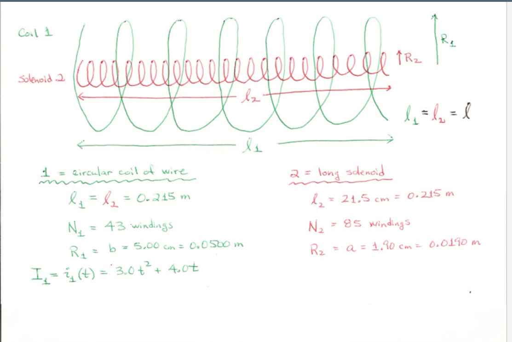
  <figcaption><b>Fig.87</b> - Pair of Coils.</figcaption>
</figure>

> **Tip 1** The circular coil and solenoid are equivalent configurations in physics. However, the problem's formulation is inadequate as employing the equation $B_{\text{loop}} = \frac{{\mu_0 NI R^2}}{{(x^2 + r^2)^{\frac{3}{2}}}}$ yields incorrect results, compounded by the unknown value of $x$. To circumvent this, we transform the circular coil into a solenoid to eliminate the concern over $x$. By doing so, we adopt the same approximation utilized in the preceding problem, assuming the circular coil carries the current due to its larger size.

> **Tip 2:** Expressing the magnetic field inside the solenoid as $B_{\text{solenoid}} = \mu_0 nI$, we derive $B_{\text{solenoid}} = B_{\text{coil}} A_{\text{solenoid}}$. Given the parallel alignment of the coils along the same axis, the dot product simplifies to multiplication, and we ascertain the $B$ field's predominantly uniform nature within the coil, unaffected by the solenoid's area.

$$B_{\text{solenoid}} = \frac{\mu_0 NI}{L}$$

$$\Phi_{B,\text{solenoid}} = \frac{\mu_0 N_{\text{coil}}I}{L} N_{\text{solenoid}}\pi R^{2}_{\text{solenoid}}$$

What is the mutual inductance of the coil and solenoid?

$$M=\frac{\mu_0 N_{\text{coil}}}{L} N_{\text{solenoid}}\pi R^{2}_{\text{solenoid}}$$

What is the magnitude of the emf induced in the solenoid at $t = 3.5~\mathrm{s}$?

$$\mathcal{E}(t) = MI'(t)$$

Topic IIIH: Inductance and RL Circuits

### Topic IIIH: Inductance and RL Circuits

#### Topic IIIH Homework

##### Problem 1: Toroidal Solenoid

A toroidal solenoid with a rectangular cross-section is wound uniformly with $N$ turns. The inner radius is $a$ , the outer radius is $b$, and it has a thickness of $t$. What is the self inductance of this device?

<figure align="center">
  
  <figcaption><b>Fig.88</b> - Pair of Coils.</figcaption>
</figure>

> **Tip 1:** Recall that, $\Phi_{B} = LI$.

$$B_{\infty, \text{wire}} = \mu_{0} \frac{NI}{2\pi r}$$

$$\mathrm{d}\vec{A} = Nt \, \mathrm{d}r$$

$$\Phi_{B} = \int_{a}^{b}  \mu_{0} \frac{N^2It}{2\pi r} \, \mathrm{d}r = \mu_{0} \frac{N^2It}{2\pi r} \ln\left(\frac{b}{a}\right)$$

$$L = \mu_{0} \frac{N^2t}{2\pi r} \ln\left(\frac{b}{a}\right)$$

##### Problem 2: Transient RL Circuit
Consider the circuit shown in the figure. The resistance of the wire used to make the inductor $L$ is negligible compared to the resistors in the circuit. Use the folowing varibles: $V$, $R_{1}$, $R_{2}$, and $L$.

<figure align="center">
  
  <figcaption><b>Fig.89</b> - Transient RL Circuit.</figcaption>
</figure>

Assume that switch $S$ has been closed for a long time so that steady currents exist in the circuit. Find the current being delivered by the battery.

$$I=\frac{V}{R_{1}}$$

Assume that switch $S$ has been closed for a long time so that steady currents exist in the circuit. Find the current going through resistor $R_{2}$.

$$I=0~\mathrm{A}$$

> **Explination:** Due to the inductor behaving akin to a wire, the current predominantly flows through it, bypassing the resistor. Consequently, there is negligible current flowing through resistor 2.

Assume that switch $S$ has been closed for a long time so that steady currents exist in the circuit. Find the current through the inductor.

$$I_{L}=\frac{V}{R_{1}}$$

Now let's open the switch. Find the initial voltage across the inductor immediately after we open the switch.

$$V_{L}=I_{L}R_{2}$$

Let's suppose it has been $0.020$ seconds since we opened the switch. Find the current through the inductor.

$$I\left(t\right)=I_{L}e^{-\frac{tR_{2}}{L}}$$

## Electromagnetic Waves

Topic IVA: Electromagnetic Waves

### Topic IVA: Electromagnetic Waves

### Mathematics of E&M waves

| **Equations** | **Constants** | **Properties** |
|:---:|:---:|:---:|
| $E=E_o \sin (k x-\omega t+\Delta)$ | $\lambda$ | is the wavelength of the   wave |
| $E^2=E_o^2 \sin ^2(k x-\omega t+\Delta)$ | $k=\frac{2 \pi}{\lambda}$ | is the wave number of the   wave |
|  | $\omega=2 \pi f$ | is the angular frequency   of the wave |
| $E_{\mathrm{av}}^2=\frac{E_o^2}{2}$ | $\Delta$ | is the phase constant of   the wave |
| $E_{\mathrm{rms}}=\sqrt{\frac{E_o^2}{2}}=\frac{E_o}{\sqrt{2}}$ | $v=\lambda f$ | is the speed of propagation   of the wave |

> **Note:** $\mathrm{rms}$ = “Root Mean Square”: square root of the average value of the function squared. 

#### Topic IVA Homework

##### Problem 1: Displacement Current
A parallel plate capacitor with circular plates of radius $R = 12 ~\mathrm{cm}$ and plate separation $d = 4 ~\mathrm{mm}$ is being charged at the rate of $2.5 ~\mathrm{C/s}$.

<figure align="center">
  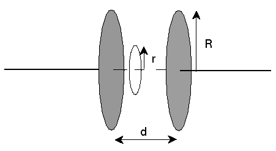
  <figcaption><b>Fig.90</b> - Displacement Current.</figcaption>
</figure>

$$I_{d}\left(r\right)=\varepsilon_{0}\left(\frac{I_{in}}{\pi R^{2}\varepsilon_{0}}\cdot\pi r^{2}\right)$$

What is the displacement current through a circular loop of radius $r = 8 ~\mathrm{cm}$ centered on the axis of the capacitor?

$$I_{d}\left(r_{1}\right) = \frac{10}{9}~\mathrm{A}$$

What is the displacement current through a circular loop of radius centered on the axis of the capacitor?^[Note that this radius is bigger than the radius of the capacitor.]

$$I_{d}\left(R\right) = \frac{5}{2}~\mathrm{A}$$

What is the magnitude of the magnetic field between the capacitor plates at a radius $r = 8 ~\mathrm{cm}$ from the axis of the capacitor?

$$B=\frac{\mu_{0}\left(I_{d}\left(r_{1}\right)\right)}{2\pi r_{1}} = \frac{1}{360000}~\mathrm{T}​$$

##### Problem 2: Frequency and Amplitude

The magnetic field of an electromagnetic plane wave is given by $B = 8.6 \times 10^{2} \sin\left[3.25 \times 10^{6} \pi \left(x - 3.0  \times 10^{8}t\right)\right]$ where everything is in SI units.

$$B(t,x)= B_0 \sin\left(kx-\omega t + \Delta\right)$$

- $B_0 = 8.6 \times 10^{2}$
- $k = 3.25 \times 10^{6} \pi$
- $\omega = 3.0  \times 10^{8}$

What is the wave's wavelength?

$$\lambda = \frac{2\pi}{k}$$

What is the wave's frequency?

$$f= \frac{2\pi}{k\omega}$$

What is the amplitude of the electric field?

$$E_{\max} = B_0c$$

#### Topic IVA Studio

##### Topic IVA Studio: Problem 1: Fizeau Apparatus for Studio

<figure align="center">
  
  <figcaption><b>Fig.91</b> - Fizeau Apparatus.</figcaption>
</figure>

What is the expression for the time for light to travel from the cog-wheel to the mirror and back to cog-wheel with respect to all relevant variables?

$$t=\frac{2D}{c}$$

What is the expression of the linear speed of the cog-wheel with respect to all relevant variables?

$$v=\omega r$$

Suppose that the light beam travels through one gap of the cog-wheel towards the mirror and back through the very next gap, find the expression for the angular frequency $\omega$ of the cog-wheel with respect to all relevant variables. I suggest using the equations that you derived in the first part of the problem, plus the tooth-to-tooth distance $d$.

$$\omega = \frac{dc}{2Dr}$$

##### Problem 2: Ampere-Maxwell

In this problem, we're going to check out the Ampere-Maxwell law in detail. That law shows us how changing electric fields can induce magnetic fields, in much the same way as Faraday's law gave us electric fields from changing magnetic fields. This nice symmetry gives rise to electromagnetic radiation.

Anyway, let's start by taking a look at the Ampere-Maxwell equation:

$$\Large \oint{\vec{B} \cdot \vec{dl}} = \mu_0 I_{enc} + \mu_0 \varepsilon_0 \frac{d\phi_E}{dt}$$

The left hand side has a $\vec{B}$ in it; this is the $\vec{B}$ present on some loop. The right hand side shows the two different ways that you can get that $\vec{B}$: either from an actual current enclosed by that loop, or from a changing electric flux through that loop (we sometimes call that second term the displacement current, since it plays a role similar to that of the real current).

Now let's take a look at an RC circuit:

<figure align="center">
  
  <figcaption><b>Fig.92.1</b> - RC circuit.</figcaption>
</figure>

Let the moment when we close the switch be $t = 0$. From then on, there'll be a current flowing through the wire as the capacitor charges. Start by finding the initial value of this current, given that $C = 9~\mathrm{mF}$, $R=8~\mathrm{k}\Omega$, and $V = 0.9 ~\mathrm{volts}$

$$I_{0}=\frac{V}{R}$$

Next, take your equation and find a numerical answer for the magnetic field at $t=72~\mathrm{s}$, given that $D = 0.06 ~\mathrm{m}$.

$$I\left(t\right)=I_{0}e^{\frac{-t}{RC}}$$

$$B\left(t\right)=\frac{\mu_{0}I\left(t\right)}{2\pi D} = \frac{\mu_{0}I_{0}e^{\frac{-t}{RC}}}{2\pi D}$$

Let's zoom in on the space in between the plates of the capacitor. There is no actual current $I$ there, but as the capacitor charges there'll be an electric field in between the plates. Since the electric field is changing, the Ampere-Maxwell law will let us find the induced magnetic field there too.

<figure align="center">
  
  <figcaption><b>Fig.92.2</b> - RC circuit.</figcaption>
</figure>

Write an algebraic equation for the charge on the capacitor as a function of time. 

$$Q\left(t\right)=CV\left(1-e^{-\frac{t}{RC}}\right)$$

Since you already have an equation for the charge on the capacitor as a function of time, you should be able to take that, divide by the area of the capacitor plates, and put together an equation for electric field as a function of time that you can use to actually get a number. Given that the plate area is $A=20 ~\mathrm{mm}^2$, calculate the magnitude of the electric field at $t=72~\mathrm{s}$. Two hints: First, note that the electric field is being made by two sheets, not just one sheet. Second, note that the amound of charge on the plates is increasing over time, not decreasing.

$$E\left(t\right)=\frac{Q\left(t\right)}{A\varepsilon_{0}}$$

Now let's take another look at the Ampere-Maxwell equation: $\large \oint{\vec{B} \cdot \vec{dl}} = \mu_0 I_{enc} +\mu_0 \varepsilon_0 \frac{d\phi_E}{dt}$

Then take another look at the picture of the capacitor. We're going to look at the induced magnetic field at the point indicated, some distance $D$ from the center of the capacitor.

<figure align="center">
  
  <figcaption><b>Fig.92.3</b> - RC circuit.</figcaption>
</figure>

Keeping in mind that the $E$-field made by two plates exists only between the two plates and not outside of them, modify your electric field equation to make it an equation for the electric flux enclosed by the loop shown.

$$f(t)=\text{RHS} = \mu_{0}\varepsilon_{0}\left(\frac{Ve^{-\frac{t}{RC}}}{\varepsilon_{0}R}\right)$$

One last tricky part. We just solved for the number that $\oint{\vec{B} \cdot \vec{dl}}$ is equal to. The magnetic field in this context must make little circular loops. With that knowledge, we can solve for the $B$ in that equation by playing the usual symmetry games. Do so now, once again using $t = 72 ~\mathrm{s}$.

$$\frac{f\left(t_{1}\right)}{2\pi D}$$

How does the $B$-field at this location outside of the capacitor compare to the $B$-field the same distance away from the wire elsewhere in the circuit (the $B$-field we calculated earlier)?

- The $B$-field is exactly the same in both contexts.

##### Problem 3: Energy Density of EM Waves
Recently in lecture we discussed the energy density for electromagnetic radiations, which was formulated from our understanding of the energy density in electric fields and the energy density in magnetic fields. While these energy densities were derived in separate topics from Blocks I, II and III independent of each other, we are now able to tie them together here due to the coupled-nature of electric and magnetic fields in electromagnetic radiations resulting from Maxwell's equations.

So, let's go through the process of putting together the energy density function for electromagnetic radiation.

First we shall once again figure out the energy density in static electric fields, $u_{E}$.

Thinking back to Block II, we figured out that the differential energy stored in a capacitor while it's charging can be derived from the relationship $\mathrm{d}U = V~\mathrm{d}q$, where $\mathrm{d}U$ is the differential energy stored, $V$ is the voltage across the capacitor, and $\mathrm{d}q$ is the differential amount of charge on the capacitor plates.

Remember the numerical equivalence, $C=\frac{Q}{V}$, what is the general expression for the total energy stored in any capacitor once it is fully charged in terms of its capacitance and voltage?

$$U_{E} = \frac{1}{2}CV^2$$

Now we're going to switch to working with a specific type of capacitor so that we can put specific values into our general equations. Let's consider a vacuum filled parallel-plate capacitor (PPC) with plate area $A$ and separation $d$.

$$C=\frac{\varepsilon_0}{d}A$$

Now develop the algebraic expression for the potential difference across the parallel plates in terms of the electric field $E$ and the dimensions of the capacitor.

$$V=Ed$$

Put everything together and get an expression for the energy stored in the PPC that depends only on material, geometry and electric field.

$$U_{E} = \frac{\varepsilon_0\cdot A\cdot E^2\cdot d}{2}$$

You can rearrange and simplify that expression in such a way that it contains the volume in between the plates of the capacitor (their area and the distance between them. With that in mind, what's the energy density (i.e., energy per unit volume) of that electric field?

$$u_{E} = \frac{1}{2}\varepsilon_0\cdot E^2$$

Note: this energy density expression, $u_E=\frac{1}{2} \varepsilon_0 E^2$ does not depend on any parameters or variables related to the capacitor that we used to derive it. In fact, what this tells us that $u_E=\frac{1}{2} \varepsilon_0 E^2$ will be the energy density in the electric field whenever and wherever there is an electric field!

Now let's figure out the energy density in static magnetic fields, $u_B$.
Thinking back to Block III, we figured out that the differential energy stored in an inductor while it's energizing can be derived from the relationship $\mathrm{d}U=P \mathrm{d}t$, where $\mathrm{d}U$ is the differential energy stored, $P$ is the power through the inductor, and $d t$ is the differential amount of time.

Using a simple "solenoid" inductor, we found that the power is given by the expression $L I \frac{\mathrm{d}I}{\mathrm{d}t}$. Using these results, derive the general expression for the total energy stored in the inductor once it is fully energized in terms of its inductance and current?

$$U_B=\frac{1}{2} L I^2$$

Now consider the vacuum filled solenoid with number turn density $n$ with current $I$ through it.

$$B= \mu_0\cdot n\cdot I$$

We've also derived an expression for the self-inductance of a solenoid. Put that in here.

$$L=\mu_{0}\cdot n^2\cdot A\cdot \ell$$

Putting everything together, you should arrive at an expression for the energy stored in the solenoid that depends only on material, geometry and magnetic field.

$$U_{B}=\frac{1}{2}\left(\mu_0\cdot n^2\cdot A\cdot l\right)\left(\frac{B}{\mu_0\cdot n}\right)^2$$

What is the energy density (that is, energy per unit volume) associated with the magnetic field in the solenoid? Note that the answer you just got for energy should have some terms in it that, when multiplied together, represent the volume of the solenoid.

$$\frac{1}{2}\left(\mu_0\cdot n^2\right)\left(\frac{B}{\mu_0\cdot n}\right)^2$$

Note: this energy density expression, $u_B=\frac{B^2}{2 \mu_0}$ does not depend on any parameters or variables related to the solenoid that we used to derive it. In fact, what this tells us that $u_B=\frac{B^2}{2 \mu_0}$ will be the energy density in the magnetic field whenever and wherever there is an magnetic field!

So here we are! We have arrived at very general expressions for the energy density of both electric and magnetic fields:

- $u_E=\frac{1}{2} \varepsilon_0 E^2$

- $u_B=\frac{B^2}{2 \mu_0}$

This means that the energy density of an electromagnetic wave, which is made up of an electric field coupled with a magnetic field, is just the sum of these two components, i.e., $u=u_E+u_B$

Remember that these expressions were derived using static fields, so how do they change if we are talking about electromagnetic radiations where both the electric and magnetic fields are no longer static? Let's figure out what the energy density would be for a electromagnetic wave at a specific instant in time (i.e., a snapshot in time), and then deal with what happens when we have to worry about the behavior over a time frame.

Analyzing electromagnetic radiation using Faraday's Law and the Ampere-Maxwell Law, we arrived at the relationship $B=\varepsilon_0 \mu_0 c E$.
With this, re-write the energy density of an electromagnetic wave using only the electric field $E$ and $\varepsilon_0$.

$$u=E^2\varepsilon_0$$

Now, re-write the energy density of an electromagnetic wave in terms of just the magnetic field $B$ and $\mu_{0}$.

$$u=\frac{B^2}{\mu_0}$$

These results should hopefully convince you that $\vec{E}$ and $\vec{B}$ are indeed coupled, and all we need is information about one field to determine information about the other field in an electromagnetic radiation.

So what about the time-varying nature of these fields? Well, remember that the oscillation of these fields are described mathematically by sinusoidal functions. Generally speaking:
- $E=E_0 \sin (k x-\omega t+\delta)$
- $B=B_0 \sin (k x-\omega t+\delta)$

And with the time-dependence, we have to deal with the rms values of these functions, and thus talk about the average energy density.
Remember that $E_{r m s}=\frac{E_0}{\sqrt{2}}$ and $B_{r m s}=\frac{B_0}{\sqrt{2}}$. Once again, we can substitute these into our previous energy density function to arrive at the average energy density function (in terms of just the electric field or the magnetic field).

Since the intensity of electromagnetic radiation is given by $I_{\text {avg }}=u_{\mathrm{rms}} c$, what is the intensity in terms of just the electric field? Write your answer in terms of the speed of light $c_1 \varepsilon_0$, and the field amplitude $E_0$. 

$$I_E=\frac{1}{2} \cdot c \cdot \varepsilon_{0} \cdot E_0^2$$

##### Problem 4: Antenna Lengths
The acceleration of charges up and down an efficient antenna is provided by a resonant standing wave, with the travel time up and down the antenna matched to one period of the oscillation. However, the speed $v$ of the wave in the conductor is somewhat slower than the speed of light; for a typical antenna, $v = 0.68 c$.

$$t = \frac{1}{2}T \leadsto \frac{1}{2f}$$

$$\ell = vt$$

$$\ell =\frac{v}{2f_{2}}$$

Topic IVB: Electromagnetic Waves and Antennae

### Topic IVB: Electromagnetic Waves and Antennae

#### Topic IVB: Homework

##### Problem 1: Ultrafast Laser
One of the Mines labs has a laser that emits pulses that last approximately $t=15 ~\mathrm{fs}$, and contains $U=109 ~\mathrm{mJ}$ of energy. `fs` indicates a femtosecond, which is $10^{-15}$ seconds.

What is the average power associated with a single pulse?

$$P=\frac{U}{t}$$

What is the physical length of this pulse?

$$h=ct$$

When the beam exits the laser, it is approximately $30 ~\mathrm{mm}$ in diameter. Molecules begin to ionize when applied electric fields reach approximately $E=8.680\times10^{9} ~\frac{\mathrm{V}}{\mathrm{m}}$. To what diameter must the beam be focused to reach this electric field strength?

$$\frac{1}{2}c\varepsilon_{0}E^{2}=\frac{P}{\pi\left(\frac{d}{2}\right)^{2}} \leadsto \boxed{d=2\sqrt{\frac{2P}{\pi c\varepsilon_{0}E^{2}}}}$$

##### Problem 2: Broadcast Antenna
A radio broadcast antenna is located at the top of a steep tall mountain. The antenna is broadcasting `104.3` FM (in Megahertz) with a mean power of 7 kilowatts.

What is the intensity of the signal at a receiving antenna located $R=17~\mathrm{km}$ away?

$$I=\frac{P}{A}=\frac{P}{4\pi R^2}$$

What is the peak voltage generated in a straight wire antenna which is long $\ell = 1.3~\mathrm{m}$ (also located $R=17~\mathrm{km}$ away)?

$$E=\sqrt{\frac{2I}{c\varepsilon_{0}}}$$

$$V_{\text{peak}}=E\cdot \ell$$

What is the peak voltage generated in a circular loop antenna which is $26 ~\mathrm{cm}$ in radius (also located $R=17~\mathrm{km}$ away)?

$$V_{\text{peak}} = \mathcal{E}_{\max}=\frac{\left(2\pi f\right)\left(\pi r_{A}^{2}\right)E}{c}$$

##### Problem 3: Electromagnetic Wave
We have a plane electromagnetic wave traveling in the $+z$ direction. As you may recall, plane waves have electric and magnetic fields that vary like either sine or cosine, with an argument of $(k z - \omega t)$. Our goal here will be to write down the equations describing the electric and magnetic fields in this particular wave, and then use those equations to calculate a few quantities.

Let's suppose that at $z=1$ and $t=0$, the magnetic field has its maximum value $B_{0}$ and points in the $-y$ direction. Use that information to decide whether your <b><i>B</i></b>-field should vary like sine or like cosine, and write a symbolic vector expression for <b><i>B</i></b>. Then write a symbolic vector expression for the <b><i>R</i></b>-field that would be in this wave. The definition of the Poynting vector will let you figure the direction of the <b><i>R</i></b>-field.

Now let's suppose that $B_0 = 0.0047 ~\mathrm{T}$. What is the scalar value of the electric field at $t=0$? Note that this could be positive or negative.

$$E=-cB_{0}$$

What is the magnitude of the Poynting vector of this wave at $t=0$?

$$S=\left|\frac{1}{\mu_{0}}\left(EB_{0}\right)\right|$$

The frequency of this wave is $f = 2.33\times 10^{6} ~\mathrm{Hz}$. What is the scalar value of the magnetic field at $t_{f} = 1.84\times 10^{-7} ~\mathrm{s}$? You can still assume that $z=0$.

$$\omega=2\pi f$$

$$B\left(t\right)=B_{0}\cos\left(\omega t\right)$$

$$\left|B\left(t_{f}\right)\right| \approx 0.00423645548073 ~\mathrm{T}$$

#### Topic IVB: Studio

##### Problem 1: EM Waves
A radio station in Golden broadcasts at a frequency of $868~\mathrm{kHz}$. At a point some distance from the transmitter, the magnetic-field amplitude of the electromagnetic wave from the station is $B_{0}=3.6\times 10^{-11}~\mathrm{T}$.

What is the wavelength $\lambda of the EM wave?

$$\lambda=\frac{c}{f}$$

What is the wave number $k$ of the EM wave?

$$k=\frac{2\pi}{\lambda}$$

What is the angular frequency $\omega$ of the EM wave?

$$\omega=2\pi f$$

What is the amplitude of the electric field $E_{0}$ of the EM wave?

$$E_{0}=cB_{0}$$

This radio station radiates electromagnetic waves in the shape of a hemisphere. The radio transmitter has a power of $85~\mathrm{kW}$. You put a radio with a $p=1.5~\mathrm{m}$ long antenna a distance $R= 200~\mathrm{km}$ from the transmitter. 

> **Note:** This transmitter has different power output and is at a different location than we've been using so far. The frequency is the same.

What is the intensity of the EM wave at the location of the radio?

$$I=\frac{p}{2\pi R^{2}}$$

What is the max electric field of the EM wave at the location of the radio?

$$E_{A}=\sqrt{\frac{2I}{c\varepsilon_{0}}}$$

What is the maximum induced voltage in the radio antenna?

$$V=E_{A}\ell$$

Now replace the straight antenna with a circular antenna. What is the radius of this circular antenna such that the maximum induced emf is the same as calculated in the previous part?
$$r_{A}=\sqrt{\frac{V}{\pi\omega\left(\frac{E_{A}}{c}\right)}}$$

##### Problem 2: Solar Sails for Spacecraft Propulsion
You are working as a design engineer for NASA on the feasibility of using "solar sails" as a means of propulsion for spacecraft. The craft will use large, low-mass sails and the energy and momentum of sunlight for propulsion. The sails should be reflective rather than absorbing (you should think about why this is true).

To start, let's get a feel for how large the acceleration due to the sun's gravity is near the earth's orbit, where the spacecraft will depart. Find what this acceleration would be at a point that is $R=1.60\times 10^{11}~\mathrm{m}$ from the sun. The mass of the sun is $m_{s}=1.99\times 10^{30}~\mathrm{kg}$. Enter your answer as a fraction of $g$ (the acceleration due to gravity near the surface of the earth). This part of the problem has nothing to do with the sun's radiation - we're just trying to get a sense of scale.

$$\text{G ratio}=\frac{Gm_{s}}{gR^{2}}$$

The sun's luminosity (total power output) is $3.83\times 10^{26}~\mathrm{W}$. Find the area of sails that would be necessary to give a spacecraft of mass $m_{\text{ship}}=1.10\times 10^{4}~\mathrm{kg}$ an initial acceleration of $g$ at the initial position of $R=1.60\times 10^{11}~\mathrm{m}$ from the sun (near the orbit of the earth). Because the gravitational force from the sun is so much smaller than the force from radiation pressure for this spacecraft design, you can neglect gravitational forces.

$A=\frac{2c\left(\pi R^{2}\right)m_{\text{ship}}g}{p}$

Find the final speed of the spacecraft with the sail area from above when it reaches a distance $R_{f}=5.40\times 10^{12}~\mathrm{m}$ from the sun (out near the orbit of pluto), starting from rest at a distance of $R_{i}=1.60\times 10^{11}~\mathrm{m}$ from the sun. Because the gravitational force from the sun is so much smaller than the force from radiation pressure for this spacecraft design, you can neglect gravitational forces. Note that the force on the spacecraft changes as it moves farther from the sun, so we can't treat it as a constant acceleration problem. Instead, think in terms of energy: Whatever kinetic energy the spacecraft ends up with must come from the work being done on it by the light hitting the sail.

$$W=\int_{R_{i}}^{R_{f}}\frac{pA}{2\pi r^{2}c}\, \mathrm{d}r = \frac{pA(R_{f}-R_{i})}{2\pi c\cdot R_{i}\cdot R_{f}}$$

$$v= \sqrt{\frac{2W}{m_{\text{ship}}}}$$

##### Problem 3: Power Output, Sun and Supernova
At the earth's orbit, the sun's intensity is about $I = 1360$ watts per square meter. Using the fact that the sun is about $R = 150$ million km away from the earth, figure out how much total power the sun is putting out, in W.

$$
\mathrm{Power} = I\left(4\pi R^{2}\right) \approx 3.845309408 \times 10^{26} \, \mathrm{W}
$$

That's quite a bit, when you stop to think about it. Now consider the supernova that could be seen with the naked eye in 1987, sometimes just called `SN1987a`. The peak intensity of the light from this supernova at the Earth's surface was a mere $I_{e}=1.30 \times 10^{-9}$ watts per square meter. However, `SN1987a` was about $1.68 \times 10^5$ light years away from the Earth.  How much power must that supernova have been generating at its peak?

$$d_{\texttt{SN1987a}}=\left(9.461\cdot10^{15}\ \cdot\ \left(1.68\cdot10^{5}\right)\right)$$

$$\mathrm{Power} = I_{e} \cdot 4\pi d_{\texttt{SN1987a}}^{2}= 4.13 \times 10^{34} \, \mathrm{W}$$

How many suns would it take to match the peak power output of `SN1987a`?

$$
\mathrm{Power ~Ratio} \approx 107403580.877
$$

Now let's go back and consider the Sun's intensity from another point of view. Given what we know, what is the intensity of the Sun's radiation out by Mars? The average orbital radius for Mars is $d = 230$ million km.

$$
\mathrm{Intensity~Mars} =\frac{p}{4\pi\left(230\cdot10^{6}\cdot10^{3}\right)^{2}}\approx 578.449905482 \, \mathrm{W/m}^2
$$

What fraction of the intensity that Earth receives does this intensity represent? That is, what is $I_{\text{mars}}/I_{\text{earth}}$?

$$
\mathrm{Intensity ~Ratio} = 0.425330812854
$$

That's not very much. Not surprisingly, Mars is rather cold. Let's get a feel for just how cold. At high latitudes on earth, the sun's rays come in at larger and larger angles with respect to the surface normal, and as a result are spread out over greater and greater areas (see the picture). What angle would the rays hitting the earth have to make to have the same intensity that they'd have on the equator of Mars? Do your calculations in degrees, and enter units of degrees as "deg".

$$
\theta = \arccos\left(\frac{I_{mars}}{I}\right) \approx 64.8283954181~\degree 
$$

At what latitude on Earth will sunlight make this angle with the normal? To make the geometry easier, ignore the tilt of the Earth's axis (that is, assume that the Earth's axis is straight up and down with respect to its orbit).

$$
\theta = \arccos\left(\frac{I_{mars}}{I}\right) \approx 64.8283954181~\degree 
$$

Finally, look on the internet and find a city whose latitude is somewhere in the neighborhood of this number.  Keep in mind that this is the most sunlight that any spot on Mars ever gets, and that Mars doesn't have the warming influence of a thick atmosphere or the moderating influence of large oceans.  It's really cold there.

##### Problem 4: Momentum Carried by an Electromagnetic Wave
You are on a spacewalk on the International Space Station. You find yourself untethered and floating away from the station, and try to use your space suit's rockets to push you back. Unfortunately, they run out of fuel after brining you to rest. Now you are a distance of $14.9~\mathrm{m}$ from the station, with zero speed relative to the station. You are carrying a $80~\mathrm{W}$ flashlight. You decide to turn on the flashlight and use it as a "light rocket" to propel you back to the station. If the flashlight has a mass of $m_{t}= 2.5~\mathrm{kg}$, and you and your space suit have a combined mass of $m_{s} =196~\mathrm{kg}$, how long will it take you to get back to the station?

Note that we've derived an equation for radiation pressure in terms of intensity, and that what we need is an equation for force in terms of power. Remind yourself how force is related to pressure and how intensity is related to power - you can then take the pressure vs. intensity equation and change it into a force vs. power equation.

$$m_{c}=m_{s}+m_{t}$$

$$t=\sqrt{\frac{2dm_{c}\cdot c}{p}}$$

Even though you have had your flashlight for many spacewalks, you decide that you do not want to wait all that time to get back to the station. So instead you plan to throw your flashlight. If the maximum speed that you can throw the flashlight with your spacesuit on is $v=9~\frac{\mathrm{m}}{\mathrm{s}}$, how long would it take you to get back to the station?

$$t=\frac{dm_{s}}{m_{t}v}$$

##### Problem 5: Solar Radiation

The intensity of solar radiation at Earth's orbit is about $1360 ~\frac{\mathrm{W}}{\mathrm{m}^2}$. Using $R_{1}=1.5 \times 10^{11}~\mathrm{m}$ for the distance from Earth to the sun, calculate the total power radiated by the sun. 

$$p=I\left(4\pi R_{1}^{2}\right)$$

What is the intensity of solar radiation at a distance of $8.2 \times 10^{11}~\mathrm{m}$ from the sun?

$$\frac{p}{4\pi R_{2}^{2}}$$

##### Problem 6: Industrial Laser

An industrial laser is used to burn a hole through a piece of metal. The average intensity of the light is $S_{\text{avg}} = 1.25 \times 10^9 \, \frac{\mathrm{W}}{\mathrm{m}^2}$. What is the RMS value of the electric field?

$$E=\sqrt{\frac{2S}{c\varepsilon_{0}}} \leadsto E_{\mathrm{rms}}=\frac{E}{\sqrt{2}}$$

For this same laser, what is the RMS value of the magnetic field?

$$B_{\mathrm{rms}}=\frac{S\mu_{0}}{E_{\mathrm{rms}}}$$

##### Problem 7: Straight Antenna

While watching the Avalanche's playoff game against the Detroit Red Wings on cable, your service went out. Knowing that the game is also being shown on a local station, you straighten out a metal coat hanger to devise an antenna for your TV to try to pick up the rest of game. The local TV station is broadcasting signals into a sphere at $P = 325~\mathrm{kW}$. If your straight antenna has a length $\ell = 0.5~\mathrm{m}$, and your TV is at a distance $36~\mathrm{km}$ away from the broadcast tower, what is the maximum possible signal voltage produced by your makeshift antenna?

$$E=\sqrt{\frac{2P}{Ac\varepsilon_{0}}}$$

$$V=E\ell\cdot10^{3}$$

##### Problem 8: Circular Loop Antenna
While watching a Nuggets' game on cable, your service went out. Thinking that perhaps the game is also being shown on a local station, you devise a circular loop antenna for your TV to try to pick up the game. The local TV station is broadcasting signals at an angular frequency of $\omega$ and a maximum electric field strength of $E_{m}$ at your TV. If your circular loop antenna has a radius $R$, and your TV is at a distance $d$ away from the broadcast tower, what is the maximum possible signal voltage produced by your circular loop antenna?

$$V= \frac {E_m \omega \pi r^2}{c}$$

Topic IVC: Geometric Optics

### Topic IVC: Geometric Optics

#### Topic IVC: Homework

##### Problem 1: Corner Reflector
A corner reflector is to be made from a glass triangular prism with index of refraction $n=2.32$, as shown in the diagram below. What is the maximum angle in degrees, with respect to the normal to the front surface of the prism, $\theta$, such that total reflection will occur on the two legs of the triangle, as shown?

<figure align="center">
  
  <figcaption><b>Fig.93</b> - Corner Reflector.</figcaption>
</figure> 

$$\theta_{c}=\arcsin\left(\frac{1}{n}\right)$$

$$\theta_{\max}=\arcsin\left(n\sin\left(45-\theta_{c}\right)\right)$$

##### Problem 2: Critical Angle
A common trick in fiber optics is to send several colors of light down the same fiber (this is a form of what's called multiplexing). Each color of light can carry a separate signal, letting you squeeze more information into your beam. This, of course, leaves you with the problem of how to separate the colors back out once your beam gets to where its going. One way to do this involves total internal reflection.

The index of refraction of glass isn't fixed; it's actually a function of frequency. Specifically, the index of the glass $n$ and the angular frequency $\omega$ of the light are related by $n^2=1+\frac{C}{\omega_0^2-\omega^2-C}$ where $C=4.43 \times 10^{32} \mathrm{rad}^2 / \mathrm{s}^2$ and $\omega_0=3.0000 \times 10^{16} \mathrm{rad} / \mathrm{s}$. Since different colors of light see different indices of refraction, different colors of light will have different critical angles.

Suppose we have a beam with yellow light (frequency $\omega=3.2 \times 10^{15}~ \mathrm{rad} / \mathrm{s}$ ) and red light (frequency $\omega=2.9 \times 10^{15} \mathrm{rad} / \mathrm{s}$ ) traveling through this glass. Eventually it's going to hit a glass-air boundary. At what angle of incidence $\theta$ should the light hit the boundary if we want the yellow light to stay in the glass and the red light to leave? 

$$N\left(\omega\right)=\sqrt{1+\frac{C}{\omega_{0}^{2}-\omega^{2}-C}}$$

$$\theta_{c}=\arcsin\left(\frac{1}{N\left(\omega_{\text{yellow}}\right)}\right) $$

##### Problem 3: Displacement Due to Refraction
By what length is a light ray displaced after passing from air into (and then out of) a $w=4.1~\mathrm{cm}$ thick sheet of material $n= 1.32$ with an incident angle of $\theta = 40^{\circ}$?

<figure align="center">
  
  <figcaption><b>Fig.94</b> - Displacement Due to Refraction.</figcaption>
</figure> 

$$\theta_{c}=\arcsin\left(\frac{\sin\left(\theta\right)}{n}\right)$$

$$\ell=\frac{w}{\cos\left(\theta_{c}\right)}\cdot\sin\left(\theta-\theta_{c}\right)$$

##### Problem 4: Lake Ontario
A point source of light is located $d=3.28 ~\mathrm{m}$ below the surface of a large lake of clear, but contaminated, water (Lake Ontario, where $n = 1.7$). Find the radius of the largest circle on the lake's surface through which light coming from the source can emerge into the air.

$$\theta_{c}=\arcsin\left(\frac{1}{n}\right)$$

$$R=d\tan\left(\theta_{c}\right)$$

#### Topic IVC: Studio

##### Problem 2: Light In Plastic
A light ray of $\lambda = 530 ~\mathrm{nm}$ enters a block of plastic from air at an angle of incidence of $\theta_{i}=35.3^\circ$. The ray's angle of refraction is $\theta_{r} = 22.9^\circ$. What is $v$ divided by $c$ for light inside the plastic?

$$\frac{c}{v} = n=\frac{\sin\left(\theta_{i}\right)}{\sin\left(\theta_{r}\right)} \leadsto \frac{v}{c} = \left(\frac{\sin\left(\theta_{i}\right)}{\sin\left(\theta_{r}\right)}\right)^{-1}$$

##### Problem 3: Equilateral Triangle
An equilateral triangle prism with $n_2 =1.52$ is placed in the path of a laser beam as shown in the figure. It is surrounded by air $n_{1}=1.00$. What are the following angles if the laser beam comes in at an angle $\theta _1 = 30^\circ$ with respect to the normal to the interface?

<figure align="center">
  
  <figcaption><b>Fig.95</b> - Equilateral Triangle.</figcaption>
</figure> 

- $$\theta_{2}=\arcsin\left(\frac{\sin\left(\theta_{1}\right)}{n_{2}}\right)$$

- $$\theta_{3}=60-\theta_{2}$$

- $$\theta_{4}=\arcsin\left(n_{2}\sin\left(\theta_{3}\right)\right)$$

- $$\theta_{\text{deflected}}=\theta_{4}-\theta_{1}$$

At which interface is Total Internal Reflection possible?

- Second Interface

What is the condition for TIR at this interface?

- Angle 4 is greater than or equal to 90 degrees

What is the angle of the incoming laser beam to obtain TIR at this interface?

$$\theta_{in}=\arcsin\left(n_{2}\sin\left(60-\arcsin\left(\frac{1}{n_{2}}\right)\right)\right)$$

At which interface can TIR occur if the prism is submerged in a fluid with $n=1.80$?

- First Interface

##### Problem 4: ABA Configuration

Consider the arrangement of materials below, in which material $b$ is sandwiched between two regions of material $a$. The index of refraction in material $a$ is less than in material $b$ (that is, $n_a < n_b$).

<figure align="center">
  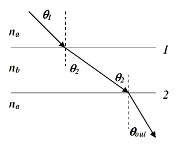
  <figcaption><b>Fig.96</b> -  ABA Configuration.</figcaption>
</figure> 

If monochromatic light with a wavelength $\lambda_a$ is incident on interface 1 with an angle $\theta_1$ as shown, at what angle with respect to the surface normal does light exit interface 2?

- Theta 1

Under what circumstances, if any, will the light be completely reflected at interface 1? That is, when could TIR occur?

- Angle 1 less than or equal to the Critical Angle

Under what circumstances, if any, will the light be completely reflected at interface 2? That is, when could TIR occur?

- Angle 2 greater than or equal to the Critical Angle

Consider now that the index of refraction in material $a$ is greater than in material $b$ (that is, $n_a > n_b$). What is $\theta_{out}$?

- Theta 1

Under what circumstances, if any, will the light be completely reflected at interface 1? That is, when could TIR occur?

- Angle 1 less than or equal to the Critical Angle

Under what circumstances, if any, will the light be completely reflected at interface 2? That is, when could TIR occur?

- Angle 2 less than or equal to the Critical Angle

##### Problem 5: Two Mirror Arrangement
A pair of vertical plane mirrors stands with an angle of $\beta = 84$ degrees between them. A pencil of light approaches in a direction parallel to one of them, as shown. After the pencil has left the mirrors, in which direction will it be going? (Give your answer as the angle above the second mirror the light hits... NOT as an angle with respect to the normal).

<figure align="center">
  
  <figcaption><b>Fig.97</b> -  Two Mirror Arrangement.</figcaption>
</figure> 

$$\theta_{1}=90-\beta$$

$$\theta_{2}=\beta-\theta_{1}$$

$$\theta_{3}=90-\theta_{2} = 180-2\beta$$

##### Problem 6: Fiber Optics Distances
When light rays travel down optical fibers, they don't follow a perfectly straight path. That means the light has to cover a little extra distance compared to the straight-line distance from one end of the fiber to the other. Suppose a light ray enters a fiber of diameter $d=4.5~\mathrm{mm}$ at an angle of $\beta=26^{\circ}$ with respect to the fiber walls. How much actual distance will the light ray have to travel for every meter of fiber it moves along?

<figure align="center">
  
  <figcaption><b>Fig.98</b> -  Fiber Optics Distances.</figcaption>
</figure> 

$$L=\left(\frac{d}{\tan\left(\beta\right)}\right)^{-1}\cdot\frac{d}{\sin\left(\beta\right)}$$

##### Problem 7: Ultrafast Lasers

A $P_{1}=30~\mathrm{W}$ LED light bulb produces about $P_{2}=10~\mathrm{W}$ of visible light. The rest of the energy is lost as heat. What is the intensity of this light at a position 5 meters from an unshaded bulb?

$$I=\frac{P_{2}}{4\pi R^{2}}$$

An amplified titanium-sapphire based laser can also produce 10 W of average output power. However, instead of producing a continuous beam, it produces a series of short pulses. If the laser produces 10000 pulses per second, how much energy is in each pulse?

$$U=\frac{10}{10000} = 0.001 ~\mathrm{J}$$

If each pulse lasts $10~\mathrm{fs}$ $(1~\mathrm{fs} = 10^{-15}~\mathrm{s})$, what is the power associated with a pulse? For comparison, the peak power demand for the US is about 700 gigawatts.

$$P_{n}=\frac{U}{10\cdot10^{-15}}$$

If a pulse is focused down to a circular spot with a diameter of $d= 1.5~\mathrm{mm}$, what will be the intensity of the resulting light? For comparison, the average intensity of the sun at the surface of the earth is $1000~\frac{\mathrm{W}}{\mathrm{m}^2}$.

$$I_{\mathrm{avg}}=\frac{P_{n}}{\pi\left(\frac{d}{2}\right)^{2}}$$

Topic IVD: Physical Optics (Part 1 of 2)

### Topic IVD: Physical Optics (Part 1 of 2)

#### Topic IVD: Homework

##### Problem 1: AR Coating

<figure align="center">
  
  <figcaption><b>Fig.99</b> -  AR Coating.</figcaption>
</figure> 

Glass, despite being transparent, still reflects a little bit of light. When making lenses and such, you'd rather not waste any light with stray reflections. Fortunately, you can use destructive interference to suppress those reflections. The picture below shows a piece of glass with a coating of magnesium fluoride (MgF2). The arrows represent incoming light. Some of the light will reflect off the air-(MgF2) interface. Some of the light will reflect off the MgF2-glass interface. If you can get these two portions of light to interfere destructively, there won't be any visible reflections. Use what you know about path length differences and interference to figure out how thick the coating of MgF2 needs to be for an anti-reflective coating for light of wavelength $\lambda = 520 ~\mathrm{nm}$. Use the thinnest coating possible. MgF2 has an index of refraction of $n_{1}=1.38$ and the glass has an index of $n_{2} = 1.5$.

$$f=\frac{c}{\lambda}$$

$$\lambda_{1}=\frac{c}{n_{1}f}$$

$$d=\frac{1}{4}\lambda_{1}$$

##### Problem 2: Two Antennas

<figure align="center">
  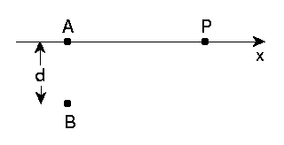
  <figcaption><b>Fig.100</b> -  Two Antennas.</figcaption>
</figure> 

Two antennas located at points $A$ and $B$ are broadcasting radio waves of frequency $f=101 ~\mathrm{MHz}$. The signals start in phase with each other. The two antennas are separated by a distance $d=10.4 ~\mathrm{m}$. An observer is located at point $P$ on the $x$ axis, a distance $x_{0}=100~\mathrm{m}$ from antenna $A$. The points $A$, $B$, and $P$ form a right triangle.

What is the phase difference between the waves arriving at $P$ from antennas $A$ and $B$? Enter your answer in radians (rad).

$$B_{P}=\sqrt{d^{2}+x_{0}^{2}} \quad \text{and} \quad A_{P}=x_{0}$$

$$I_{D}=B_{P}-A_{P}$$

$$\delta=\frac{2\pi I_{D}}{\lambda}$$

Now observer $P$ walks along the $x$ axis toward antenna $A$. What is $P^{\prime}$ s distance from $A$ when they first observe fully constructive interference between the two waves?

$$\sqrt{d^{2}+x^{2}} = \lambda + x$$

$$x=\frac{d^{2}-\lambda^{2}}{2\lambda}$$

If observer $P$ continues walking until they reach antenna $A$, at how many places along the $x$ axis (including the place you found in the previous problem) will they find maxima in the radio signal due to constructive interference?

$$\sqrt{d^{2}+x^{2}} = x+m\lambda$$

$$d^{2}=m\lambda\left(2x+m\lambda\right)$$

$$m=\left[1,...3\right]$$

$$\text{Maxima} = 3$$

##### Problem 3: Two Slabs

<figure align="center">
  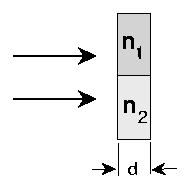
  <figcaption><b>Fig.101</b> -   Two Slabs.</figcaption>
</figure> 

Two beams of light start together and then hit a slab of two different kinds of material. This will cause one of the beams to get "ahead" of the other; that is, one will emerge from the slab sooner than the other. The beams have a wavelength of $\lambda$ outside the slabs, and the slab is $d = 2.1 \mu~\mathrm{m}$ thick. If the top half of the slab has index of refraction $n_{1}$ and the bottom has index $n_{2}$, by what time interval will one of the beams be ahead of the other once they've gone through the slab?

> **Note:** People actually do use this kind of technique to very accurately control the relative positions of light pulses in devices and experiments.

$$v_{1}=\frac{c}{n_{1}} \quad \text{and} \quad v_{2}=\frac{c}{n_{2}}$$

$$t_{1}=\frac{d}{v_{1}} \quad \text{and} \quad t_{2}=\frac{d}{v_{2}}$$

$$\Delta t= t_{1}-t_{2}$$

##### Problem 4: Soap Film
One way you can get iridescence is to have a thin film of material on some surface and shine white light at it. The different colors that make up white light have different wavelengths, and will either interfere constructively or destructively, so you'll see different patterns of colors that shift according to little changes in angle and film thickness.

Let's suppose we have a thin, uniform layer of soap film on a sheet of glass. And let's suppose we shine white light on that layer at normal incidence. You'll see a pattern of colors. And you can also do things like figure out the properties of the soap film based on that pattern. Let's suppose the light interferes constructively at a wavelength of $\lambda_{c}=562 ~\mathrm{nm}$ and destructively at a wavelength of $\lambda_{d}= 450 ~\mathrm{nm}$, with no minima between $\lambda_{c}$ and $\lambda_{d}$. If $n = 1.36$ for the soap film, what is the film thickness? Note that the given wavelengths are the wavelengths of that light in air.

$$m=\frac{\lambda_{d}}{2\left(\lambda_{c}-\lambda_{d}\right)}$$

$$f=\frac{c}{\lambda_{c}} \leadsto \frac{c}{\lambda_{c}}=\frac{\left(\frac{c}{n}\right)}{\lambda_{mat}}$$

$$\lambda_{mat}=\frac{\left(\frac{c}{n}\right)}{\frac{c}{\lambda_{c}}} = \frac{\lambda_{c}}{n}$$

$$\Delta t =\frac{1}{2} \Delta r=\frac{1}{2} m\lambda_{mat} $$

##### Problem 5: X-Ray Diffraction
X-rays of wavelength $0.155~\mathrm{nm}$ are incident on a cubic crystal with spacing d as shown in the figure. The incident angle is fixed at $\theta_{in}=77$ degrees. We move a detector around until we find the first maximum in the diffracted radiation at $\theta_{s}=41$ degrees. What is the lattice spacing, $d$, of the cubic crystal?

<figure align="center">
  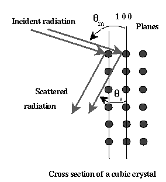
  <figcaption><b>Fig.102</b> -   X-Ray Diffraction.</figcaption>
</figure> 

$$d=\frac{m\lambda}{\sin\left(\theta_{in}\right)+\sin\left(\theta_{s}\right)}$$

## Pandoc Code

- `pandoc --katex --standalone -f markdown -t html --css styles.css Lecture_Notes.md -o LectureNotes.html`

